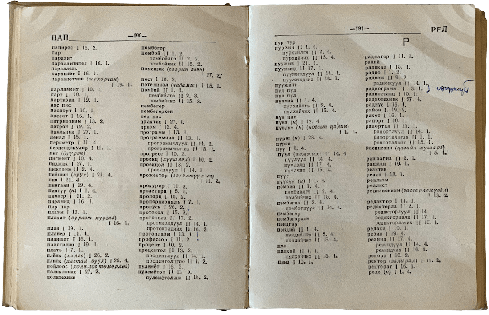

# Бүтээлийн тухай

Энэхүү бүтээлийг академич Ц. Дамдинсүрэнгийн зохион боловсруулсан монгол үсгийн дүрэм, түүнд тулгуурлан гаргасан Монгол үсгийн дүрмийн толины үгсийн бичлэгийг эх хувилбараар нь авч туурвихдаа дараах толинуудыг ашиглав:

1. [Монгол үсгийн дүрмийн толь](book.html#монгол-үсгийн-дүрмийн-толь)
1. Монгол хэлний товч тайлбар толь
1. Монгол бичгийн хадмал толь
1. Монгол хэлний хадмал толь
1. Монгол хэлний их тайлбар толь
1. Монгол хэлний зөв бичих дүрмийн журамласан толь

Толинд зөвхөн түгээмэл ашиглагддаг гадаад (орос, хятад, төвд, санскрит) үгсийг оруулсан болно.

Толинууд | Үндэс үгийн тоо | Хэв/байдлын нөхцөлтэйгөөр
------------- | ------------- | -------------
Монгол хэлний товч тайлбар толь | 17,000 | 30,000
Монгол үсгийн дүрмийн толь | 18,000 | 31,000
Монгол бичгийн хадмал толь | 27,000 | 34,400
Монгол хэлний хадмал толь | 39,300 | 50,000
Монгол хэлний зөв бичих дүрмийн журамласан толь | 31,100 (< 38,000)[^1] | 56,000
Монгол хэлний их тайлбар толь | 40,000 | 52,400 (< 60,000)
**Монгол үгийн алдаа шалгах толь** | **45,000** | **541,000**

Энэхүү бүтээлийн өмнөтгөл бүтээлүүдийг дурдвал:
1. [WinEdt Dictionary](http://www.winedt.org/dict.html){:target="_blank"}
1. [Aspell Dictionary](https://ftp.gnu.org/gnu/aspell/dict/0index.html){:target="_blank"}
1. [Mongolian spelling and hyphenation dictionaries for OpenOffice](https://extensions.openoffice.org/fr/project/mongol-helniy-ugiyn-aldaa-shalgagch-ueer-taslagch-mongolian-spelling-and-hyphenation){:target="_blank"}
1. [Mongolian spellchecking dictionary for LibreOffice](https://extensions.libreoffice.org/en/extensions/show/1980){:target="_blank"}
2. [Mongolian spellchecking dictionary for Firefox](https://addons.mozilla.org/en-US/firefox/addon/dict-mn/){:target="_blank"}

2001 оноос эхлэн [WinEdt](https://en.wikipedia.org/wiki/WinEdt){:target="_blank"} программд зориулсан монгол үгийн алдаа шалгах толио бүтээж эхэлсэн бөгөөд улмаар 2008 онд 2 сая орчим үгийн санг [Aspell](https://en.wikipedia.org/wiki/GNU_Aspell){:target="_blank"} программын монгол толинд нэгтгэж байв. Түүнчлэн [OpenOffice](https://en.wikipedia.org/wiki/OpenOffice.org){:target="_blank"}, [LibreOffice](https://en.wikipedia.org/wiki/LibreOffice){:target="_blank"} болон [Firefox](https://en.wikipedia.org/wiki/Firefox){:target="_blank"} программуудад зориулсан хувилбараа тус тус гаргаж байлаа.

## Толинд орсон зарим үгсийн бичлэгийн талаар

Академич [Ц. Дамдинсүрэн](https://mn.wikipedia.org/wiki/%D0%A6%D1%8D%D0%BD%D0%B4%D0%B8%D0%B9%D0%BD_%D0%94%D0%B0%D0%BC%D0%B4%D0%B8%D0%BD%D1%81%D2%AF%D1%80%D1%8D%D0%BD){:target="_blank"}, Б. Осор нарын "[Монгол үсгийн дүрмийн толь](book.html#монгол-үсгийн-дүрмийн-толь)"-оос ялгаатай орсон монгол үгсийг жагсаавал:

Хуучин хувилбар | Шинэчилсэн хувилбар
------------- | -------------
аальгүйт | аальгүйд
гуалаг | гоолиг
гуалагхан | гоолигхон
дүрсгүйт | дүрсгүйд
саваагүйт | саваагүйд
уйгар | уйгур
хойхно | хойхон
хүннүү | хүннү
цаахна | цаахан
эвгүйт | эвгүйд

Энэхүү бүтээлд "Монгол хэлний зөв бичих дүрмийн журамласан толь"-оос ялгаатай цөөнгүй үг бий. Ялгаатай үгийн талаар товчоор дүгнэн хэлбэл, 1980-аад онд байсан, нэг үгийг хэд хэдэн янзаар бичдэг, монгол хэлний өнгөрсөн байдалд зохицуулах хандлага зэрэг нь 40 жилийн дараа ч мөн байсаар байна. 

Журамласан толиноос ялгаатай үгсийн учрыг, журамласан толь бүтээгчдийн, толины тухай оршил хэсэгтээ онцлон дурдсанаас нь жишээ татаж, тайлбарлая.

> 1.5. Монгол хэлэнд дүрслэх язгуураас жинхэнэ нэр бүтээх –аахай3 гэсэн дагавар байдгийг өөр байр үүрэгтэй дагавартай адилтгаж журамласан тохиолдол байгааг анхаарч нэг мөр болгов. Жишээ нь: эрвээхэй, дэгдээхэй,ангаахай, овоохой, бөмбөөхэй, сарваахай, сэрвээхэй гэх мэт үгийг ижил бүтэцтэй гэж үзэж журамлав. Харин дэлхий, эсгий, ээзгий, мэлхий гэдэг үгс дээрх үгстэй ижил бүтэцтэй биш юм.

Энэ талаар академич Ц. Дамдинсүрэн нэгэнтээ өөрийн толь бичгийн оршил хэсэгт дурдсан байгаа (Монгол үсгийн дүрмийн толь, 6-р тал) бөгөөд -хий гэсэн дагаврын зөвхөн эм үгийн хувьд дурдсан бөгөөд -хэй гэснийг -хий болгох тухай дурджээ.

Журамласан толь зохиогчдын татсан жишээ нь -аахай3 гэсэн дагавар байдаг хэмээн онцолсон нь тун ойворгон дүгнэлт юм. Учир нь ангаахай, дэгдээхий, дэлхий, мэлхий гэсэн үгсийн хувьд -хай, -хий гэсэн дагавар нь нэр үгнээс нэр үг үүсгэх дагавар бөгөөд, хэрэв үйл үгэнд холбогдох бол үйл язгуур нь зайлшгүй нэр үгийн дагавар авч таарна.

Задалбал: анга (үйл язгуур) + аа (үйлээс нэр үг бүтээх дагавар) + хай (нэрээс нэр үг), мэл (нэр язгуур) + хий (нэрээс нэр үг үүсгэх дагавар). Тиймээс энэ дагавар нь өөр байр үүрэгтэй дагавар биш бөгөөд дэлхэй, мэлхэй гэхгүй дэлхий, мэлхий гэсэн тул дэгдээхэй биш дэгдээхий гэх нь зайлшгүй юм.

> 1.7. Монгол бичгийн хэлний “-ри, -ни, -ли, -ги” гэсэн үеийн “и” эгшиг нь одоо урагш шилжин хэлэгдэх болсон тул дараах байдлаар журамлав
> 
> Будули- (монгол бичигт) > будил-, будилаан, будилаад
> 
> Дабалигун- (монгол бичигт) > давилуун

Одоо урагш шилжих хэлэгдэх болсон гэдэг бол өнгөц дүгнэлт юм. Ижил төстэй үгээр жишээ татвал, дуулиан гэдгийг уйгуржин бичгээр дуулиян, будлиан гэдгийг будулиян гэж бичдэг. Эндээс будил + аан гэж бичиж таарахгүй байна. Тиймээс дуулиан, будлиан гэвэл үгийн үндэс нь будли болно.

Давлиун гэдгийг давилуун гэж бичнэ гэвэл түүнтэй ижил төстэй төгсгөлтэй кирилл үгсийг иш татвал, оргилуун буюу оргилугун, анхилуун буюу ангхилугун гэсэн үгс нь -угун гэсэн төгсгөлтэй байхад давилуун буюу дабалигун гэхэд -угун биш -игун төгсгөлтэй байна. Түүнчлэн оргилуун, анхилуун гэсэг үгсийн үндэс нь үйл язгуур тул давилуун биш давлиун байх нь зөв байна.

> 1.8. Ав- язгуураас үүсэх дараах хоёр үгийг “-лига” болон “-лага” гэх хоёр өөр дагавартай үг гэж үзэн авлига (хээл хахууль), авлага (өр авлага, гарын авлага) гэж журамлав.

Монгол хэлэнд -лига дагавар байхгүй тул авлига = ав + ли + га гэж задалбал -ли гэж үйлээс нэр үг үүсгэх дагавар байгаа гэвэл -га гэсэн нэрээс нэр үг бүтээх дагавар байхгүй юм.

Тиймээс байж болох задаргаа нь ав[ь/и] + л (үйл үг үүсгэх дагавар) + га (үйлээс нэр үг бүтээх дагавар) болох тул авлига биш авилга гэх нь зөв болно.

Дээрхээс, нэгэнт -лига гэсэн нэр үг үүсгэх дагавар байхгүй тул уйгуржин бичгийн бичлэг нь алдаатай байна.

> 1.12. Улс үндэстэн, ястны нэрийн битүү үеийн балархай эгшгийг гээж бичихгүй. Жишээ нь: орос + ын = оросын, хятад + ын = хятадын, төвөд + ийн = төвөдийн, ойрад + ын = ойрадын, урад + ын = урадын, дархад + ын = дархадын, боржигин + ы = боржигины, хонгирад + ын = хонгирадын, дөрвөд + ийн = дөрвөдийн, түмэд + ийн = түмэдийн, хорчин + ы = хорчины, харчин + ы = харчины, үзэмчин + ий = үзэмчиний, цахар + ын = цахарын, захчин + ы = захчины, зөрчин + ий = зөрчиний, зөрчид + ийн = зөрчидийн гэх мэт.

Яг ийм дүрэм байхгүй бөгөөд үүнд хамаарч болох оноосон нэрийн, гадаад үгийг хэрхэн бичих тухай эсвэл уламжлал баримтлан бичих тухай л дүрэм бий:

> 47.2. Хүний нэр, амьтан, хот суурин, уул ус зэрэг ертөнц дээр ижилгүй юмны оноосон нэрийг том үсгээр эхэлж бичнэ.
> 
> 28.Г1. Оноосон нэрийн төгсгөлийн гийгүүлэгчийн өмнөх балархай эгшгийг гээхгүй.
> 
> 28.Г2. Галав, төлөв гэх мэт зарим үгийн балархай эгшгийг гээхэд үгийн үндэс ихээхэн өөрчлөгдөхөөр болбол балархай эгшгийг гээхгүй.
> 
> 49.1. Монгол хэлэнд эрт цагт орсон бөгөөд нийтэд гадаад үг гэж мэдэгдэхээ больсон үгийг монгол үсгийн дүрмийг баримталж бичнэ.
> 
> 49.3. Гадаад үг бол монгол хэлний эгшиг зохицох ёс, балархай эгшгийн дүрэм ба гээгдэх эгшгийн дүрмийг дагахгүй.

Дээрх жишээнд: орос, хятад, төвд гэсэн үгүүд нь тодотголын үүрэгтэй гадаад үндэстний нэр бөгөөд оноосон нэр биш тул жижиг үсгээр бичжээ. Харин улсын нэрийг бичихдээ томоор бичих бөгөөд балархай эгшгийг гээхгүй.

Харин бусад үгс нь хэсэг бүлэг хүмүүсийг нэрлэсэн тул оноосон нэр биш тул гээгдэх эгшгийн дүрэмд захирагдана. Жишээлбэл, үзэмчний, захчны. Зарим цөөн хэдэн үгэнд эгшиг гээж бичихэд үгийн үндэс ихээхэн өөрчлөгдөх учир эгшиг гээхгүй. Жишээ нь, хонгирад, хонгирадын; найманы.

> 1.14. Үүсмэл үгийн бүтцийг буруу ухаарснаас болоод буруу бичиж хэвшсэн нэлээд үгийг зөв хэлбэрээр нь журамлалаа. Жишээ нь: оношилгоо, санаачилга, сурвалжилга, эмхэтгэл, цомхотгол, номхотгол, зөвлөгөөн гэх мэт.

Энэ талаар академич Ц. Дамдинсүрэн мөн номдоо дурдсан (7-р тал):

> ... Үсгийн дүрэмд энд тэнд тархмал байсан буюу балархай байсан зүйлийг тодруулаад "Зарим дагаврыг бичих дүрэм" гэж нэрлээд нэгтгэж цэгцлэн бичив. Үүнд жишээг хэлбэл: сонстох, утастах буюу сонсдох, утасдах гэж хоёр янзаар бичиж байсныг нэгтгэж сонстох, утастах гэж бичихээр дүрэмдээ оруулав.

гэсэн бөгөөд дээрх төрлийн үгстэй холбоотой дүрэм тус номын 417-р талд буй.

Журамласан тольд энэ мэт хоёрдмол бичлэгтэй цөөнгүй үг орсон зэргээс харахад тус толь бүтээгчдийн дурдсанчлан:

> ... Энэхүү журамласан толийг зохиохдоо 1941 онд Ц. Дамдинсүрэн зохиож 1983 онд нэмэн засварлаж хэвлэсэн дүрэм (Ц.Дамдинсүрэн, Б.Осор, «Монгол үсгийн дүрмийн толь» Редактор С.Мөөмөө, Улаанбаатар., 1983. 404-429 тал)-ийг баримталсан болно.

хэмээн өгүүлсэн нь бодит үнэнтэй зөрчилдөж байгаа төдийгүй

> ... Өөрөөр хэлбэл Ц.Дамдинсүрэнгийн дүрэмд ямар нэг өөрчлөлт оруулаагүй, харин зарим нэг нэмэлт тайлбар, тодруулга хийсэн болно. Гэхдээ дээр дурдсан толь (1983)-д туссан үгийн тоо харьцангуй цөөн, нэлээд үгийг журамлахдаа монгол хэлний үгийн бүтэц, бүтээврийн байрын тогтсон зүй тогтлыг зөрчсөн, үгийн гарал, уламжлалт бичлэгийг дутуу анхаарсан зэргийг засаж журамлалаа. 

гэсэн нь засаж журамлах нэрийдлээр 40 жилийн тэртээ байсан хуучин алдааг эргэн давтсан хэрэг болжээ хэмээн дүгнэхэд хүргэж байна.

"Монгол үсгийн дүрмийн толь" нь алдаа тун бага төдийгүй, дүрэм нь тун чамбай болсон бүтээл болсон гэдгийг дахин онцлох хэрэгтэй.

## Бүтээх болсон шалтгаан

1990 он гарч улсын хэвлэлийн үйлдвэрүүд татан буугдсанаар ном хэвлэлд тавигдах хэм хэмжээ суларч хүмүүс хувиараа ном бичиж, хэвлүүлэх болсон билээ. Энэ нь нэг талаар зүй ёсны хэрэг боловч нөгөө талаар ном хэвлэл чанаргүй, үг үсгийн алдаа ихтэй, утга найруулгын хувьд учир дутагдалтай зэрэг сөрөг талууд түгээмэл ажиглагдах болсон билээ.

2020 он гарахад ном хэвлэлийн алдаа 20 жилийн тэртээхтэй харьцуулахад ердөө 15--20 хувь л буурчээ. Энэ бол дэндүү хангалтгүй үзүүлэлт юм.

Яагаад буурахгүй байна гэдэгт дараах дүгнэлтийг хийж байна:
1. [Уйгуржин бичиг](https://en.wikipedia.org/wiki/Old_Uyghur_alphabet){:target="_blank"} нь монгол хэлнээ нутагшаад харьцангуй урт удаан хугацааг элээж буй ч үгсийг харилцан зөрүүтэй бичих явдлыг бүрэн цэгцэлж чадаагүй байгаа төдийгүй халх аялгууны "О, У, Ө, Ү, Д, Т, Х, Г, С, Ш, Ц, Ч" үсгүүдийг нарийн тодорхой ялгах боломжгүйгээс үүдэлтэйгээр, 1990 он хүртэл, толь бичиг, ном хэвлэлд зарим үгүүд [кириллээр](https://en.wikipedia.org/wiki/Cyrillic_script){:target="_blank"} хэд хэдэн янзаар бичигдсээр иржээ. Жишээлбэл, төвшин, түвшин; ташрамд, дашрамд; төлөв, түлэв; цээж, чээж гэх мэт. Энэ байдал одоо ч хэвээр төдийгүй, журамласан тольд энэ мэт цөөнгүй үгс оржээ. Зүйрлэвэл, академич Ц. Дамдинсүрэнгийн өгүүлсэнчлэн монгол хэлний өнгөрсөн байдалд зохицуулах хандлага одоо ч байсаар байна.
1. Монгол толь, Монгол хэлний зөв бичих дүрмийн журамласан толь гарснаар нэг үгийг хоёр янзаар бичих явдлыг бүрэн цэгцлээгүй (төвшин, түвшин), монгол үсгийн дүрмийг зөрчсөн үг агуулсан ([утасд](http://toli.gov.mn/w/lb9JwFg7GBuQSjBo){:target="_blank"}), үгийг алдаатай хувилгасан ([вирусний, вирусээс](http://toli.gov.mn/w/Iq4gTTseAlRzo394){:target="_blank"}; [далавчийн, далавчинд](http://toli.gov.mn/w/B22cX2fo3XO91IpJ){:target="_blank"}; [түрийвчийн, түрийвчид, түрийвчнээс](http://toli.gov.mn/w/53Fh61qtk6aazr1r){:target="_blank"}; [үгний, үгээс](http://toli.gov.mn/w/SLgQl0TfZQXyvzDH){:target="_blank"}[^2]), Монгол үсгийн дүрмийн толинд нэгэнт тогтсон бичлэгүүдийг өөрчилсөн үг ихтэй ([дэгдээхэй](http://toli.gov.mn/w/In8XXMwCmp4xJSTe){:target="_blank"}, [мөхсөд](http://toli.gov.mn/w/IDuKZjmpILbbQ6kE){:target="_blank"}, утасд) зэрэг алдаа дутагдал ихтэй төдийгүй, үгийг салаа утга бүрээр нь ялган бичихийг оролдож, хэлийг улам төвөгтэй болгосон (иш, эш; ишлэх, эшлэх; төвшин, түвшин; бэлэг, бэлгэ, билиг; цустах, цусдах) зэрэг дутагдал ихтэй болжээ.
1. Нийтээр үнэ төлбөргүй хэрэглэхэд зориулагдсан нээлттэй эхэд суурилсан алдаа шалгах программуудад ([Hunspell](https://en.wikipedia.org/wiki/Hunspell){:target="_blank"}, [Aspell](http://aspell.net/){:target="_blank"}, [Myspell](https://en.wikipedia.org/wiki/MySpell){:target="_blank"}, [Nuspell](https://nuspell.github.io/){:target="_blank"}) дэмжигдэх чанартай сайн монгол толь хараахан бүтээгдээгүй.
1. Иргэдийн хэлний боловсрол болон түүнийг чухалчлан үзэх ухамсрын төвшин доогуур.

Энэхүү толилуулан буй бүтээл бол миний олон жилийн тэртээ сэдэн туурвисан, академич Ц. Дамдинсүрэнгийн зохиосон монгол үсгийн дүрмийг программчилж, үгийг хэрхэн хувилгахыг хүн төдийгүй машин шийдэх чадвартай болгосноор залгамал монгол хэлний хувьд урьд хожид тооцоолж байгаагүй их хэмжээний үүсмэл үгийн санг (хагас тэрбум) гарган авах тухай эрдмийн ажил байсан бөгөөд улмаар 10 жилийн дараа ийнхүү дэвшүүлсэн санаагаа баталж, бодит ажил болгон нийтэд үнэ төлбөргүй түгээж байгаа нь энэ билээ.

Энэхүү төслийг хийж болсон шалтгаанаа товч дурдвал:
1. Өөрийн дэвшүүлсэн онолыг бодит ажил болгох, улмаар нэгэнт ашиг олох зорилгогүй учраас нийтэд үнэгүй түгээх
1. 40 жилийн тэртээ нэгэнт тогтсон үгийн бичлэгийг өнөө цагт хамаа замбараагүй, зөв буруу өөрчлөн оролдох болсон нь гагцхүү жинхэнэ эхийг эрэлхийлэх хүсэлд хөтөлсөн 

[^1]: < ижил бичлэгтэй ондоо утгатай болон давхцаж орсон эсвэл 2 янзын бичлэгтэй үгс
[^2]: Энэ талаар "Монгол үсгийн дүрмийн толь"-ийн 418-р тал 44.2-т дурдсан бөгөөд тогтворгүй н үсэг ихэвчлэн харьяалах, өгөх орших, гарах гурван тийн ялгалд нэгэн адил гарна гэжээ. Зарим үгийн хувьд биет болон хийсвэр утгаас хамааран аль аль хувилбар байх боловч гагцхүү дээр дурдсан гурван тийн ялгал нь сөөлжлөн хувирахгүй юм.

## Нийтлэл болон ярилцлага

- <https://montsame.mn/mn/read/247850>
- <https://www.polit.mn/a/90959>
