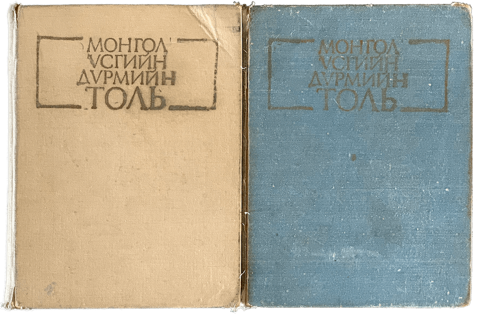

# Монгол үсгийн дүрэм

Ц. Дамдинсүрэн, Б. Осор нарын „[Монгол үсгийн дүрмийн толь](book/#монгол-үсгийн-дүрмийн-толь)“ номын оршил болон дүрмийн хэсгүүдийг онцлон байгаагийн ач холбогдол гэвэл академич Ц. Дамдинсүрэнгийн монгол хэлний дүрэмтэй холбоотой өөрийнх нь тухайн үеийн байр суурь, үзэл баримтлал болон зарим хоёрдмол бичлэгтэй үгсийг хэрхэн шийдвэрлэж байсан болоод тухайн үед байсан эсрэг хандлага одоогийн журамласан тольтой хэрхэн нийцэж буй зэргийг эргэцүүлэн тунгаах бололцоог олон нийтэд олгох зорилготой юм.

## Оршил

Өөрийн үндэсний хэлбичигт сайн суралцах нь олон төрлийн мэдлэг мэргэжилтэй болохын анхны шат болно. Анхны шат дээр гишгэлгүй, шууд 2-р, 3-р шатанд авирч болдоггүй шиг, үндэсний хэлбичигт сайн суралцахгүйгээр шууд мэргэжлийг эзэмшихэд их бэрхшээлтэй байна. Иймийн тул манай нам засаг бага дунд сургуульд хүүхдийг сайн сургаж хүмүүжүүлэх, үндэсний, хэлбичигт сайн сургахын төлөө их анхаарал тавьж байна. БНМАУ-ын Ардын Боловсролын Яамны Сурган хүмүүжүүлэх ухааны хүрээлэнгийн захиалга даалгаврыг хүлээн авч, дунд сургуулийн монгол хэлбичгийн сургалтад туслах зорилгоор энэ Монгол үсгийн дүрмийн багахан толь бичгийг зохиож гаргав. Энэ нь Шинжлэх Ухааны Академийн Хэл зохиолын хүрээлэнгийн зохиож байгаа зөв бичих зүйн дэлгэрэнгүй толь бичигтэй давхардах явдалгүй болно.

Бид энэ Монгол үсгийн дүрмийн толь бичгийг зохиохдоо үсгийн дүрмийг өөрчлөхгүй, олон янз бичдэг үгийг толь бичгээр зохицуулна гэж дээд байгууллагаас өгсөн гол зарчмыг баримталж хийлээ. Ялангуяа МАХН-ын Төв Хорооны Улс Төрийн Товчооны 429-р тогтоол, МАХН-ын Төв Хорооны ерөнхий нарийн бичгийн дарга, БНМАУ-ын Ардын Их Хурлын Тэргүүлэгчдийн дарга нөхөр Ю. Цэдэнбалын удаа дараагийн албан даалгавар болон БНМАУ-ын Сайд нарын Зөвлөлийн 1980 оны 202-р тогтоолд албан бичиг баримтын хэл найруулгыг сайжруулах, үгийн олон янзын бичлэгийг нэг мөр болгон жигдлэх тухай заасныг мөрдлөг болгон баримталж түүнийг биелүүлэх зорилтын үүднээс энэ толийг зохиов.

Энэ толь бичгийг зохиохдоо бидний голчлон хэрэглэсэн толь бичгүүдийг дурдвал:

1. Шагжи, Монгол үсүг-үн толи бичиг, Улаганбагатур, 1937
1. Ц. Дамдинсүрэн, Я. Цэвэл, Үсгийн дүрмийн зөв бичих толь, Улаанбаатар, 1951
1. С. Мөөмөө, Зөв бичих дүрмийн толь, Улаанбаатар, 1962
1. А. Лувсандэндэв, Монгол орос толь, Москва, 1957
1. Я. Цэвэл, Монгол хэлний товч тайлбар толь, Улаанбаатар, 1966
1. Х. Далхажав, Ц. Цэрэнчимид, Зөв бичих зүйн толь бичиг, Улаанбаатар, 1974

Одоо бидний хэрэглэсэн эдгээр толь бичгүүдийн тухай товчхон өгүүлсүгэй.

Шагжи, „Монгол үсүг-үн дүрэм-үн толи бичиг“ 1937 онд хэвлэгдсэн, 27 мянга орчим үгийг багтаажээ. **О, У, Ө, Ү, Д, Т, Х, Г** зэрэг үсгийг ялгаж тодруулан үсгийн дэс дараагаар жагсаасан нь Монгол бичгийн судлалын чухал ололт юм. Манай Халхын **Ө**-гөөр дууддаг нэлээд үгийг **Ү**-гээр бичсэн онцлог энэ толинд бий. Жишээ нь: **төлөвийг--түлэв, төвгийг--түвэг, өмхийг--үмхий, төвшинг--түвшин, өвтэгшийг--үвтэгш** гэх мэт.

1951 онд Ц. Дамдинсүрэн, Я. Цэвэл нар „Үсгийн дүрмийн зөв бичих толь“ хэмээх номыг зохиож гаргав. Энэ бол шинэ үсгээр гарсан анхны толь юм. Цөөвтөр үг багтааснаас гадна, **гоймон, таваар, огцрох** зэрэг олон чухал үгийг орхигдуулсан, буу тэргүүтэй хориод үгийн дэс дарааг алдсан зэргийн дутагдал гарчээ. Гэвч энэ толь нь үгийг зөв бичиж, Монголын төв аялгуун дээр үндэслэсэн шинэ бичгийн хэлийг бойжиж цэгцрэхэд их тус хүргэсэн билээ.

А. Лувсандэндэвийн редакторлаж 1957 онд хэвлүүлсэн „Монгол орос толь“ үсгийн дүрмийн биш боловч 22 мянган монгол үгийг орос орчуулгатай жагсаасны хувьд монгол үгийг зөв бичихэд их ач тус болсныг тэмдэглэх ёстой байна. Ялангуяа өвс ургамал, адгуус амьтан зэрэг даяар мэддэг биш монгол үгийг ойлгож мэдэхэд их тус боллоо. Жишээлбэл: **анар** (гранат), **анаш** (жираф), **арвис** (знание) гэх мэт.

Я. Цэвэл 1958 онд „Монгол хэлний товч тайлбар толь“ хэмээх 30 орчим мянган үгийг багтаасан толь бичгийг хэвлэж гаргав. Энэ толь бол олон монгол үгийг багтаасан ба тайлбарласны талаар урьдын толинуудаас үлэмжхэн давуу болсон юм. Гэвч нэг үгийг **түвшин--төвшин, үгүүлэл--өгүүлэл, үмхий--өмхий** гэх мэтээр хоёр хувилбартай бичсэн нь монгол бичгийн хэлний төлөвшин тогтоход нэмэр болох чанарыг хомстгосон байна.

1962 онд С. Мөөмөө „Зөв бичих дүрмийн толь“ хэмээх жижиг дэвтрийг гаргав. 1974 онд Х. Далхажав, Ц. Цэрэнчимид нар „Зөв бичих зүйн толь бичиг“ хэмээх номыг гаргав. Энэ хоёр ном хоёул Монголын нийт ерөнхий боловсролын сургуульд зориулагдсан тул зорилт санаа нь адил ажээ. Гэвч хийсэн арга барил нь өөр юм. С. Мөөмөө бол нийтэд хэрэглэгддэг хэдэн мянган үгийг зүгээр л Монголын төв аялгууг баримтлан бичиж жагсаасан байна. Тэгэхлээр энэ толь бол ерөнхий боловсролын сургуульд хэрэглэх чухал материал болох үүргээ сайн гүйцэтгэсэн байна. Х. Далхажав нарын толь бичигт бол нэгэнтээ журамшиж байгаа хэлбэрийг аль болохоор өөрчлөх гэсэн оролдлого тодорч байна. Жишээ нь: **суртхуун, өгүүлхүүн** гэж бичсэн байна. Монгол хэлэнд **суртаху, суртахуй, суртахуун** гэж нэг гаралтай гурван үг байлаа. Энэ нь сурах гэдгийн идэвхгүй хэлбэр юм. Олохын идэвхгүй хэлбэр нь олдох болдогтой адил билээ. **Суртахун** гэдэг нь угтаа олон тооны хэлбэр боловч олон тоог үзүүлэх чанараа алдаж зөвхөн хийсвэр нэр болжээ. Шинэ бичигт **УН** гэсэн богино **У**-тай дагавар байхгүй тул тавиад оны үеэс **УУН** гэж урт **УУ** эгшигтэй суртахуун гэдэг үг үүсжээ. **ХУУН**-ы өмнөх а эгшиг бол үйлт нэрийн ирээдүйн төлөвийн а эгшиг мөн болно. Гэтэл Х. Далхажав **ХУУН** гэдэг биеэ даасан тусгай дагавар гэж хэлээд а-г хасаж суртхуун болгожээ. Үүнийг эрдэм шинжилгээний үүднээс энэ нь ийм язгуур, энэ нь ийм дагавар гэж тайлбарлах аргагүй болгожээ. Бас Х. Далхажав оршилдоо **нисэж, нисчээ, өсөж, өсчээ** гэж бичнэ гэж заажээ. Уг нь **өсч** гэж бичсэн болбол **өсчээ** гэх нь зүйтэй. Хэрэв **өсөж** гэж бичсэн болбол **өсжээ** гэж бичих нь зүйтэй билээ. Монгол хэлэнд юмны чанарыг асуусан „хэр", юмны хэмжээг асуусан „хир“ гэж хоёр үг байдаг. Монгол хүн хэлэхдээ энэ хоёр үгийг тодорхой ялгаж хэлдэг, ялгаж хэрэглэдэг билээ. Гэтэл Далхажав энэ хоёр үгийг нэгтгэн „хэр“ гэж бичих болгожээ. Тэгэхлээр бид „Аль хир үнэтэй юм бэ?“ гэж асуухдаа „Аль хэр үнэтэй юм бэ?“ гэж асуух хэрэгтэй болж байна. Энэ мэтээр нэлээд үгийг зөв бичиж, зөв тайлбарлаж чадаагүй явдал Далхажав нарын толинд тохиолдож байна.

Гэвч Далхажав нарын толинд өлгөж авах хэрэгтэй юм бас бий. Тэр нь юу вэ гэвэл аливаа үгийн зарим ээдрээтэй хувирлыг догол мөрөнд жагсаасан явдал болно. Энэ сайн туршлагыг бид толиндоо уламжлан авч хэрэглэв.

Бид дунд сургуульд үзэх сурах бичгүүд, Д. Нацагдоржийн „Зохиолын түүвэр", „Хүүхдийн уран зохиолын дээж", „Ардын боловсролын ажилтан нарт тусламж“ зэрэг номын доторх үгсийг картлан авч энэ толины гол үгсийг бүрэлдүүлэв. Дараа нь энэ эмхэлсэн үгсийнхээ санг С. Шагжи, Ц. Дамдинсүрэн, Я. Цэвэл, С. Мөөмөө, Х. Далхажав нарын толинуудтай нийлүүлэн үзэж зохимжтой үгсийг сонгон авч нэмэв. Тэгээд бидний зохиосон энэ үсгийн дүрмийн толь бичигт дунд сургуулийн хэмжээнд хэрэглэгдэх 18000 орчим үг багтав.

Бидний хийсэн энэ толь бичигт байгаа нэг шинэ зүйл болбол үг хувилгах жишээг хавсаргасан явдал болно. Энэ хавсралт дотроо хоёр хэсэгтэй юм. I хэсэгт нэр үгийг хувиргах жишээг гаргав. Тэгэхдээ нэр үгсийг хэдэн хэлбэрт хувааж, хэлбэр бүрийг араб тоогоор дугаарлав. II хэсэгт үйл үгийг хувиргах жишээг гаргав. Тэгэхдээ үйл үгсийг хэдэн хэлбэрт хувааж, хэлбэр бүрийг араб тоогоор дугаарлав. Хэлбэр бүрийн дотор гуравдугаар араб тоо байгаа бөгөөд энэ нь үгсийн доторх хэлбэрийн дугаар болно. Уг толины дотор байгаа нэр үйл үгийн үндэсний ард жишээлбэл II, 5, 2 гэсэн тоо байна. Тэр үг яаж дагавар авч хувирахыг хавсаргасан жагсаалтаас олж үзэж болно. Ингэж нэр үг ба үйл үгийн олон хувилбарыг бүрэн жагсаахгүй, тэр олон хувилбарыг эцсийн жагсаалтаас үзэхээр хийсэн нь уг толийг авсаархан болгоход их тус боллоо. Гэвч ийм хавсралттай толь урьд хийж байгаагүй тул энэ толийг анх хэрэглэж дадтал жаахан бэрхшээл учирч болзошгүй.

Тус толь бичигт сурагч, эрхлэгч гэдэг үг байхгүй, харин сурагчид, эрхлэгчид гэдэг үг толь бичигт орсон билээ. Учир нь сурагч, эрхлэгч гэдэг үгийг бичихэд амархан бөгөөд цаашдаа залгавар нэмэхэд хувирахгүй юм. Харин сурагчид, эрхлэгчид гэж бичсэн үгэнд цаашдаа залгавар нэмэхэд балархай эгшиг гээгдэж хувирах тул сурагчид, эрхлэгчид гэдэг үгийг оруулахаар барахгүй, түүнд залгавар нэмэхэд яаж хувирах жишээг хавсаргасан болно.

**Хувцасны шинэ моод, бараа бааз, Гадаад Явдлын Яамны ноот бичиг** зэргийн үгс гадаад хэлэндээ мод, баз, нот гэдэг боловч энэ нь жинхэнэ монгол хэлний **ойн мод, атгаж баз, нот бат** гэдэг үгтэй адил хэлбэртэй болж хутгалдмаар тул тэдгээр гадаад хэлнээс дамжсан үгсийг монгол дуудлагаар **моод, бааз, ноот** гэж бичиж толинд оруулав.

Дэлхий, мэлхий, ээзгий, эсгий гэхэд цөм **ий** дагавартай байна. Гэтэл дэгдээхэй, эрвээхэй гэж **эй** дагавартай хэлдэг нь гажилт мөн тул үүнийг хэрэгсэхгүй, **дэгдээхий, эрвээхий** гэж бичлээ.

Хоёр янзаар хэлдэг, бичдэг үгс одоогийн монгол хэл бичигт олон тохиолдож байна. Үүнээс аль нийтлэг гэж үзсэнийгээ сонгож энэ толь бичигт оруулав. Ийм үгсээс хэдэн жишээг үзүүлье.

**Өс, өш** гэдэг нэг утгатай, хоёр хэлбэртэй үг байна. Энэ үгэнд залгаврыг нэмэхэд **өших, өшөө, өшөөлөх, өшөөрхөх** болох тул хааяа **өс, өстэй, өстөн** гэдэг боловч **өс** гэдэг хэлбэрийг орхиж зөвхөн **өш** гэдэг язгуур ба түүнээс гарсан **өшөө, өших** зэрэг үгийг сонгож тус толинд оруулав.

Гэвч урьдын нэг үг нь одоо хоёр өөр дуудлагатай, хоёр өөр хэлбэртэй болж хоёр өөр утгыг илтгэж байгаа бол түүнийг заавал ижил бичихийг оролдсонгүй. Жишээ нь: **огторгуйн одыг харав, Алтан гадас одонгоор шагнуулав** гэх мэт.

**Зөвлөлгөөн, зөвлөгөөн, зөвөлгөөн** гэж гурван янзаар энэ үгийг бичиж байна. Үүнээс бид **зөвлөгөөн** гэдэг хэлбэрийг сонгож авав. Учир нь энэ үг бол **зөвлөл** дээр **гөөн** залгаж бүтсэн биш, харин **зөв** гэдэг нэр дээр **лө** залгаж **зөвлө** хэмээх үйл үг болоод дараа нь нэр бүтээх дагавар **гөө, гөөн** дагавартай үг болсон шиг байна.

Бид энэ толь бичигтээ „Монгол үсгийн товч дүрмийг“ хавсаргав. Энэ бол чухамдаа 1954 онд Ц. Дамдинсүрэн, Я. Цэвэл нарын „Үсгийн дүрмийн зөв бичих толинд“ хавсаргасан дүрмийг бараг хэвээр нь хуулж бичсэн билээ. Зөвхөн 1951 онд товч дүрэмд тодорхойгүй бүрхэг зүйлийг тодруулсан, орхигдсон зүйлийг нэмсэн зэрэг бага сага засварыг оруулав. Эдгээр засварыг хийхдээ шинэ үсгийг 40 жил хэрэглэсэн ба олон сургуульд зааж сургаж байгаа туршлагад дулдуйдаж гүйцэтгэв. Үсгийн дүрэмд энд тэнд тархмал байсан буюу балархай байсан зүйлийг тодруулаад „Зарим дагаврыг бичих дүрэм“ гэж нэрлээд нэгтгэж цэгцлэн бичив. Үүнд жишээг хэлбэл: **сонстох, утастах** буюу **сонсдох, утасдах** гэж хоёр янзаар бичиж байсныг нэгтгэж **сонстох, утастах** гэж бичихээр дүрэмдээ оруулав.

Монгол хэлний **тогтворгүй Н** авиа бол толь ба дүрмийг цэгцлэн боловсруулахад нэлээд бэрхшээлийг учруулж байна. Урьд цагт эцэстээ Н авиатай байсан олон үгний эцсийн Н хаягджээ. Жишээ нь: **морин--морь, усун--ус, дарсун--дарс** гэх мэт. Ингэж хаягдсан Н авиаг бичихгүй нь мэдээж хэрэг. Гэтэл дээр дурдсан үгсийн эцсийн хаягдсан Н авиа, мөн үгэнд харьяалах, өгөх орших, гарах гурван тийн ялгалын залгаврыг нэмэхэд гарч ирдэг байна. Жишээ нь: морины, усны, дарсны, моринд, усанд, дарсанд, мориноос, уснаас, дарснаас гэх мэт. Угаасаа **тогтворгүй Н**-гүй байсан үгийг дээрх гурван тийн ялгалаар хувилгахад **тогтворгүй Н** гарч ирдэггүй байна. Жишээ нь: **ном, номын, номд, номоос, гар, гарын, гарт, гараас** гэх мэт. Тэгэхлээр **тогтворгүй Н**-тэй буюу Н-гүй үгсийг дээрх гурван тийн ялгалаар хувилгаж **тогтворгүй Н** байгаа эсэхийг шалгаж болох байна. Үүнийг журам болгож бид дүрэмдээ ч бичлээ. Гэтэл үүнд гажилт байдаг байна. Зарим үгийн тогтворгүй Н-тэй эсэхийг дээрх гурван тийн ялгалаар шалган тогтоож арай болохгүй тохиолдол үзэгдэж байна. Жишээ нь: **өрхийн тэргүүлэгч, өрхний оосор, сумын дарга, сумны зэв, хүүхэд хэлд орох, монгол хэлэнд орчуулах, дөрөвдүгээр сарын хоёронд, дөрвийг хоёрт хуваах** гэх мэт. Нарийвчлан ажиглавал эдгээр үгний зарим нь хоёр өөр утгатай хоёр үг болсон учир тийн ялгалын залгаврыг залгахад өөр өөр хувилж байх мэт. Жишээ нь: **сумны зэв, гэвэл харвадаг сум ойлгогдоно, сумын дарга** гэвэл захиргааны нэгж гэж ойлгогдоно. Энэ мэтийн нарийн ялгавар монгол хэлэнд боловсорч байгаа юм. Үүнийг бид энэ удаагийн толь ба дүрэмд тусгахыг оролдсон боловч гүйцэд нэгэн тийш болгож хараахан чадаагүй тохиолдол бий. Жишээлбэл: ууланд гарах, уулнаас буух гэж хэлээд уулны өвөрт гэхгүй, уулын өвөрт гэж хэлэх юм. Бидний дээр хэлсэн гурван тийн ялгалаар **тогтворгүй Н**-ийг шалгах гэсэн журамд уул гэдэг үг захирагдахгүй байна. Энэ асуудлыг цаашдаа сайн судалж байж шийдвэрлэх хэрэгтэй юм.

Зарим хүн монгол хэлний хөгжлийн хуулийг хайхрахгүй зөвхөн өнгөрсөн үеийн монгол хэлний байдлаар гол тулгуураа хийхийг шаардаж байна. Жишээлбэл: тэд нар **дөрөвдүгээр сарын хоёронд** гэдэг буруу, дөрөвдүгээр сарын хоёрт гэж бичих ёстой гэцгээж байна. Нэгэнтээ адилтгалын (аналогийн) хуулиар, **дөрөвдүгээр сарын арванд, таванд** гэдгийн адилаар **дөрөвдүгээр сарын хоёронд** гэж Монголын төв аялгуунд хэлдэг болсон. Үүнийг бид буруу гэж үзэхгүй. Харин ярианы хэлэнд хоёронд, хоёрт гэж ялгаж хэлдэг болсон учир, бичгийн хэлэнд мөн ялгаж бичих хэрэгтэй гэж үзэж байна. Үсгийн дүрэм ба үсгийн дүрмийн толийг зохиогчид өөрийн хэлний хөгжлийн өнгөрсөн үе, одоогийн байдал, ирээдүйн хандлага гурвуулыг харгалзах ёстой юм. Урьд амьд байгаад одоо мөхсөн зүйлийг ирээдүйд дахин сэргэнэ гэж горьдох явдал найдлага муутай байдаг. Харин урьдын цагт байгаагүй боловч одоо ургаж байгаа үзэгдлийн ирээдүйн хандлага нь зөв болбол түүнийг заавал анхаарч үзэх хэрэгтэй. Жишээлбэл: монгол хэлэнд урьд үгийн нэгдүгээрээс хойших үед тодорхой богино эгшиг байжээ. Тэр хоёрдугаараас хойших үеийн тодорхой богино эгшгийн нэлээд нь одоо балархай болсон ба зарим нь бүрмөсөн хаягдсан байна. Тэгэхлээр түүнийг ирээдүйд тодорхой эгшиг болно гэж найдах аргагүй байна. Монгол хэлний балархай эгшгийн нэлээд нь одоо утгын үүрэггүй болсон байна. Жишээ нь: дотно, дотоно гэж хэлэхэд нэгэн адил утгатай байна. Утга ялгах үүрэггүй үсэг бол бичиг зохиолд ашиггүй ачаа болно. Үлгэрийн баатар эр, ажнай мориныхоо хурдыг бууруулахын тул олон шуудай шороо ганзагалсан гэдэг шиг хэрэг болно. Ийм учраас одоо сонстохгүй болсон богино эгшгийг хаяж балархай эгшгийн дүрмийг боловсруулсан юм. Шинэ үсгийн дүрмийн бусад зүйл ч мөн ийм чиглэлийг баримталсан билээ. Эдгээр дүрмийг олон нийтээр зөвшөөрөн хэрэглэсээр дөч гаруй жил болж байна. Гэвч энэ дүрмийг шүүмжлэх явдал мөн хугацаанд гарч байлаа. Огцом богино эгшгийг бичнэ, гээгдэх эгшгийг гээгдэхгүй болгоно, нэгэнтээ бичигдсэн үгийн язгуурыг эвдрэхгүй болгоно, үгзүйн зарчмыг яг баримтална гэх зэргийн олон шүүмжлэл нь чухамдаа монгол хэлний өнгөрсөн байдалд зохицуулах гэсэн хандлага мөн тул тийм саналуудыг Монголын хэлбичгийн сэхээтэн, олон нийтээр няцаасаар ирсэн нь маш зөв.

Үсгийн дүрмийн толь бичиг ба үсгийн дүрэмд хэрэглэсэн нэр томьёоны тухай хэдэн үг хэлье.

1941 онд шинэ үсгийн дүрмийг зохиож гаргасан үүнд, хэлзүйн нэлээд нэр томьёог хэрэглэж бичсэн нь мэдээж хэрэг билээ. Тэр дүрэмд хэрэглэсэн нэр томьёоны ихэнхийг 1951 онд зохиож гаргасан дунд сургуулийн 5-р ангийн Монгол хэлний сурах бичиг ба 1964 онд боловсруулж гаргасан Хэлний шинжлэлийн нэр томьёоны бичигт өөрчилж хэрэглэсэн байна. Эдгээр нэр томьёог ингэж өөрчлөх шаардлага байж уу, үгүй юү гэдгийг одоо олон жил өнгөрсөн хойно асууж шүүмжлэн бодож болох юм. Юуны өмнө ямар нэр томьёог яаж өөрчилсөн тухай цөөн жишээг авч үзье.

**Хоолойн Г--хэлний гүн угийн Г  
Хэлний Г--хэлний гүн биш угийн Г  
Хамрын Н--хэлний угийн Н  
Хэлний Н--хэлний үзүүрийн Н  
Нууц Н--тогтворгүй Н  
Богино эгшиг--огцом эгшиг  
Шилжих эгшиг--гээгдэх эгшиг  
Үгүүлэхүүн--өгүүлэхүүн  
Үгүүлэгдэхүүн--өгүүлэгдэхүүн  
Гадаад үг--зээлдсэн үг  
Үсгийн дүрэм--зөв бичих зүй**

Энэ мэтээр өөрчилсөн нэр томьёо олон бий. Үүний дотор эрдэм шинжилгээний шаардлагаас үүссэн зөв зүйтэй засвар хэд байна. Жишээлбэл: шилжих эгшгийг гээгдэх эгшиг гэж сольсон нь зүйтэй. Яагаад вэ? гэхэд эгшиг нь шилжээд өөр эгшиг болж хувирах удаа олон байна. Жишээлбэл: **суртал--суртлын, явдал--явдлууд** гэх мэт. Дээр дурдсан өөрчлөлтийн заримд нь чухал шаардлага байгаагүй. Жишээлбэл: үгүүлэхүүнийг өгүүлэхүүн болгосон нь эрдэм шинжилгээний үндэс муутай буюу байхгүй. **Нууц Н, тогтворгүй Н** хоёрын аль нь ч байж болох нэр томьёо юм. Түүнийг солиод дээрдсэн ч юм алга, дордсон ч юм алга. **Хэлний гүн угийн Г, хэлний гүн биш угийн Г** гэдэг нь Г авианы мөн чанарыг зөв тодорхойлж чадаагүйн дээр нуршуу урт нэр томьёо болжээ. Нэр томьёо бол товч тодорхой байх ёстой гэсэн шаардлагыг хангаж чадсангүй.

Балархай эгшиг гэдэг нэр томьёог сольсон асуудлыг тусгайлан авч үзье. Балархай эгшиг гэдэг нэр томьёог солих чиглэлтэй олон нэр томьёог санаачлан гаргацгаав. Жишээлбэл: балархайшсан эгшиг, суларсан эгшиг, жийрэг эгшиг, хэт огзом эгшиг гэх зэрэг болно. Эдгээр олон нэр томьёо нь хэлний нарийн шинжлэлд хэрэгтэй ч байж магадгүй. Гэвч дунд сургуулийн сурах бичигт нэгэнтээ хэрэглэж дадсан балархай эгшиг гэдэг нэр томьёог солиход зохицохгүй гэж бодож байна. Учир нь, балархайшсан гэдэг нь балархай гэдэгтэй утга ойр бөгөөд хэлэхэд урт унжруу болохоос өөр ямар ч талаар дээр нэр томьёо биш юм. Суларсан эгшиг гэж байвал чангарсан эгшиг гэж байх хэрэгтэй болно. Чангарсан эгшиг гэдэгтэй ойр утгатай өргөлтөт эгшиг гэдэг нэр томьёо нэгэнтээ тогтсон байх юм. Үүнийг солих шаардлагагүй. Суларсан, чангарсан эгшиг гэж байвал сулраа ч үгүй, чангараа ч үгүй, ерийн эгшиг гэж байх болно. Монголын богино эгшгийг суларсан, чангарсан, ерийн гэж гурав ялгах шаардлага дунд сургуулийн сурах бичигт байхгүй шиг санагдана. Жийрэг эгшгийн тухай болбол балархай эгшгийн дүрмийг жийрэглэх эгшгийн дүрэм болгож солих хандлага 1951 онд хэвлэсэн сургуулийн 5-р ангид үзэх Монгол хэлний сурах бичигт эхэлж гарсан байна. Ер нь монгол хэлэнд жийрэг эгшиг байхаас гадна, жийрэг гийгүүлэгч гэж байдаг. Жишээ нь **дараагийн** гэхэд **Г** авиа нь жийрэг гийгүүлэгч (зааглах авиа) болно. Дурдсан сурах бичигт зааснаар болбол гийгүүлэгчээр төгссөн үгийн үндсэнд гийгүүлэгчээр эхэлсэн дагаврыг залгахад хооронд нь бичих эгшгийг жийрэг эгшиг гэдэг байна. Энэ тайлбар болбол балархай эгшгийн дүрмийг гүйцэд орлож чадах тайлбар биш юм. Хамгийн наад захаас хэлэхэд үгийн үндсэнд байгаа балархай эгшгийг яаж олж бичих вэ? гэдэг асуултыг хариулж чадахгүй байна. Жишээ нь: **газар, худаг** гэдэг үгийн хоёрдугаар эгшгийг бичих эсэх тухай асуултыг хариулж чадахгүй байна. Энэхүү балархай эгшгийн дүрмийг жийрэглэх эгшгийн дүрмээр солих хандлага сургуулийн практик дээр амжилтгүйгээ нотолсон тул 1972 онд хэвлэгдсэн Ж. Надмидын зохиосон Монгол хэлний сурах бичигт орхигдов. Зарим нэг буруу хандлага практикаар шалгагдаж амжилтгүй болж орхигдох нь зүй ёсны явц билээ. С. Мөөмөө 1962 онд хэвлэгдсэн зөв бичих дүрмийн толиндоо „балархай эгшиг шаардагдах эсэхийг жийрэглэх эгшгийн дүрмээр тогтооно“ гэж бичсэн боловч амьдралын туршлагад ахицыг олж чадсангүй. Ийм учраас бид энэ удаагийн хэвлэж байгаа үсгийн дүрмийн толь бичигт хавсаргасан Монгол үсгийн дүрэмд балархай эгшиг гэдэг нэр томьёог хэвээр хэрэглэсэн билээ.

Улсын нэр томьёоны комиссын тогтоолыг улсын хэмжээгээр дагаж мөрдөх ёстой боловч хааяа бас амьдралын практикаас үндэслэж нэр томьёоны комиссын тогтоолд засвар оруулж байвал зүйтэй юм. Жишээ нь: Улсын нэр томьёоны комиссоос **балархай эгшиг** гэдэг нэр томьёог хаяхаар 1964 онд тогтоосон боловч монголчууд **балархай эгшиг** гэдэг нэр томьёог дөчин жил хэрэглэж дадсан бөгөөд үүнийг солих, хаях дургүй байна. Иймийн тул балархай эгшиг гэдэг нэр томьёог цаашдаа хэрэглэж байх саналыг улсын нэр томьёоны комиссын өмнө дэвшүүлж байна. Үүний далимд хэлэхэд нэгэнтээ тогтоож хэрэглэгдээд олон нийтийн мэдэх болсон нэр томьёог өөрчлөхгүй бол нэн сайн билээ. Шаардлага гараагүй байхад нэр томьёог байн байн өөрчлөх нь шинэ бичгийн хэлний тогтворжих явдалд хортой нөлөөг учруулж байна. **Хэлний гүн угийн Г, хэлний гүн биш угийн Г** гэдэг эв хавгүй бөгөөд шинжлэх ухааны үндэсгүй нэр томьёог бид сольж хуучин хэрэглэж байсан **хэлний Г, хоолойн Г** гэдэг нэр томьёог хэрэглэж бичив. Чухамдаа **хоолойн Г** авиаг хэлэхэд хэлний гүн уг идэвхтэй оролцож байгаа биш, харин, хүүхэн хэл идэвхтэй оролцож байгаа юм.

Бид энэ толь ба хавсаргасан товч дүрмийг 1981 онд зохиож дуусаад хэдэн хувь машиндуулан мэргэжилтэн хүмүүсийн саналыг авахаар тараасан билээ. Тэгээд нам засгийн „Үнэн“ сонины газар, Шинжлэх Ухааны Академийн Хэл зохиолын хүрээлэн, Их сургууль, Багшийн дээд сургууль, Багшийн сургууль, Сурган хүмүүжүүлэх ухааны хүрээлэн, Хэвлэлийн нэгдсэн редакц, Улаанбаатарт ажилладаг хэлбичгийн зарим багш зэрэг нэлээд газар ба хүмүүс амаар ба бичгээр санал зөвлөгөө өгсөн нь үлэмж боллоо. Эдгээр санал зөвлөгөөний нэлээдийг бид хүлээн авч зохиолдоо тусгасан билээ. Ерөнхийд нь хэлэхэд эдгээр зөвлөгөө нь биднээс уг номоо дахин дахин бодож нягтлан боловсруулахад их тус болсныг онцлон тэмдэглэж тэдгээр санал зөвлөгөөг өгсөн байгууллага ба хүмүүст гүн талархлаа хүргэе.

Цаашдаа энэ номыг хэвлэгдэн гарснаас хойш уншигчид санал бодлоо Ардын Боловсролын Яамны Сурган хүмүүжүүлэх ухааны хүрээлэнд ирүүлж байвал уг дүрэм, толийг сайжруулахад их тус болохыг тэмдэглэе.

Академич Ц. ДАМДИНСҮРЭН

## Монгол үсгийн дүрэм

### § 1.

Монгол үсгээр үг яаж бичихийг үзүүлбэл:

| Үсэг | Үсгийн нэр       | Хэрэглэх жишээ               |
| ---- | ---------------- | ---------------------------- |
| А а  | а                | Арван настай байна.          |
| Б б  | бэ               | Бараан самбар байна.         |
| В в  | вэ               | Ваар сав аваад яв.           |
| Г г  | гэ               | бага гар, хамаг гэр          |
| Д д  | дэ               | Долоон адуу ууланд явна.     |
| Е е  | е                | Хүүе, ердөө тэгье.           |
| Ё ё  | ё                | Ёстой гоёмсог оёжээ.         |
| Ж ж  | жэ               | Жаахан ажил хийжээ.          |
| З з  | зэ               | Газрын зураг үз.             |
| И и  | и                | их, шинэ анги                |
| Й й  | хагас й          | Сайн нохой айлд хэрэгтэй.    |
| К к  | ка               | Карл Маркс, коммунизм        |
| Л л  | эл               | Лав олон малтай болно.       |
| М м  | эм               | Маргааш явмаар юм.           |
| Н н  | эн               | Монголын наадам сайхан.      |
| О о  | о                | Орхон гол олон модтой.       |
| Ө ө  | ө                | Өвгөн Мөнх мөнгө өглөө.      |
| П п  | пэ               | пролетари, монополи, пагдгар |
| Р р  | эр               | Нар, сар гарав.              |
| С с  | эс               | Сурлага бас сайн.            |
| Т т  | тэ               | Атан тэмээ хүчтэй.           |
| У у  | у                | Худаг ухаж ус ундруул.       |
| Ү ү  | ү                | Сүүтэй үнээ үнэтэй.          |
| Ф ф  | эф               | фабрик, Африк                |
| Х х  | ха               | Хонио өсгөх хэрэгтэй.        |
| Ц ц  | цэ               | Цайгаа буцалга.              |
| Ч ч  | чэ               | Чин зориг чамд чухал.        |
| Ш ш  | ша               | маш шулуун шударга заншил    |
| Щ щ  | ща               | Шедрин (Оросын зохиолч)      |
| Ъ    | хатуугийн тэмдэг | харъя, товъёг                |
| Ы    | урт ы            | хувьсгалын, соёлын, нарны    |
| Ь    | зөөлний тэмдэг   | үзье, хүрье, хонь, амь       |
| Э э  | э                | эрх чөлөөгөө эдэлсэн         |
| Ю ю  | ю                | Аюултай юм могой юу?         |
| Я я  | я                | Ямар аянд явах вэ?           |

### § 2.

Монгол бичиг 35 үсэгтэй.
: Эдгээр үсгийг эгшиг, гийгүүлэгч, тэмдэг гэж гурав хуваана.  
Уушгинаас гарсан хий амны хөндийгөөр саадгүй чөлөөтэйгөөр гарч хэлэгдэх авиаг эгшиг авиа гэнэ.  
Уушгинаас гарсан хий амны хөндийгөөр гарахдаа ямар нэг саад хашилт тохиолдож хэлэгдэх авиаг гийгүүлэгч авиа гэнэ.  
Цагаан толгойн үсгийн а, э, и, о, у, ө, ү, я, е, ё, ю, й, ы энэ арван гурав нь эгшиг; б, в, г, д, ж, з, к, л, м, н, п, р, с, т, ф, х, ц, ч, ш, щ энэ хорь нь гийгүүлэгч, ъ, ь хоёр нь дуудлагагүй тул эгшиг ч биш, гийгүүлэгч ч биш зүгээр тэмдэг үсэг болно.

### § 3.

Эгшиг үсэг 13 боловч монгол хэлний эгшиг авиа 7 юм.
: Энэ долоон авиаг тэмдэглэх а, э, и, о, у, ө, ү үсгийг үндсэн эгшиг гэнэ. Нөгөө я, е, ё, ю, й, ы зургааг туслах эгшиг гэнэ.  
Үндсэн ба туслах эгшиг үгийн дотор богино, урт, хос, өргөлттэй, балархай янз янзаар орно. Жишээлбэл:

<table><thead> <tr> <th colspan="2"></th> <th colspan="7">Үндсэн эгшгүүд</th> <th colspan="6">Туслах эгшиг</th> </tr></thead><tbody> <tr> <td colspan="2">Эгшгүүд</td><td>а </td><td>о</td><td>у </td><td>э </td><td>ө</td><td>ү</td><td>и </td><td>й</td><td>я </td><td>е</td><td>ё</td><td>ю </td><td>ы</td></tr><tr> <td rowspan="2">Богино</td><td>өргөлттэй</td><td>хар </td><td>ол</td><td>ус</td><td>хэр</td><td>өд</td><td>үс</td><td>ир</td><td>-</td><td>яс</td><td>ер</td><td>ёс</td><td>юм</td><td>-</td></tr><tr> <td>балархай</td><td>хавар</td><td>олом</td><td>-</td><td>хэлэх</td><td>өдөр</td><td>-</td><td>ажил</td><td>-</td><td>уя</td><td>үер</td><td>оё</td><td>-</td><td>-</td></tr><tr> <td colspan="2">Урт</td><td>цаас</td><td>оосор</td><td>уул</td><td>дээр</td><td>өөд</td><td>үүл</td><td>ийм</td><td>-</td><td>яам</td><td>еэвэн</td><td>ёотон</td><td>юу</td><td>намын</td></tr><tr> <td colspan="2">Хос</td><td>айл</td><td>ойх</td><td>туйл</td><td>эвтэй</td><td>-</td><td>үйл</td><td>-</td><td>айх</td><td>яйрах</td><td>-</td><td>ёйлгор</td><td>юйрэх</td><td>-</td></tr></tbody></table>

### § 4.

Монгол үгийн эхний үеийн эгшиг дандаа тодорхой хэлэгдэх тул түүнийг өргөлтөт эгшиг гэдэг.
: Үгийн нэгдүгээр үеэс хойш орох богино эгшгүүд цөм тодорхойгүй хэлэгдэх тул түүнийг балархай эгшиг гэнэ. _Жишээлбэл: Гэрэл, мандах гэдэг хоёр үгийн эхний эгшгүүд өргөлттэй ба сүүлийн эгшгүүд балархай юм._

### § 5.

Сунгаж удаанаар хэлэх эгшгийг урт эгшиг гэнэ. Урт эгшгийг дөрвөн аргаар тэмдэглэнэ.
1. Үндсэн эгшгийг давхарлаж аа, ээ, оо, уу, өө, үү гэж тэмдэглэнэ.
1. Я, е, ё, ю эгшгийн дараа үндсэн эгшгийн нэгийг давхарлаж яа, яу, еэ, еү, еө, ёо, ёу, юу, юү гэж тэмдэглэнэ.
1. Зөөлөрсөн гийгүүлэгчийн дараах урт эгшгийг бичихдээ зөөлний тэмдгийг и болгож үндсэн эгшиг нэгийг нэмж иа, ио, иу гэж тэмдэглэнэ. Үндсэн эгшиг гурвыг давхарлаж бичихгүй.
1. И эгшгийг уртаар бичихдээ эр үгийн ы, эм үгийн ий гэж ялгаж тэмдэглэнэ. Эр үгийн ы эгшиг дан үсгээр тэмдэглэсэн богино эгшгийн хэлбэртэй боловч урт и эгшиг юм. Эм үгийн ий хос эгшгийн хэлбэртэй боловч урт эгшиг юм. _Жишээлбэл: Ардын, ордны, өвлийн, дэрсний_ гэх мэт.

### § 6.

Нэг үе болж хавсран орсон хоёр өөр эгшгийг хос эгшиг гэнэ.
: _Жишээлбэл: Аймаг, ойр, үнэтэй, үйлдвэр, туйл, яйрах, ёйлгор, гуанз, аугаа_ гэх мэт. Монгол хэлний хос эгшгийг ай, эй, ой, уй, үй, яй, ёй, юй, хааяа уа, ау гэж тэмдэглэнэ. Монгол хэлэнд „өй“ гэсэн хос эгшиг хэрэглэхгүй.

### § 7.

Арван гурван эгшгээс хэлний угт бүтэх а, о, у, я, ё, ю (у), ы долоог эр эгшиг гэнэ.
: Хэлний дунд бүтэх э, ө, ү, е, ю (ү) тавыг эм эгшиг гэнэ.  
Хэлний үзүүрт бүтэх и, й хоёрыг саармаг эгшиг гэнэ. Эр эгшиг орж бүтсэн үгийг эр үг гэнэ. Эм эгшиг орж бүтсэн үгийг эм үг гэнэ.  
Саармаг эгшгээр бүтсэн үгэнд залгавар залгахад эм эгшиг гардаг учир саармаг эгшгээр бүтсэн үгийг эм үгэнд тооцно. _Жишээлбэл, ишиг--ишгээр, жил--жилүүд, чийг--чийгтэй гэх мэт._

### § 8.

Үгийн эхний эгшиг, мөнхүү үгийн дараах эгшгийг ялган тогтоох ёсыг эгшиг зохицох ёс гэнэ.
: Эгшиг хэлний ба уруулын талаар зохицно.  
Монгол хэлний нэг үгэнд эр, эм эгшиг хамтран орохгүй. Эр эгшиг эр эгшигтэйгээ, эм эгшиг эм эгшигтэйгээ зохицож орно. Саармаг эгшиг эр, эм ямар ч эгшигтэй зохицон орно. Энэ бол эгшиг хэлний талаар зохицох ёс юм.

Гажилт:
1. Хоёр үгнээс бүтсэн нэг үгэнд эр, эм эгшиг орж болно. _Жишээлбэл: горьгүй, болохгүй, Батгэрэл гэх мэт._
1. Хааяа үгийн эцсийн урт эгшиг энэ дүрмийг зөрчинө. _Жишээлбэл: байжээ, болжээ, гарчээ гэх мэт._

### § 9.

Эгшиг уруулын талаар зохицохдоо:
1. Үгийн эхний үед а, у байвал хойшид а дагана. _Жишээлбэл: авдартай, уламжлахад, хамгаалахаараа, уулзвар гэх мэт._
1. Үгийн эхний үед э, ү, и байвал хойшид э дагана. _Жишээлбэл: эрдэм, үзэгдэхэд, жинхэнэ гэх мэт_
1. Үгийн эхний үед о байвал хойшид о дагана. _Жишээлбэл: онгоцоор, оролцоход гэх мэт._
1. Үгийн эхний үед ө байвал хойшид ө дагана. _Жишээлбэл: мөнгө, өргөдөл, өндөглөхөд гэх мэт._
1. Энэ зохицолд урт, хос, туслах эгшиг хамаарагдана. _Жишээлбэл: Ёндон, олъё, уралдаантайгаар, үзье, үдэшлэгтэй, инээдэм, уяатай гэх мэт._

Энэ дүрмийг хүснэгтээр үзүүлбэл:

| Үгийн эхний үед ийм эгшиг байвал | Хойшид тохиолдох эгшиг нь |
| -------------------------------- | ------------------------- |
| а, у                             | а                         |
| э, ү, и                          | э                         |
| о                                | о                         |
| ө                                | ө                         |

Гажилт:
1. уу, үү, юу, юү, яу, ёу, еү, иу эгшгүүд эгшиг зохицох ёсыг зөрчиж орох бөгөөд хойшид дагах эгшгийг өөрийн зохицолд авна. _Жишээлбэл: орчуулагч, өрнүүлсэн, оёулахдаа, үеүдэд, хориулан гэх мэт._
1. и, ий, ы, эй эгшгүүд эгшиг зохицох ёсыг зөрчиж орох боловч хойшид дагах эгшиг нь өмнөх эгшгийн зохицолд хамаарагдана. _Жишээлбэл: ажиллах, хөгжилдөнө, онийсон, нөхөдтэйгөө, өвстэйхөн, доёийсон гэх мэт._

### § 10.

ы, ий хоёрыг ялгаж бичих дүрэм:

1. Урт ы үсгийг эр үгэнд бичнэ. Эм үгэнд ердөө бичихгүй. _Жишээлбэл: ардын, нарны, хотыг, уулыг гэх мэт._
1. Эм үгэнд ий үсгийг бичнэ. _Жишээлбэл: хүний, эрдмийг, өвлийн, шүлгийг гэх мэт._
1. ий үсгийг эр үгэнд хааяа бичнэ. _Үүнд:_ ж, ч, ш, ь, и, хэлний г үсгээр төгссөн эр үгэнд бичнэ. _Жишээлбэл: туужийг, ачийн, багшийн, айргийг, ааргийн, харь--харийн, анги--ангийн гэх мэт._

### § 11.

я, е, ё, ю дөрөв бол уг нь гийгүүлэгч эгшиг хоёр авиагаар бүтсэн бүхэл үеийг тэмдэглэх үсэг юм.
: Үүнийг хавсарсан үсгээр жишээ болгон үзүүлье (Гийгүүлэгч үсгийг i үсгээр тэмдэглэв).  
Я-ia  
е-iэ, iө  
ё-iо  
ю-iу, iү  
энэ дөрвөн үсгийг я-гийн төрлийн үсгүүд гэнэ.

### § 12.

Эр үгийн эхний үед богино и үсгийг бичихгүй, дандаа я-гийн төрлийн үсгийг бичнэ.
: _Жишээлбэл: мянга, пял, янзага, ёс, хялгана гэх мэт._

### § 13.

Юу, яу, ёу, еү эгшгийг ялгаж бичих нь:
: Үгэнд юу мэтээр хэлэгдэх урт эгшгийг юу, яу, ёу, еү дөрвөн янзаар бичнэ.  
Үгийн үндэс нь, я, е, ё үсгээр төгссөн бол түүнийг солихгүй зөвхөн у, ү эгшиг нэмнэ. _Жишээлбэл: хоёр--хоёул, хая--хаяул, оё--оёул, үе--үеүд, бие--биеүд гэх мэт._  
Үгийн үндэс нь, я, е, ё үсгээр төгссөн биш бөгөөд ю хэлэгдвэл тэр ю үсгийг бичнэ. _Жишээлбэл: аюул, Аюуш, оюун, гиюүрэх гэх мэт._

### § 14.

Я-гийн төрлийн эгшиг өмнөх эгшигтэйгээ нийлж урт эгшиг буюу хос эгшиг болдоггүй, тусгай үе хэвээр байна.
: _Жишээлбэл: байя, хөөе, ная, оё, бие гэх мэт._  
Я-гийн төрлийн эгшиг арын эгшигтэй нийлж урт ба хос эгшгийг бүтээнэ. _Жишээлбэл: яарах, үеэс, аюул, оёод, оюутан, оёулах, хаяулах, саяын, гоёыг, биеийг гэх мэт._

### Балархай эгшгийн дүрэм

### § 15.

Монгол хэлэнд үгийн нэгдүгээр үеэс хойш орсон богино эгшгүүд цөм тодгүй балархай хэлэгдэнэ.
: Балархай эгшгийг олж бичихэд амаргүй боловч гийгүүлэгч үсгүүдийг хянаж үзвэл зарим гийгүүлэгч үсгүүд заавал эгшиг дагуулж үе бүтээдэг байхад зарим гийгүүлэгч үсгүүд заавал эгшиг дагуулж явдаг биш байна.  
Энэ байдлаас үндэслэн балархай эгшгийн дүрмийг тогтоохын тулд гийгүүлэгч үсгийг эгшигт гийгүүлэгч, заримдаг гийгүүлэгч, онцгой гийгүүлэгч гэж гурав хуваав.

### § 16.

Эгшигт гийгүүлэгч: м, н, г, л, б, в, р энэ долоон гийгүүлэгч үсэг үгэнд орохдоо өмнөө буюу хойноо аль тод хэлэгдэх талдаа заавал эгшигтэй бичигдэнэ.
: Үүнийг эгшигт гийгүүлэгч гэнэ. _Жишээлбэл: газар, тохом, цацрал, модон; хөдөлмөр, гарав; үзэл, тасархай гэх мэт._ Үүнийг цээжлэхдээ „Монгол баавар“ гэнэ.

Гажилт:
1. Хэлний угийн н-ийн дараа заахын тийн ялгалын г нөхцөл эгшиггүй бичигдэж болно. _Жишээлбэл: байшинг, дүнг, Галсанг, хөвөнг гэх мэт._
1. Тусгай бичигддэг л, нь хоёр эгшиггүй бичигдэнэ. _Жишээлбэл: сайн л байна. Хоёр нь үлджээ гэх мэт._

### § 17.

Д, т, ж, з, с, ш, ц, ч, х есөн гийгүүлэгч үсэг үгэнд эгшигтэй, эгшиггүй хоёр янзаар бичигдэх тул заримдаг гийгүүлэгч гэнэ.
: Заримдаг гийгүүлэгч бол эгшигт гийгүүлэгчийн дараа өмнө хойноо эгшиггүй орж болно. _Жишээлбэл: Ховд, хагд; амт, тэнд, ард, тэвш; багш; булш, зунш, дарш, эзэмш гэх мэт._

Гажилт:
: Үйлт нэрийн ирээдүй цагийн х нөхцөлийн өмнө заавал эгшиг бичдэг учир энэ дүрэмд хамаарахгүй. _Жишээлбэл: өгөх, явах, олох; хамах, харах гэх мэт._

### § 18.

Заримдаг гийгүүлэгч нь заримдаг гийгүүлэгчийн дараа орохдоо сүүлчийн заримдаг нь өмнөө буюу хойноо аль хэлэгдэх талдаа заавал эгшигтэй бичигдэнэ.
: _Жишээлбэл: модот, модтод, хожид, хождох, бусад, бусдад, эзэд, батад, ахад, лацад, мөчид, хойшид; буцаж, эцэс; ачит; анжис гэх мэт._

Гажилт:
: Заримдаг гийгүүлэгчийн дотроос с, х үсгийн дараа т, ч үсэг өмнө хойноо эгшиггүй орж болно. _Жишээлбэл: туст нөхөр, түүхт он, усч хүн, түүхч эрдэмтэн гэх мэт._

### § 19.

Эгшигт гийгүүлэгчийн дараа үгийн эцэст ямар ч балархай эгшиг бичиж болно.
: _Жишээлбэл: ямба, толбо, алба, Пагма, хурга, хөрөнгө, мөнгө, анги, тогло, ажигла, муна, ирнэ, урва, харва, цэлмэ гэх мэт._  
Заримдаг гийгүүлэгчийн дараа үгийн эцэст и-ээс өөр балархай эгшиг бичихгүй. Жишээлбэл: салхи, банди, гархи гэх мэт.  
Энэ дүрмийн § [16](#-16), [18](#-18) дугаар зүйлд дурдсан балархай эгшгийн дүрмийг мартахгүй тогтооход зориулж томьёогоор үзүүлбэл  
7 + э  
7 + 9 - э  
9 + 9 + э  
Эгшигт гийгүүлэгчийг 7-гийн тоогоор заримдаг гийгүүлэгчийг 9-ийн тоогоор, эгшиг үсгийг э-ээр тэмдэглэв.

### § 20.

К, Ф, Щ гурван үсэг монгол үгэнд бичигдэхгүй, зөвхөн гадаадын үгэнд бичигдэнэ.
: _Жишээлбэл: коммунизм, капитал, фабрик, Щорс гэх мэт._  
П үсэг монгол үгийн дунд ба адагт орохгүй, харин монгол үгийн эхэнд хааяа бичигдэнэ. _Жишээлбэл: пагдгар, пүл пал, пээ юу вэ гэх мэт._  
К, ф, щ, п дөрвөн үсгийг онцгой гийгүүлэгч гэж нэрлэнэ.

### § 21.

Б, В үсгийг ялгаж бичих дүрэм:
1. Б үсгийг ихэвчлэн үгийн эхэнд бичнэ. Үгийн дунд л, м, н, в үсгийн дараа бичнэ. _Жишээлбэл: бодлого, толбо, самбар, хэн бэ? явбал гэх мэт._
1. В үсгийг ихэвчлэн үгийн дунд адагт бичнэ. Үгийн эхэнд хааяа цөөн үгэнд бичнэ. _Жишээлбэл: ваадан, вандан, ваар, хавав, харав, хөвөвч гэх мэт._

### § 22.

Г үсгээр хоёр авиаг тэмдэглэнэ:
1. Хүүхэн хэл идэвхтэй оролцож „га, го, гу, гы“ гэж хэлэгдэх г авиаг хоолойн г гэнэ. Хоолойн г-ийн ард а, о, у, ы дөрвөн эгшгийн нэгийг бичнэ. _Жишээлбэл: арга, аргын, бага, ботго, гудамж гэх мэт._
1. Хэлний угаар хэлэгдэх г авиаг хэлний г гэнэ. Хэлний г ардаа эгшиггүй буюу а, о, у, ы дөрвөөс өөр эгшигтэй байна. _Жишээлбэл: аймаг; нутаг; хөрөнгө; цэнгэл, цэцэг; гүйцэтгэх гэх мэт._

Хэлний г үсгийн ард залгавар залгахад а, о, у эгшиг орох боловч хэлний г хэвээр байна. _Жишээлбэл: хамаг--хамгаас, тоорцог--тоорцгоор, туг--тугууд, аймаг-аймгарх, омог--омгорхуу гэх мэт._

### § 23.

Н үсгээр хоёр авиаг тэмдэглэнэ:
1. Хэлний үзүүр хатуу тагнайд хүрч хэлэгдэх н авиаг хэлний үзүүрийн н гэнэ. Хэлний үзүүрийн н хойноо эгшиг буюу ь-тэй байна. _Жишээлбэл: чанар, үнэг, чоно, явна, нум, нөмөр, оньс, тань гэх мэт._
1. Хэлний үзүүр хатуу тагнайд хүрэхгүй хэлэгдэх н авиаг хэлний угийн н гэнэ. Хэлний угийн н ардаа эгшиггүй байна. _Жишээлбэл: ганган, онгоц, сан, байшин, Лувсан, Сүрэн гэх мэт._

Зарим үгийн эцсийн хэлний үзүүрийн н авиа халх аялгуунд хэлний угийн н болж хэлэгддэг бөгөөд залгавар залгахад хэлний үзүүрийн н болох нь тодорхой болно: _Жишээлбэл: мэргэн--мэргэнээр, он--оны, үнэн--үнэний гэх мэт._

### § 24.

Хэлний үзүүрийн н-ийг хэлний угийн н-ээс, хоолойн г үсгийг хэлний г-ээс ялгахын тул хэлний үзүүрийн н, хоолойн г үсгийн ард бичсэн балархай эгшгийг ялгах эгшиг гэнэ.
: _Жишээлбэл: хана, бага, оно, торго, үнэ, онгоц, өнөр, торни гэх мэт._

Тайлбарлах нь:
: Өргөлттэй эр, үндсэн эгшиг, мөн урт хос үндсэн эр эгшиг ба ы эгшгийн өмнө орсон г бол их төлөв хоолойн г байна. _Жишээлбэл: газар, гуйх, гоожих, тогоо, агуу, даргын, агаар гэх мэт._  
Балархай эгшгээс бусад эдгээр дурдсан эгшгийг ялгах эгшиг гэж нэрлэхгүй.

### § 25.

Дараалсан гурван гийгүүлэгчийн гуравдугаар нь хоолойн г, хэлний үзүүрийн н хоёрын нэг бөгөөд түүний арын ялгах балархай эгшгээр үг төгсгөвөл тэр ялгах эгшиг сонстохгүй тул н ба г-ийн өмнө богино эгшиг бичнэ.
: Үүнийг дараалсан гурван гийгүүлэгчийн дүрэм гэнэ. _Жишээлбэл:_
1. Аньсага, бортого, ганзага, жинхэнэ, зулзага, оньсого, турсага, хавтага, харцага, хоромсого, хундага, чагтага, чандага, чогчиго, эрдэнэ, янзага гэх мэт цөөн нэр үг байна.
1. Цаг заах үйл үгийн одоо ирээдүй цагийн -на, -нэ, -но, -нө нөхцөлийг давхар гийгүүлэгчээр төгссөн үгэнд залгахдаа дараалсан гурван гийгүүлэгчийн дүрмээр бичнэ. _Жишээлбэл: манд-на--мандана мөлх-нө--мөлхөнө, урс-на--урсана, орш-но--оршино гэх мэт._

Дээрх хоёр тохиолдлоос бусад үгэнд балархай эгшгийн дүрмийг зөрчихгүй бол 3 ба 4 гийгүүлэгч дараалан орж болно. _Жишээлбэл: урсга, ястны, эмхтгэх. цомхтго, төрөлхтний, эрхтний гэх мэт._

### § 26.

Дараалсан хоёр гийгүүлэгчийн хоёрдугаар гийгүүлэгч нь хоолойн г, хэлний үзүүрийн н хоёрын нэг байвал түүний өмнө и-гээс бусад балархай эгшиг бичихгүй.
: _Жишээлбэл: авга, алга, тамга, ганга, торго, годгор, хазгар, босго, тошгор, авна, аялна, бодно, маажна, босно, хөшнө гэх мэт._  
Хэлний үзүүрийн н буюу хоолойн г-ийн өмнө хэлний үзүүрийн н буюу хоолойн г тохиолдвол завсар нь эгшиг бичнэ. _Жишээлбэл: унана, дагана, унага, шанага, багана гэх мэт._

### § 27.

Ж, ч, ш-ийн дараах эгшиг:
1. Эр үгийн эхний ж, ч, ш гурвын дараа богино и эгшиг бичихгүй, а, о, у гурвын нэгийг бичнэ. _Жишээлбэл: шар, чагтага, жаргалан, шороо, чоно, чухал, шугам гэх мэт._
1. Эм үгийн эхний ж, ч, ш-ийн дараа богино э эгшгийг бичихгүй и, ө, ү гурвын нэгийг бичнэ. _Жишээлбэл: жил, чимээ, ширээ, чөлөө, шөнө, жүжиг, шүдлэн гэх мэт._
1. Эр эм ямар ч үгийн дунд орсон ж, ч, ш гурвын дараа балархай эгшиг бичих шаардлага гарвал дандаа и эгшиг бичнэ. _Жишээлбэл: ажил, ашиг, ишиг, хөгжил, учир, дэвших гэх мэт._
1. ж, ч, ш-ийн дараа ямар ч урт эгшгийг бичиж болно. _Жишээлбэл: шаантаг, шээзгий, шүүх, хашаа, чанаржуулах, хөгжөөнө гэх мэт._

### Гээгдэх эгшиг

### § 28.

Үгэнд залгавар залгахад балархай эгшгийн дүрмийн ёсоор шаардагдахгүй болж хасагдах эгшгийг гээгдэх эгшиг гэнэ.
: Ийнхүү эгшиг гээгдэх гурван тохиолдол байна. _Үүнд:_

1. Гийгүүлэгчээр төгссөн үгэнд урт эгшгээр эхэлсэн залгавар залгахад уг үгийн төгсгөлийн гийгүүлэгчийн өмнөх балархай эгшиг гээгдэнэ. _Жишээлбэл: олон--олноос, авар--авраад, суртал--суртлаар гэх мэт._
1. И-аас бусад богино эгшгээр төгссөн үгэнд урт эгшгээр эхэлсэн залгавар залгахад төгсгөлийн балархай эгшиг гээгдэнэ. _Жишээлбэл: чарга--чаргыг, хана--ханаар, сана--сануул, эмнэ--эмнүүл, өмнө--өмнөөс гэх мэт._
1. Гийгүүлэгчээр төгссөн үгэнд гийгүүлэгчээр эхэлсэн залгавар залгахдаа өмнө нь эгшиг жийрэглэвэл мөн үгийн эцсийн гийгүүлэгчийн өмнөх эгшиг гээгдэнэ. _Жишээлбэл: боловсор-л--боловсрол, сурагчид-д--сурагчдад, үсэр-х--үсрэх гэх мэт._

Гажилт:
1. Оноосон нэрийн төгсгөлийн гийгүүлэгчийн өмнөх балархай эгшгийг гээхгүй. _Жишээлбэл: Матад--Матадаас, Орхон--Орхоны, Пунцаг--Пунцагийг гэх мэт._
1. Галав, төлөв гэх мэт зарим үгийн балархай эгшгийг гээхэд үгийн үндэс ихээхэн өөрчлөгдөхөөр болбол балархай эгшгийг гээхгүй.
1. Уламжлалын зарчим баримталж бичсэн үгийн „и“ эгшгийг гээхгүй. _Жишээлбэл: тэнхимийн, эрихээр гэх мэт._

### § 29.

Нэг үгэнд хэд хэдэн залгавар залгахдаа нэгэнтээ гээж бичсэн эгшгийг сэргээж бичихгүй.
: _Жишээлбэл: бутар--бутрал, бутралаар, нөхөд--нөхдөд--нөхдөдөө, бэх--бэхэж--бэхэжтүгэй--бэхжих--бэхжихэд гэх мэт._

### § 30.

Эгшгийг гээхдээ эгшигт гийгүүлэгч, заримдаг гийгүүлэгчийг эгшиггүйдүүлэх, мөн үгийн дунд орсон ялгах эгшиг, үйлт нэрийн „х"-гийн өмнөх эгшиг, дараалсан гурван гийгүүлэгчийн дүрмээр бичсэн эгшиг, зөөлрүүлэх үүрэгтэй „и“ эгшгийг гээх зэргээр балархай эгшгийн дүрмийг зөрчиж болохгүй.

### Хатуу, зөөлний тэмдгийн дүрэм

### § 31.

Эр үгэнд орсон зарим гийгүүлэгчийг уг хэлэгдвэл зохих байраас нь урагшлуулах, тагнайшуулах зэргээр хэлэхийг зөөлрүүлэх гэнэ.
: _Жишээлбэл: бар--барь, хол--холь, ам--амь, зах--захь, тав--тавь гэх мэт._  
Эм үгийн гийгүүлэгч үсгүүд угаас тагнайшиж зөөлөн хэлэгддэг тул түүнд зөөлний тэмдгийг зөөлрүүлэх үүрэгтэй хэрэглэхгүй.  
Зөөлөрсөн дан гийгүүлэгчийн ард зөөлний тэмдгийг бичнэ. Хэрэв давхар гийгүүлэгч зөөлөрвөл түүний ард „и“ бичнэ. _Жишээлбэл: морь, тахь, хонь, архи, орхи, тамхи, болхи, солби, дорви, анги гэх мэт._

### § 32.

Зөөлний тэмдгийн солигдох нь:
1. Зөөлний тэмдгийн дараа үндсэн эгшиг (а, о, у, и) орвол зөөлний тэмдгийг сольж и болгоно. _Жишээлбэл: боль--болиод, дохь--дохио, захь--захиа, сургууль--сургуулийн, харь--хариу гэх мэт._
1. Зөөлний тэмдгийн дараа эгшигт гийгүүлэгч (в, г, л, м, н, р) орвол зөөлний тэмдгийг сольж и болгоно. _Жишээлбэл: морь--моринд, соль--соливол, ярь--яриг, барь--баримт, сахь--сахилаа, тахь--тахина гэх мэт._
1. Зөөлний тэмдгийн дараа үйлт нэрийн ирээдүй цагийн -х нөхцөл орвол зөөлний тэмдгийг сольж и болгоно. _Жишээлбэл: тавь--тавих, ярь--ярих, ань--аних, холь--холих, хумь--хумих гэх мэт._
1. Заримдаг гийгүүлэгчийг зөөлрүүлсэн зөөлний тэмдгийн дараа дахин заримдаг гийгүүлэгч орвол зөөлний тэмдгийг сольж и болгоно. _Жишээлбэл зохь--зохис, захь--захидал, сахь--сахиж, боть--ботид гэх мэт._

### § 33.

Зөөлний тэмдгийн үл солигдох нь:
1. Зөөлний тэмдгийн дараа туслах эгшиг (я, ё) орвол зөөлний тэмдэг хэвээр байна. _Жишээлбэл: барья, сахья, сольё, дохьё гэх мэт._
1. Эгшигт гийгүүлэгчийг зөөлрүүлсэн зөөлний тэмдгийн дараа заримдаг гийгүүлэгч орвол зөөлний тэмдэг хэвээр байна. _Жишээлбэл: барь--барьдаг, барьц, барьзна, амьтан, шуугьж, хальсан гэх мэт._
1. Хоёр үгнээс бүтсэн үгэнд зөөлний тэмдэг хэвээр байна. _Жишээлбэл: Дарьбазар, морьгүй гэх мэт._

### § 34.

Тусгаарлагч ъ, ь:
1. Эр үгэнд я, ё эгшиг өмнөх гийгүүлэгчээсээ саланги дуудагдахаар орвол өмнө нь хатуугийн тэмдгээр тусгаарлаж бичнэ. _Жишээлбэл: авъя, олъё, товъёг, угтъя гэх мэт._
1. Эм үгэнд е эгшиг өмнөх гийгүүлэгчээсээ саланги дуудагдахаар орвол өмнө нь зөөлний тэмдгээр тусгаарлаж бичнэ. _Жишээлбэл: өгье, үзье, тэнцье гэх мэт._
Я, е, ё, ю үсгүүд эгшиг ба зөөлний тэмдгийн дараа залгаж ороход өмнө нь хатуу, зөөлний тэмдэг (ъ, ь) бичихгүй. _Жишээлбэл: саная, хичээе, олгоё, байя, хөгжөөе, барья, орхиё, цохьё гэх мэт._

### Утгат хэсгийг зөв бичих

### § 35.

Үгийн утгат хэсэг язгуур, дагавар, нөхцөлийг нэг тогтсон хэлбэртэй бичихийг чармайна.
: Жишээлбэл: Үйл үгийн байдал заадаг -цгаа, -цгээ, -цгоо, -цгөө, -зна, -знэ, -зно, -знө нөхцөлийн бүтцийг ц, з гийгүүлэгчийн ард эгшигтэй бичвэл эгшиг буюу эгшигт гийгүүлэгчээр төгссөн үгэнд залгахад балархай эгшиг нь илүүдэх учир нөхцөлийн бүтэц -цагаа, -цгаа; -зана, -зна гэж хоёр янз болж тайлбар дүрэм хэрэгтэй болно. Иймээс _байцгаа, байзна, хүлээцгээ, хүлээзнэ, харцгаа, харзна, уншицгаа, уншизна_ гэж нэг ижил бүтэцтэй бичнэ.

### § 36.

Үгэнд залгавар залгахад үгийн үндсийг эвдсэн ч болох, эвдээгүй ч болох учир тохиолдвол үгийн үндсийг эвдэхгүйг чухал болгоно.
: _Жишээлбэл: эцэст, тасал--тасалж, товчил-товчилж гэж бичнэ, эцсэд, таслаж, товчлож_ гэж бичихгүй.

### § 37.

Үсгийн дүрэм ёсоор ижил бичиж болмоор боловч үгзүйн зарчмаар өөр өөр бичих үгийг үгийн бүтэц, үгзүйн зарчмыг баримталж бичнэ.
: _Жишээлбэл:_

- _хүрэг_ -- зөвшин захирах хэлбэр, сураг гэсэнтэй адилхан утгатай залгавар;
- _хүргэ_ -- бусдаар үйлдүүлэх хэв, сурга гэсэнтэй адилхан утгатай залгавар;
- _учралаа, хамтралаа, огтлолоо, жуулчлалаа, мэдрэлээ_ гэхэд юугаа гэсэн асуултад хариулагдах ерөнхийлөн хамаатуулах -аа, -ээ, -оо, -өө нөхцөлтэй жинхэнэ нэр үг байна;
- _учирлаа, хамтарлаа, огтоллоо, жуулчиллаа, мэдэрлээ_ гэхэд яав гэсэн асуултад хариулагдах цаг заах төлөвийн -лаа, -лээ, -лоо, -лөө нөхцөлтэй үйл үг байна;
- _өргөдөх_ гэдэг үг бол _өргөд--өргөн_ гэж үгзүйгээр задарна;
- _өрөгдөх--өрөгд--өр_ гэж задарна (үсэг өрөгдөх гэх мэт);
- _эндэх (осолдох, цалгардах), эндэхийг шахлаа_;
- _эндэх (энд байгаа) эндхийн хүн шүү дээ_;
- _явчих--явчхаад_ (бүрмөсөн үйлдэх байдал), _яв--явч--явчих--явчихыг, явчихад_ (үйлт нэрийн ирээдүй цагийн х нөхцөлтэй үг).

### § 38.

Үйл үгийн үндэс үүсгэх л дагаврын шаардагдах балархай эгшгийг хаана нь бичих вэ гэвэл:
1. Эгшигт гийгүүлэгчээр төгссөн үгэнд -л дагаврыг залгахдаа зохих балархай эгшгийг ард нь бичнэ. _Жишээлбэл: тагла, тавла, бөглө, нэрлэ, ажилла, төлөвлө, амла, тугалла, сумла гэх мэт._
1. Заримдаг гийгүүлэгчээр төгссөн үгэнд -л дагаврыг залгахдаа зохих балархай эгшгийг өмнө нь бичнэ. _Жишээлбэл: дансал, хагасал, борцол, бутал гэх мэт._

Гажилт:
: Хэрэв -л дагаврыг залгахад заримдаг гийгүүлэгчийн өмнөх балархай эгшиг гээгдэхээр байвал -л дагаврын шаардагдах эгшгийг ард нь бичнэ. _Жишээлбэл: үндэс--үндэслэ, хавтас--хавтасла, идэш--идэшлэ, холтос--холтосло гэх мэт._

1. Зөөлний тэмдгээр төгссөн үгэнд -л дагавар залгахдаа зөөлний тэмдгийг и болгоод -л дагаврыг шууд залгана. _Жишээлбэл: цохь--цохил, барь--барил, хань--ханил гэх мэт._
1. Эгшгээр төгссөн үгэнд -л дагаврыг эгшиггүй залгаж бичнэ. _Жишээлбэл: тоо--тоол, цай--цайл, хөө--хөөл гэх мэт._  
   Нэр үгийн -л дагавар энэ [38](#-38)-р зүйлд хамаарагдахгүй. _Жишээлбэл: авар--аврал, авралаар, явдал, хурал, цугларал гэх мэт._

### § 39.

Үйл үгийн бусдаар үйлдүүлэх хэвийн -г нөхцөлийг -га, го, гэ, гө гэж ард нь эгшигтэй бичнэ.
: _Жишээлбэл: сур--сурга, ол--олго, хүр--хүргэ, хөөр--хөөргө гэх мэт._ Харин захирах хүсэх төлөвийн -г нөхцөлийг ард нь эгшиггүй бичнэ. _Жишээлбэл: сур--сураг, ол--олог, хүр--хүрэг, хөөр--хөөрөг гэх мэт._

### § 40.

Нөхцөл үйлийн зэрэгцэх хэлбэрийн -ж, -ч нөхцөлийг үгэнд залгахдаа:
1. Эгшгээр төгссөн үгийн хойно -ж нөхцөлийг бичнэ. _Жишээлбэл: хурааж, гүйцээж, манаж харайж, орхиж гэх мэт._
1. Заримдаг гийгүүлэгчээр төгссөн үгэнд зөвхөн -ж бичнэ. _Жишээлбэл: бодож, хатаж, буцаж, оршиж, дасаж, бялхаж, гацаж, засаж, дуусаж, нисэж гэх мэт._
1. Эгшигт гийгүүлэгчээр төгссөн үгэнд ихэвчлэн -ж бичих боловч хааяа -ч бичих удаа бий:  
   а) л, м-ийн дараа -ж бичнэ. Жишээлбэл; олж, хамж, нийлж, нэмж гэх мэт.  
   б) в, г-гийн дараа бараг төлөв -ж бичнэ. Зөвхөн авч, өгч хоёрт -ч бичнэ. _Жишээлбэл: хавж, хөвж, сэвж, эгж, бүгж гэх мэт._  
   в) Урт буюу хос эгшигтэй ганц үетэй бас хоёроос дээш үетэй р-ээр төгссөн үйл үгэнд цөм -ч бичнэ. _Жишээлбэл: таарч, тойрч, хөөрч, хуурч, ээрч, хайрч, хагарч, бутарч, дулаарч, хөөрч, самарч гэх мэт._  
   г) Богино эгшигтэй ганц үетэй р-ээр төгссөн үйл үгэнд их төлөв -ж бичнэ. _Жишээлбэл: харж, орж, эрж, тарьж, хөрж, үрж гэх мэт._

Гажилт:
: _хүрч, гарч, сурч_ гэх зэрэг цөөн үг байна.  
Энэ нь цаг заах үйл үгийн өнгөрөн үргэлжилсэн цагийн -жээ, -чээ нөхцөлийг бичихэд нэгэн адил хамаарагдана. _Жишээлбэл: хөржээ, хөөрчээ, дусжээ, дуусжээ, оножээ, авчээ гэх мэт._

### § 41.

С үсгээр төгссөн нэр үгэнд үйл үгийн үндэс үүсгэх -д дагаврыг залгахгүй, -т дагаврыг залгана.
: _Жишээлбэл: мөс--мөст--мөстөх, мөхөс--мөхөст, сэвс--сэвст--сэвстэх, тос--тост--тостох, утас--утаст--утастах, хилс--хилст--хилстэх, хомс--хомст--хомстох, хөөс--хөөст, цус--цуст--цустах гэх мэт._  
Бас үйл үгийн бусдын эрхэнд үйлдэгдэх хэвийн -д, -т дагаврыг залгахдаа мөн энэ дүрмийг баримтална. Жишээлбэл: сонс--сонст--сонстох гэх мэт.

Гажилт:
: С үсгээр төгссөн нэг үг хоёр өөр утга илтгэдэг бол мөн үгэнд -д, -т дагаврын алиныг ч залгаж болно. _Жишээлбэл: үсдэх (үснээс шүүрч чангаах), үстэх (үс тогтох буюу үс мэт зүйл бүрхэх), тоосдох (тоос болгох), тоостох (тоостой болох) гэх мэт._

### § 42.

Гийгүүлэгчээр төгссөн үгийн хойно -лага, -лого дагаврыг бичнэ.
: _Жишээлбэл: бод--бодлого, зар--зарлага гэх мэт._  
Эгшиг ба зөөлний тэмдгээр төгссөн үгийн хойно -лга, -лго дагавар бичнэ. _Жишээлбэл: буу-буулга, зорь--зорилго гэх мэт._

### § 43.

Хамааруулах -х дагаврыг эр, эм ямар ч үгэнд зөөлний тэмдэг буюу и үсэггүй бичнэ.
: _Жишээлбэл: дараах, хойнох, доторх, гаднах, эндэх, манайх, манайхан, танайх, дундах гэх мэт._
: Хааяа энэ дагавар өгөх оршихын тийн ялгалын нөхцөл зэрэгтэй нийлж тусгай үг мэт болсон байх учир бичгийн хэлний уламжлалыг дагаж дахь, дахин гэж тусгай бичнэ.

### § 44.

Зарим тийн ялгалын нөхцөлийг бичих тухай өгүүлбэл:
1. Үгийг тийн ялгалаар хувилгахдаа тогтворгүй н үсгийг уг үгийн төгсгөлийн гийгүүлэгч гэж үзэхгүй, харин, үгийн үндэс ба залгаврын жийрэг гэж үзнэ. _Жишээлбэл: тэрэг--тэрэгний, төлөг--төлөгний, үндэс--үндэсний гэх мэт._
1. Тогтворгүй н-тэй үгийг тийн ялгалаар хувилгахдаа н үсгийг гаргаж бичнэ. Энэхүү тогтворгүй н үсэг ихэвчлэн харьяалах, өгөх орших, гарах гурван тийн ялгалд нэгэн адил гарна. _Жишээлбэл: модны, модонд, модноос, морины, моринд, мориноос, унины, унинд, унинаас гэх мэт._ Гэтэл _номны сан_ гэдэггүй учир _номонд_ гэж бичихгүй _номд_; асуултны амжилтны гэдэггүй учир _асуултад, амжилтад_ гэж бичнэ.
1. Харьяалахын тийн ялгалын -ы, -ий нөхцөлийг тогтвортой ба тогтворгүй н үсгээр төгссөн үгэнд эгшиг зохицох ёсоор залгана. _Жишээлбэл: модны, түмний, усны гэх мэт._  
   Харьяалахын тийн ялгалын -н нөхцөлийг хос эгшиг ба урт ий эгшгээр төгссөн үгэнд залгана. _Жишээлбэл: толгойн, дэлхийн гэх мэт._
1. Өгөх оршихын тийн ялгалын нөхцөл -д -т:
- Т нөхцөлийг г ба өмнөө эгшигтэй с гийгүүлэгчээр төгссөн тогтворгүй н гүй үгэнд залгана. _Жишээлбэл: худагт, Нацагт, нутагт, хэлтэст гэх мэт._ Бас р, в гийгүүлэгчээр төгссөн зарим үгэнд уламжлал баримтлан бичнэ. _Жишээлбэл: гарт, Дэндэвт гэх мэт._
- Д нөхцөлийг дээрхээс бусад үсгээр төгссөн үгэнд бичнэ. _Жишээлбэл: ахад, шилд, сард, хүн бүрд гэх мэт._
1. Заахын тийн ялгалын -г нөхцөлийг урт, хос эгшиг, хэлний угийн н үсгээр төгссөн үгэнд залгана. _Жишээлбэл: дүнг, шороог, тахиаг, гахайг, Галсанг гэх мэт._  
   Биеийн хамаатуулах минь, чинь, нь-ийн өмнөх заахын тийн ялгалын -ыг, -ийг; харьяалахын тийн ялгалын -ын, ийн, нөхцөлийн г, н үсэг, сонстохгүй боловч энэхүү н, г үсгийг гээхгүй бичнэ. _Жишээлбэл: ахыг нь, гарыг минь, үзгийг чинь, гарын нь гэх мэт (ахы нь, гары минь, үзгий чинь, гары нь гэж бичвэл буруу)._
1. Зарим нэр үг хоёр өөр утгыг илтгэх болоод тийн ялгалаар хувилахдаа ч ялгавартай болжээ. _Жишээлбэл: Шөнө од (нэрлэхийн тийн ялгал) гялалзана. Алтан гадас одон Лувсангийн энгэр дээр гялалзана. Ард Насангийн соёолон насны морь наадамд түрүүлэв. Өвлийн эхэн сарын (харьяалах) арван тавны шөнө сарны гэрэл тооноор орно, сард авах цалин, саранд нисэж очих гэх мэт._ Зарим үг тийн ялгалаар хоёр өөр хувирч хоёр өөр утгыг илтгэх явдал байна. _Жишээлбэл: адуугаар баян нэгдэл, танай адуунаар миний морь явчлаа гэх мэт_

### Үеийн тухай, үг шилжүүлэх дүрэм:

### § 45.

Амьсгалын нэг түрэлтээр хэлэгдэх нэг буюу хэдэн авиаг үе гэнэ.
: Үг, нэг түрэлтээр хэлэгдэх эгшгийн тоогоор үе болно. Урт ба хос эгшиг нэжгээд үе болно. _Жишээлбэл: ман-дуул-сан, хой-но, хойш-ло-ход, тэм-дэг-лэг-дэх-дээ, сурт-лаа-раа, хонь, морь, о-ё гэх мэт._

Үгийг үелэхдээ:
1. Үелэх заагт нэг гийгүүлэгч байвал тэр гийгүүлэгчийн өмнүүр, хоёр гийгүүлэгч байвал хоёрдугаар гийгүүлэгчийн өмнүүр, гурван гийгүүлэгч байвал гуравдугаар гийгүүлэгчийн өмнүүр, дөрвөн гийгүүлэгч байвал дөрөвдүгээр гийгүүлэгчийн өмнүүр үелнэ. _Жишээлбэл: го-лын, ол-дох, үлд-сэн, тө-рөлхт-ний гэх мэт._
1. Хатуугийн тэмдэг, зөөлний тэмдгийг өмнөх гийгүүлэгчийг дагуулан үелнэ. _Жишээлбэл: үзь-е, ха-руулъ-я гэх мэт._

### § 46.

Нэг мөрөөс нөгөө мөрт үгийг шилжүүлэхдээ үеэр тасалж шилжүүлнэ.
: Нэг үеийг хоёр мөрт хувааж бичиж болохгүй. Хэдийгээр биеэ даасан үе боловч нэг үсгийг мөрийн эцэст үлдээх буюу шинэ мөрт шилжүүлж болохгүй. _Жишээлбэл: олох, явуулъя,_ гэхэд тасалж шилжүүлж болохгүй.  
Тасалж шилжүүлсэн зураасыг зөвхөн мөрийн эцэст тавина.

### § 47.

Том үсгээр бичих:
1. Өгүүлбэрийн эхний үсгийг заавал томоор бичнэ. _Жишээлбэл: Манай эх орон уудам, ард түмэн нь эрх жаргалантай билээ. Бид энх тайвныг сахин хамгаална гэх мэт._
1. Хүний нэр, амьтан, хот суурин, уул ус зэрэг ертөнц дээр ижилгүй юмны оноосон нэрийг том үсгээр эхэлж бичнэ. _Жишээлбэл: Дамдины Сүхбаатар, Улаанбаатар хот, Энх тайвны гудамж, Богд уул, Орхон гол, Шувуун саарал (морь), Банхар (нохой) гэх мэт._
1. Дэлхий дахины албан ба олон нийтийн байгууллагын нэрийг хэдэн үгээр бүтсэн бол цөмийг том үсгээр эхэлж бичнэ. _Жишээлбэл: Нэгдсэн Үндэстний Байгууллага, Дэлхийн Энх Тайвны Зөвлөл, Эдийн Засгийн Харилцан Туслах Зөвлөл гэх мэт._
1. Улс гүрэн ба улсын төвийн хороо, зөвлөл, яам, холбоо зэрэг байгууллагын нэр хэдэн үгээр бүтсэн бол цөмийг том үсгээр эхэлж бичнэ. _Жишээлбэл: Монгол Ардын Хувьсгалт Намын Төв Хороо, Бүгд Найрамдах Монгол Ард Улсын Сайд нарын Зөвлөл, Монголын Хувьсгалт Залуучуудын Эвлэл, Монголын Хөгжмийн Зохиолчдын Холбоо, Ардын Боловсролын Яам гэх мэт._  
   Үүнээс бусад улсын төвийн захиргаанд харьяалагдах албан, үйлдвэр, аймаг, сум район, соёл шинжлэх ухаан зэрэг газрын нэрийг хэдэн үгээр бүтсэн бол зөвхөн эхний үгийг том үсгээр эхэлж бичнэ. _Жишээлбэл: Сурган хүмүүжүүлэх ухааны хүрээлэн, Сэлэнгэ аймгийн Намын хороо, Ерөөгийн Сангийн аж ахуй, Ноосны үйлдвэрийн нэгдэл, Хүүхдийн хувцасны үйлдвэр гэх мэт._

Тайлбарлах нь:
: а) [47](#-47)-р зүйлийн 3, 4-д заасан оноосон нэрийг дэлгэрэнгүй товч ямраар ч бичсэн том үсгээр эхэлж бичнэ. _Жишээлбэл: Зөвлөлт Социалист Бүгд Найрамдах Холбоот Улс, Зөвлөлт Холбоот Улс, Зөвлөлт Улс; Монголын Үйлдвэрчний Эвлэлийн Төв Зөвлөл; Үйлдвэрчний Эвлэлийн Төв Зөвлөл, Төв Зөвлөл; Их сургууль; Улсын Их сургууль, Бүгд Найрамдах Монгол Ард Улсын Их сургууль гэх мэт._  
: б) Монгол, Орос зэргийн улс орны нэрийг зөвхөн хүний ерийн нэр болгож хэрэглэх буюу орон улсаас өөр эд юм ба ерийн нэр үгийн өмнө тодотгол болгож хэрэглэсэн бол бага үсгээр бичнэ. _Жишээлбэл: Жижигхэн монгол эмээл моринд халтай. Бид орос хэл суралцахыг оролдоно гэх мэт._  
Бас „_монгол хэл_“ гэхэд бага үсгээр бичээд „_Монголын хэл_“ гэхэд том үсгээр бичнэ. Учир нь монгол хэл гэхэд „_Монгол_“ бол зөвхөн тодотгол бөгөөд „_ямар_“ гэсэн асуултад хариу болно. Монголын хэл гэдгийн „_Монгол_“ бол орон улс нийтийг нэрлэж байгаа юм. Гэвч тэр монголын үс нь хар гэхэд монголыг жижиг үсгээр бичнэ. Учир нь энд Монгол улсыг хэлээгүй, зөвхөн нэг монгол хүнийг хэлж байна.  
: в) Том үсгээр бичигдвэл зохих хэдэн үгээр бүтсэн нэг юмын нэрийг товчилж аль нэг үгийг авч бичвэл түүнийг том үсгээр эхэлж бичихгүй. _Жишээлбэл: Манай байгууллагын Монгол Ардын Хувьсгалт Намын гишүүд цуглав. Манайд намын хэдэн гишүүн цуглав. Монгол Ард Улсын төлөө зүтгэх, улсын төлөө зүтгэх гэх мэт._

1. Ном зохиол, сонин сэтгүүл, нэгдэл зэргийн нэрийг хашилтад том үсгээр эхэлж бичнэ. _Жишээлбэл: В. И. Лениний „Юу хийх вэ“ зохиолыг уншиж тэмдэглэл хөтлөв. „Үнэн“ сонин, „Ардын төр“ сэтгүүл, Явуухулангийн „Мөнгөн хазаарын чимээ“ зохиол; „Бүтээлч“ нэгдэл гэх мэт._
1. Эрхэмлэн хүндэтгэсэн утгаар хэрэглэсэн зарим үгийг том үсгээр эхэлж бичнэ. _Жишээлбэл: Жаран насны ойг тань тохиолдуулан Танд эрүүл энх, урт удаан наслахыг ерөөе; Даян дэлхийд Энх тайван мандтугай! гэх мэт._
1. Онцгой дурсгалт үйл явдлын нэрийг том үсгээр эхэлж бичнэ. _Жишээлбэл: Октябрийн хувьсгал, Майн баяр гэх мэт._
1. Хамт бичиж заншсан хоёр үгнээс бүтсэн оноосон нэрийн хоёрдугаар үг нь эгшгээр эхэлсэн байвал хооронд нь холбоос тавьж хоёр дахь үгийг томоор эхэлж бичнэ. _Жишээлбэл: Баян-Өлгий, Буян-Өлзий, Баруун-Урт хот гэх мэт._

### § 48.

Үг хурааж бичих:
: Хэдэн үгээр бүтсэн нэг нэрийг хурааж бичиж болно.

1. Эхний үеэр хураана. _Жишээлбэл: ня-бо (нягтлан бодох), тө. (төгрөг), мө. (мөнгө) гэх мэт._
1. Эхний үсгээр хураана. _Жишээлбэл: МАХН, БНМАУ гэх мэт._
1. Заримдаа хоёр үгээр бүтсэн нэг нэрийг хураахдаа хоёр үгийн эхний үсгээр хураана. _Жишээлбэл: БХ--Баянхонгор, УБ--Улаанбаатар гэх мэт._
1. Зарим үгийг эх адгийн үсгээр хурааж болно. _Жишээлбэл: 18-р хурал. 5-р сар, н-р (нөхөр); д-р (доктор) гэх мэт._
1. Оноосон нэрийг үсгээр хураавал бүх үсгийг томоор бичнэ. Үеэр хураавал үеийн эхний үсгийг буюу бүх үсгийг томоор бичнэ. Хүний овог нэрээс бусад оноосон нэрийг хураасан үсгийн ард цэг тавихгүй. _Жишээлбэл: МАХН, БНМАУ, ХЗХ (Хөгжмийн зохиолчдын холбоо) БНАфгУ (Бүгд Найрамдах Афганистан Улс), Мон Ца Мэ буюу МОНЦАМЭ, Д. Нацагдорж, Ц. Гайтав гэх мэт._

### § 49.

Гадаад үгийг бичих нь:
1. Монгол хэлэнд эрт цагт орсон бөгөөд нийтэд гадаад үг гэж мэдэгдэхээ больсон үгийг монгол үсгийн дүрмийг баримталж бичнэ. _Жишээлбэл: шил, эрдэнэ, цонх, янз, судар, саван, савхи, булигаар гэх мэт._
1. Ойрмог гадаад хэлнээс аваад гадаад үг гэдэг нь нийтэд мэдэгдэж байгаа үгийг бичихэд уг хэлний дуудлага ба бичгийн дүрсийг харгалзана. Орос үг ба оросоор дамжиж ирсэн гадаад үгийг оросоор яаж бичдэгийг ерөнхийд нь баримталж бичнэ. _Жишээлбэл: мотор, феодал, трест, трактор, большевик, артель гэх мэт._
1. Гадаад үг бол монгол хэлний эгшиг зохицох ёс, балархай эгшгийн дүрэм ба гээгдэх эгшгийн дүрмийг дагахгүй.
1. Оросоор ия үсгээр төгссөн үгийн эцсийн ия үсгийг их төлөв хасна. _Жишээлбэл: Румыния--Румын, станция--станц, комиссия--комисс, лекция--лекц, гэх мэт._ Гэвч ия үсгээр төгссөн зарим үгийн эцсийн гийгүүлэгч зөөлөрсөн байвал зөвхөн я үсгийг хасна. _Жишээлбэл: Азия--Ази, Италия--Итали гэх мэт._  
   Гадаад үгийн эцэст өргөлтгүй богино эгшиг байвал түүнийг их төлөв хасна. _Жишээлбэл: фабрика--фабрик, аптека--аптек, норма--норм, тонна--тонн гэх мэт._  
   Хэрэв гадаад үгийн эцсийн эгшиг өргөлттэй бол хасаж болохгүй. _Жишээлбэл: кино, пальто, шевро гэх мэт._
1. Гадаад үгэнд монгол хэлний залгавар залгаж болно. Гадаад үгэнд ямар нэг эр эгшиг байвал эр үгийн залгавар залгана.  
   Нэг үгэнд хэд хэдэн өөр эр эгшиг байвал аль өргөлттэй эгшигт нь зохицуулан залгавар залгана. Хэрэв эр эгшиг дээр өргөлт ногдоогүй бол эхний эр эгшигт зохицуулан залгавар залгана. _Жишээлбэл: аптекаар, пионерын, театрууд, бригадад, механикжсан, автобуснаас, ацетоны гэх мэт._  
   Хоёр үгнээс бүтсэн нэг нэрийн сүүлчийн үгийн эгшигт зохицуулан залгавар залгана. _Жишээлбэл: агротехникээр, амперметрийн, атмосферээс гэх мэт._

Гажилт:
: Зарим үгийн төгсгөлийн өргөлтөт эр эгшиг балархай хэлэгдвэл монгол хэлний уламжлал ёсоор нэгдүгээр үеийн эгшигтэй зохицуулан эгшиг бичиж болно. _Жишээлбэл: кило--килээр, килтэй, киллэвэл, киллэнэ гэх мэт._

1. Гадаад үгэнд ямар нэг эр эгшиг байхгүй бол эм үгийн залгавар залгана. _Жишээлбэл: хими--химиэс, лент--лентээр, шеф--шефийн, трест--трестүүд гэх мэт._
1. К үсгийг хэлний г үсгийн дүрмээр к үсгээр төгссөн эр үгэнд ий эгшиг залгах ба к үсгийг эгшигт гийгүүлэгчийн адил үзэж залгавар залгана. _Жишээлбэл: фабрикийн, паркт, тактикла гэх мэт._  
   Мөн щ үсгийг ш үсгийн адил үзэж зохих залгавар залгана.
1. Б, п, ф, в үсгийг нэг төрлийн үсэг гэж адилаар үзнэ. _Жишээлбэл: Ямар драп бэ? Хэний шкаф бэ? Хэдэн куб бэ? шкафт, клубт гэх мэт._
1. Оросын у үсгийг монголын Ү үсгийн адил эм эгшиг гэж үзэж залгавар залгана. _Жишээлбэл: клубээс, группийн гэх мэт._

### Сул үг, дагавар үгийг зөв бичих

### § 50.

Сул үгийг уг үгнээс нь саланги бичнэ.
1. Асуух сул үг бэ, вэ заримдаа урт эгшигтэй, заримдаа эгшиггүй хэлэгдэх боловч вээ, в хоёр хэлбэрийг хэрэглэхгүй, дандаа бэ, вэ гэж богино эгшигтэй бичнэ. _Жишээлбэл: Таны нас хэд вэ? Та хэзээ буцах вэ? Хэн хэлэх вэ!_  
В, л, м, н үсгээр төгссөн үгэнд бэ бичнэ. _Жишээлбэл: Яасан их ов бэ? Ямар өргөн гол бэ? Аль аймгийн ямар сум бэ? Өнөөдөр хэдэн бэ? гэх мэт._  
Үүнээс бусад эгшиг, гийгүүлэгчээр төгссөн үгэнд вэ бичнэ. _Жишээлбэл: Ямар газар вэ? Хэний хонь вэ? Хэн хэлэх вэ? Одоо яах вэ? (яахав гэж бичиж болохгүй) гэх мэт._
1. Асуух сул үг юу, юү хоёрыг урт ба хос эгшгээр төгссөн үгэнд эгшиг зохицох дүрмээр бичнэ. _Жишээлбэл: Адуу юу, тэмээ юү? Малгай юу? бээлий юү гэх мэт._  
   Үүнээс бусад богино эгшиг гийгүүлэгчээр төгссөн үгэнд уу, үү бичнэ. _Жишээлбэл: хана уу, унь уу, тэрэг үү, чарга уу гэх мэт._
1. Л, ч, шүү сул үгийг ямар ч үгийг дагуулан саланги бичнэ. _Жишээлбэл: Сайн л явна. Өвс ч их ургажээ. Тоогоо бодно шүү гэх мэт._
1. Зөвшөөрөх сул үг за-г богино эгшигтэй бичнэ.
1. Даа, дээ, доо, дөө сул үгийг эгшиг зохицох дүрэм баримтлан саланги бичнэ. _Жишээлбэл: авна даа, хэлнэ дээ, олно доо, өгнө дөө гэх мэт._
1. Дуудах аялга үг аа, ээ, оо, өө дөрвийг эгшиг зохицох дүрмийг баримтлан саланги бичнэ. _Жишээлбэл: хүүхдүүд ээ, залуучууд аа, нөхөд өө гэх мэт._
1. Дагавар үг уруу гэж бичихдээ эгшиг зохицуулахгүй эхний эгшгийг хасахгүй эр эм ямар ч үгэнд уруу хэвээр нь бичнэ. _Жишээлбэл: уул уруу (уул өөд гэдэгтэй адил), гэр уруу (гэр өөд гэдэгтэй адил), гол уруу, өрөө уруу гэх мэт. Уул руу, гэр лүү гэж бичихгүй._
1. Идэвхгүй „а“ язгуур нь гээгдсэн „сан, даг“ нөхцөлийг уг үгнээс нь саланги эгшиг зохицох дүрмийн ёсоор „сан, сэн, сон, сөн, даг, дэг, дог, дөг“ гэж бичнэ. _Жишээлбэл: явсан сан, явсан даг, ирдэг сэн, ирдэг дэг, очсон сон, очсон дог, өгсөн сөн, өгсөн дөг, хардаг сан, хардаг даг, мэддэг сэн, мэддэг дэг гэх мэт._
1. Тэрчлэн мэтчилэн энэчлэн, сэтгэлчлэн зэрэг чилэн залгаврыг балархай эгшгийн дүрэм, эгшиг зохицох ёсоор уг үгтэй нь хамт бичнэ. _Жишээлбэл: түүнчлэн, явдагчлан, явсанчлан гэх мэт._

### Монгол бичигт хэрэглэх цэг цэглэл

### § 51.

Цэг (.):

: а) Хүүрнэсэн өгүүлбэрийн эцэст цэг тавина. _Жишээлбэл: Нар гарав. Монгол хүн сансарт нисэв гэх мэт._
: б) Ерийн байдлаар захирсан өгүүлбэрийн эцэст мөн цэг тавина. _Жишээлбэл: хүү минь, хичээлээ давт. Дараа нь хоолоо ид._
: в) Тооны тэмдгийн ард цэг тавьж дугаар гэсэн утгыг илэрхийлнэ. _Жишээлбэл: 1. Хичээл (нэгдүгээр хичээл), 10. Бүлэг (аравдугаар бүлэг), 5. Дасгал (тавдугаар дасгал) гэх мэт._
: г) Цэгийг үг хураасныг заахад хэрэглэнэ. _Жишээлбэл: Д. Сүхбаатар, Х. Чойбалсан, Г. Бумцэнд гэх мэт._

Тэмдэглэх нь:
: Номын нэр, бүлэг гарчиг, албан газрын хаяг зэргийг том үсгээр эхэлж бичих боловч эцэст нь цэг тавихгүй.

### § 52.

Асуултын тэмдэг (?):

: а) Асуусан өгүүлбэрийн эцэст асуултын тэмдэг тавина. Хэрэв асуусан утгатай хэд хэдэн үг, өгүүлбэр дараалан орвол тэрхүү үг өгүүлбэр тус бүрд асуултын тэмдэг тавьж болох ба эсвэл өгүүлбэрийн хооронд таслал тавьж өгүүлбэрийн эцэст асуултын тэмдэг тавьж болно. _Жишээлбэл: Энэ номыг та уншсан уу? Үгүй юү? Уншсан бол танд ямар санагдав? Энэ номыг та уншсан уу, үгүй юү, уншсан бол танд ямар санагдав? гэх мэт._
: б) Иш татсан зүйлд зарим нь эргэлзээтэй буюу бүрхэг санагдвал өгүүлбэр дотор асуултын тэмдгийг хаалтад тавьж болно. _Жишээлбэл: Доржийн хэлсэн нь: „Бэлчээрийн өвсний сөлтэй эсэхийг мэдэхийн тулд хэдэн ширхэг өвсийг шатааж үзэх хэрэгтэй. Өвс шатаад хар өнгөтэй болбол сөлтэй байна. Хөх өнгөтэй өвс (?) бол сөлгүй байна“ гэх мэт._
: в) Бусдын шууд асуусан үгийг өгүүлбэрийн дотор оруулан бичихэд мөн асуултын тэмдэг тавина. _Жишээлбэл: Багш сурагчдаас „Хичээлээ бэлтгэсэн үү?“ гэж асуугаад сурагчдын бэлтгэсэн даалгаврыг шалгаж эхлэв гэх мэт._

### § 53.

Анхаарлын тэмдэг (!):

: а) Сэтгэл ихэд хөдлөн хэлсэн (анхааруулах) өгүүлбэрийн эцэст анхаарлын тэмдэг тавина. _Жишээлбэл: МАХН мандтугай! Онгоц ирлээ ээ! гэх мэт._
: б) Сэтгэл ихэд хөдөлж хэлсэн хандсан үг, аялга үгийн дараа анхаарлын тэмдэг тавина. _Жишээлбэл: Нөхөд өө! Таван жилийн төлөвлөгөөг хугацаанаас нь өмнө биелүүлцгээе! Ээ гялай! Манай бригад түрүүлжээ!_

### § 54.

Цуваа цэг (...):

: а) Өгүүлбэр төгсөөгүй буюу өгүүлбэрийн дунд хэлэлгүй орхисон үгийн оронд цуваа цэгийг тавина. _Жишээлбэл: Нэг хүн: Аливаа жижиг юмыг урьд хар хумсны төдий гэж зүйрлэдэг байсан. Энэ зүйрлэл одоо ... гээд хэлэх гэтэл нөгөө хүн: Тэр зүйрлэл хуучирчээ гэж хэлэв гэх мэт._
: б) Үг өгүүлбэр төгссөн боловч зохиогч санаагаа бүрэн гаргаж чадаагүй дутуу орхисон гэж үзвэл цуваа цэгийг тавина: _Жишээлбэл: Би чоныг хөөж явтал чоно жалга уруу оров ... гэх мэт._
: в) Мэгдэж түгдэрсэн буюу ээрч түдгэлзсэн газарт цуваа цэгийг тавина. _Жишээлбэл: Юу ... юунд ... шатаах билээ. Миний бод ... бодвол эндхийн ар ... ард о ... олонд тар ... тарааж өг ... өгвөл зүй ... зүйтэй гэж хэлмэгц ... (Н. А. Островский „Болд хэрхэн хатаагдсан нь“ зохиолоос) гэх мэт._
: г) Иш татсан зүйлд энд тэндээс орхисон бол тэр орхисон газрыг цуваа цэг тавьж тэмдэглэнэ. _Жишээлбэл: 1925 онд Монголын сэхээтэнд илгээсэн захидалдаа М. Горький бичсэн нь: ... Идэвхтэй зарчим, ухааны шаргуу ажиллагааг илүү үзүүлсэн бөгөөд үргүй чөлөөг хүсэх биш, харин, жинхэнэ эрх чөлөөг хүссэн зүйлийг ... өргөнөөр харуулсан зохиолыг орчуулах нь чухал гэж сургамжилсан юм гэх мэт._
: д) Шүлгийн мөрүүдийг орхисон буюу үргэлжилсэн зохиолын том бүлэг, их хэсгийг орхисныг үзүүлэх гэвэл цуваа цэгийн оронд мөрлөсөн цэгийг тавина.

### § 55.

Давхар цэг (:):

: а) Аливаа хүний хэлсэн үг, бодсон санаа зэргийг бичихдээ өмнө нь өгүүлэгч, бодогч эзний дараа давхар цэг тавиад уг хөндлөнгийн үгийг хашилтад бичнэ. _Жишээлбэл: Багш „Хичээлээ эхэлье“ гэж сурагчдад хэлэв._  
Давхар цэгийн дараа хашилтын оронд урт зураасыг хэрэглэж болно. Ингэвэл гол төлөв догол мөрөөс эхэлж бичнэ. _Жишээлбэл: Багш:  
&nbsp;&nbsp;&nbsp;-- Хичээлээ эхэлье гэж сурагчдад хэлэв._
: б) Аливаа тоочин хэлэх зүйлийн өмнө хамтатгасан буюу угтсан утгатай (_жишээ нь, жишээлбэл, тухайлбал, үлгэрлэвэл, нэрлэвэл зэрэг_) үг байвал давхар цэг тавина. _Жишээлбэл: Шууд тусагдахуун авч чадах бүх үйл үгийг тусах үйл үг гэнэ. Жишээлбэл: Би бичиг уншив. Бид таны морийг авчрав гэх мэт. Шууд тусагдахуун авч үл чадах үйл үгийг эс тусах үйл үг гэнэ. Жишээлбэл: Бид мориор ирэв. Ард түмэн жаргав гэх мэт._

### § 56.

Таслал (,):

: Таслал тавихгүй бол өгүүлбэрийн утга хувирах буюу бүрхэг болох газарт таслал заавал тавина.

Таслалыг хэрэглэх нь:
: а) Зэрэгцсэн гишүүн хэд хэдэн үг, хоршоо үгээр бүтсэн бөгөөд, таслал тавихгүй бол утга бүрхэгдмээр байвал хооронд нь таслал тавина. _Жишээлбэл: Талд олон хонь, цөөн адуу, хэдэн үхэр бэлчиж байна. Хойд авдрыг нээвэл: Хуйгаар торго, хунзаар цай, хулсан лимбэ, хуур ятга, бийр янтай, бичиг данс, шагай шатар, хашлага сум, эрийн зодог, эвийн цавуу, хурдан морины хусуур, хур сүүлийн боолт хүртэл цөм бүрэн, түүнийг мялаая гэх мэт._
Хэрэв зэрэгцсэн зарим гишүүд нь нэг үгээр ба хэд хэдэн үгээр холилдон бүтсэн бол нэг үгээр бүтсэн зэрэгцсэн гишүүнийг таслалгүй бичиж болно.
: б) Таслалыг урт өгүүлбэрийг хэсэглэн уншихын тул бичих ба бас нөхцөл үйл өгүүлэхүүн нь өмнөх хойдох аль үгэнд холбогдож байгааг харуулахын тул тавина. _Жишээлбэл: Дарга ирж, байгаа хүмүүсийг хуралдуулав. Дарга--ирж байгаа хүмүүсийг хуралдуулав. Арслан--Туулын хөвөөнд очоод, усанд орж байгаа Дуламтай дайралдав. Арслан--Туулын хөвөөнд очоод усанд орж байгаа Дуламтай дайралдав. гэх мэт._
: в) Зарим дэд гишүүн нь дараагийн үгэнд шууд холбогдохгүй нэг буюу хэдэн үгийг алгасаж өөр үгэнд холбогдох бол таслал тавина. _Жишээлбэл: Өчигдөр, таны авчирсан номыг уншив. Өчигдөр таны авчирсан номыг уншив. Модчин--Хэнтийн салбар уулнаас мод огтлох, цахилгаан хөрөөгөөр банз зүсэх, сүүний заводод хэрэглэх торх хийх зэрэг ажлыг хийж байна._ Үүнд огтлох, зүсэх, хийх зэрэг үг нь ажлыг гэдэг үгийн тодотгол бөгөөд таслалгүй бол огтлох нь цахилгааны тодотгол, зүсэх нь сүүний тодотгол шиг болно.
: г) Нийлмэл өгүүлбэрийн өгүүлэхүүн нь үйлт нэр буюу нэр үгийн аймгийн үг байвал дараах үгийн тодотгол мэт болох учир таслал тавина. _Жишээлбэл: Нэгдлийн хонийг би өчигдөр хариулсан, аав өнөөдөр хариулаад сая ирсэн, ижий маргааш хариулна гэх мэт._
: д) Өгүүлбэрийн төгс өгүүлэхүүний дараа дэд гишүүн орвол хооронд нь таслал тавина. _Жишээлбэл: Би авлаа шүү, энэ номыг чинь гэх мэт._
: е) Хандсан үг, оруулсан үг, аялга үгийг өгүүлбэрийн эхэнд бичвэл ард нь, дунд бичвэл хоёр талд нь, эцэст бичвэл өмнө нь таслал тавина. _Жишээлбэл: Хөгшин ижий нь, бусдаас сонсоход, охиноо мөрөөдсөөр өвчтэй болох шахаж гэнэ. Охин нь, сээтгэнүүр гайхал, эхдээ нэг ч захидал бичээгүй хоёр жил боллоо. Би ногоотой хоолонд махнаас илүү дуртай, үнэнээ хэлэхэд гэх мэт._

Таслалыг сайн бодож оновчтой тавихгүй бол өгүүлбэрийн утгыг тодорхой болгохгүй, харин ч, бүрхэг болгож таслал тавьсан тавиагүй хоёр адилхан болно. _Жишээлбэл: Дондог ууланд гарч жимс түүж яваад хүйтэн бороонд нэвт норж чичирч байгаа хүүхдийг үзэв_ гэсэн энэ өгүүлбэрийн нөхцөл үйл үг бүрийн ард таслал тавивал дөрөв таван янзаар ойлгогдох болно. Хэрэв гарч гэдгийн ард таслал тавивал _Дондог ууланд гарч яваад хүүхдийг үзсэн ба тэр хүүхэд жимс түүж яваад бороонд нороод чичирч байсан тухай_ өгүүлжээ. Энэ мэт нэг таслалыг түүж яваад гэдэг үгийн дараа тавихад өөр утгатай болно.

### § 57.

Цэгтэй таслалыг (;) хэрэглэх нь:

: а) Таслалтай олон зэрэгцсэн гишүүнийг утгаар нь ангилахын тул цэгтэй таслал хэрэглэнэ. _Жишээлбэл: Ертөнц гэхэд: газар дээрх уул ус, шороо чулуу; хүн амьтан, мод ургамал, ан гөрөөс цөм орно._  
: б) Өгүүлбэрийн зэрэгцсэн олон гишүүн нь тоо дугаартай боловч бүтэн өгүүлбэр биш байвал эцэст нь цэгтэй таслал тавина. _Жишээлбэл: Орон сууц хөлслөн авагчид нь:_
1. _Орон сууц ашигласны хөлсийг цаг тухайд нь төлөх, хэрэв гэрээнд өөрөөр заагаагүй бол орон сууцны хөлсийг сар тутам, дараа сарын 10-наас хожимдуулахгүй төлөх;_
1. _Орон сууцыг зохих зорилго гэрээний нөхцөлд зохицуулан ашиглах, эвдрэл гэмтэлгүй байлгах, орон сууц нийтийн ашиглалтын газрын ариун цэврийг сахих;_
1. _Орон сууцанд зайлшгүй шаардагдах бага засварыг цаг тухайд нь хийх;_
1. _Хамтын аж байдлын социалист хэв журмыг сахиж орон нутгийн ардын депутатуудын хурал, улс хоршооллын олон нийтийн байгууллагын мэдлийн орон сууцыг ашиглах (орон сууцны дотоод дүрэм) дүрмийг сахиж биелүүлэх, --үүрэгтэй (Иргэний хуулийн 202-р зүйлээс)._

: в) Хэлбэрийн хувьд биеэ даасан өгүүлбэрүүд--утгын хувьд нягт холбоотой байвал хооронд нь цэгтэй таслал тавина. _Жишээлбэл: Манай аргал бороонд их норжээ; нар гараасай; аргал хатах сан._

### § 58.

Хашилт (« » „ “):

: а) Шууд хэлсэн хөндлөнгийн үгийг хашилтад хийнэ. _Жишээлбэл: 1846 онд Карл Марксын хэлсэн нь „Хөгжлийн явцад ажилчин анги хуучин хөрөнгөтөн нийгмийн оронд ангиуд ба эдгээрийн зөрчлийг арилгасан тийм эвлэлийг бий болгоно. Чухамдаа улс төрийн ямар ч засаггүй болно“ гэх мэт._  
: б) Аливаа үгийг ерийн утгаар биш, онцлон заасан буюу егөөдсөн утгаар хэрэглэвэл хашилтад хийнэ. _Жишээлбэл: Мөн ч „гавшгай“ ажилладаг хүн байна даа гэх мэт._ Үүнд „_гавшгай_“ гэсэн нь чухамдаа гавшгай биш гэсэн санааг илтгэжээ.  
: в) Ном зохиол, сонин сэтгүүл, онгоц хөлөг, үйлдвэр нэгдэл, албан байгууллага зэргийн болзож оноосон нэрийг их төлөв хашилтад хийнэ.

Тэмдэглэх нь:
1. Дээр дурдсан зүйлийн ерийн нэрийг хашилтгүй бичнэ.
1. Зохиолын зүүлт ба номын бүртгэлд зохиолын нэрийг зохиогчийн нэрийн хойно хашилтгүй бичнэ.
1. Олонд алдаршсан зарим ном сонин зэргийн оноосон нэрийг заримдаа хашилтгүй бичнэ. _Жишээлбэл: Намын Үнэн сонин, Монголын Нууц товчоо, Гэсэрийн тууж гэх мэт._

### § 59.

Хаалт (( ) [ ]):

: а) Дүгрэг хаалт, дөрвөлжин хаалт гэж хоёр зүйлийн хаалт хэрэглэнэ. Өгүүлбэрийн дотор тайлбар тодорхойлолт нэмэлт ажиглалт зэрэг үг өгүүлбэрийг хаалт дотор бичнэ. _Жишээлбэл: Ардын Хувьсгалт Намын үйл хэргийг биелүүлэхэд ардын сайн дурын олон байгууллага (залуучуудын эвлэл, үйлдвэрчний эвлэл, пионерын байгууллага зэрэг) туслалцана гэх мэт._  
: б) Илтгэгчийн үгийг сонсогчид ямраар үзсэн, яасан тухай тэмдэглэлийг хаалтад бичнэ.  
: в) Дүгрэг хаалтыг өмнөх үгийн тайлбар болгож хэрэглэдэг бол дөрвөлжин хаалтыг нэмэлт оруулга үгэнд хэрэглэнэ. _Жишээлбэл: Гадаад хэлийг гэнэт дайрч [хэдхэн хоногийн дотор] сурахад хэцүү, харин, тогтмол чармайвал сурахад хялбар гэх мэт._

### § 60.

Зураас (- -- , --):

: Богино зураас, урт зураас, таслалтай зураас гэж гурван янзын зураас хэрэглэнэ.

Богино зураасыг хэрэглэх нь:
: а) Үгийн хагасыг нөгөө мөрт шилжүүлэхэд мөрийн эцэст үлдсэн хагас үгийн ард богино зураасыг тавина.
: б) Олон хэрэглэдэг зарим үгийг эх адгийн үсгээр хураахад богино зураас тавина. _Жишээлбэл: Доктор д-р, нөхөр н-р, 10-р гэх мэт._

### § 61.

Урт зураасыг хэрэглэх нь:

: а) Өгүүлэгдэхүүний илтгэцийн үүргээр хэрэглэнэ. _Жишээлбэл: Багш Дорж--Дулам Зоригт нарт шинэ дуу заав. Говийн тэмээ адуу хонь ямаа--сарлагийг хараад үргэдэг юм гэх мэт._  
: б) Өгүүлэгдэхүүн гишүүн өгүүлбэр илтгэцгүй байвал урт зураас тавина. _Жишээлбэл: Зуны ид халуун цаг--долдугаар сар гарлаа гэх мэт._  
: в) Нийлмэл өгүүлбэрийн нэг нь нөгөөгийн шалтгаан үр дагавар нэмэлт дүгнэлт чанартай бол хооронд нь урт зураасыг тавьж болно. _Жишээлбэл: Уулыг өндөр гэж бүү ай--давъя гэвэл давна. Усыг гүн гэж бүү ай--гаталъя гэвэл гатална гэх мэт._  
: г) Цаг, зай, тооны хязгаарыг нэрлэсэн хоёр үгийн хооронд урт зураас тавина. _Жишээлбэл: XV--XX зууны үе (15-аас 20-р зууны үе), Улаанбаатар--Москва хүрэх зам (Улаанбаатараас Москва хүрэх зам) 10--20 төгрөг (арав хорин төгрөг) гэх мэт._

### § 62.

Таслалтай зураасыг хэрэглэх:

: _Зараа сохор номин зэрэг шавж идэгчид; хэрэм минж туулай хулгана зэрэг мэрэгчид; чоно баавгай бар суусар зэрэг араатан; үхэр хонь ямаа буга гахай зэрэг ац туурайтан; морь илжиг зэрэг битүү туурайтан, --цөм сүүн тэжээлт амьтан болно._

### § 63.

Зүйлийн тэмдэг (§):

: Дүрэм, заавар, ном зохиолд § гэсэн зүйлийн тэмдгийг хэрэглэнэ. _Жишээлбэл: § 65“ гэснийг 65-р зүйл гэж уншина. Эсвэл зүйл 65“ гэж уншиж болно._

### § 64.

Дэс дарааллыг тэмдэглэх нь:

: Аливаа тоочсон зүйлийн дарааллыг тоогоор буюу цагаан толгойн үсгээр дугаарлаж бичнэ. Хэд хэдэн давхар дарааллыг тэмдэглэхдээ эхлээд ром тоогоор, түүний доторх дугаарлалын тоог бичгээр мөн цифрээр, цагаан толгойн үсгийн дарааллаар тус тус дугаарлана.  
Ром тоог зөвхөн дэс дараалал заахад хэрэглэх бөгөөд цэггүй бичнэ. _Жишээлбэл: XVIII их хурал, XX зуун, V бүлэг гэх мэт._  
Дугаар гэсэн үгийн оронд номерын тэмдэг №-ийг хэрэглэж болно. _Жишээлбэл: Энэ хүний паспорт болбол 1983 онд олгосон № 272505 гэсэн номертой болно._
