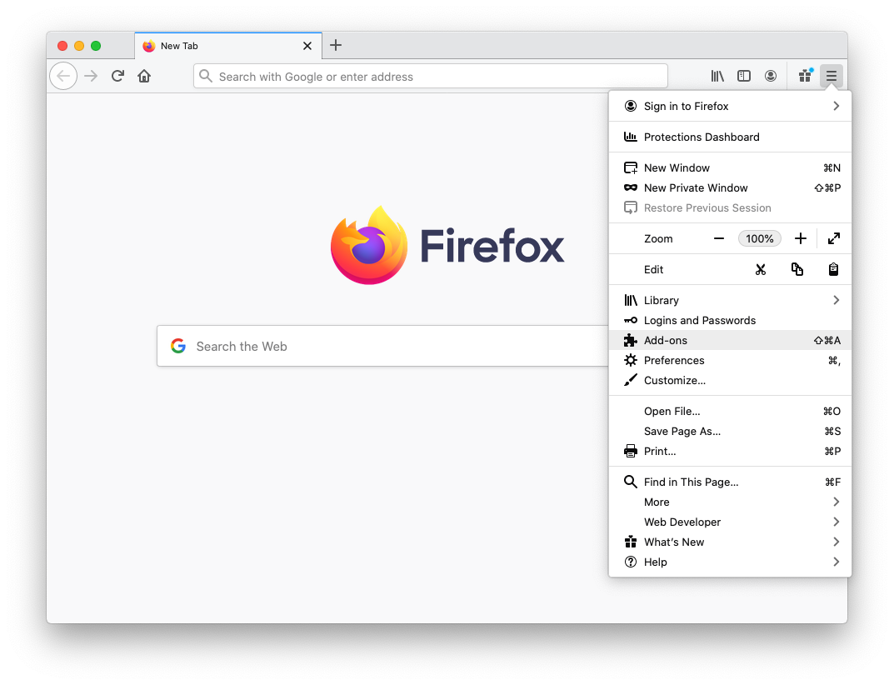
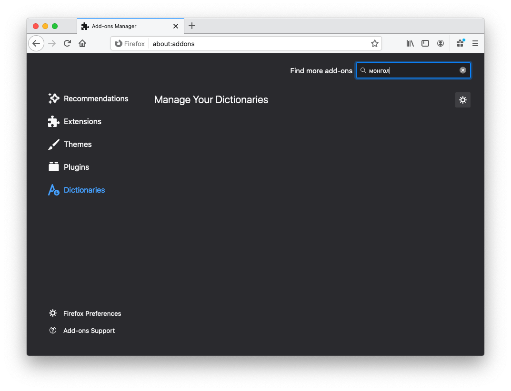
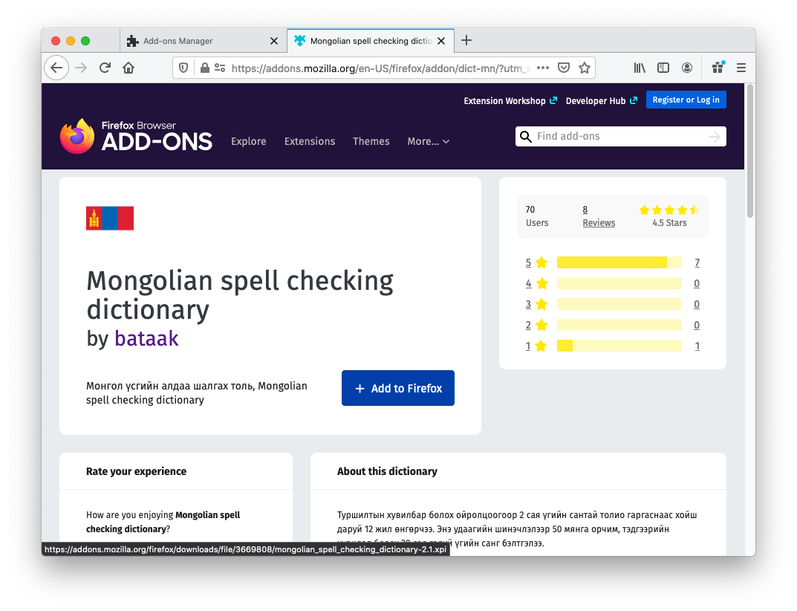
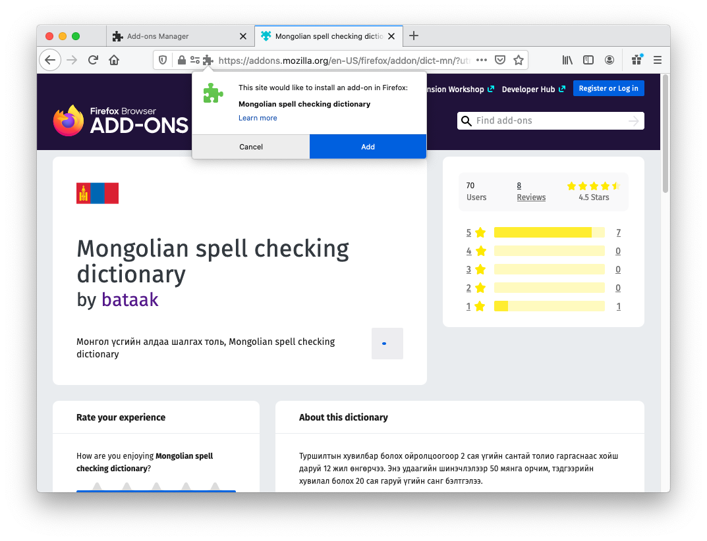

# Firefox дээр ашиглах

   <iframe src="https://www.youtube.com/embed/N-oRV9TlYrA" frameborder="0" allow="accelerometer; autoplay; clipboard-write; encrypted-media; gyroscope; picture-in-picture" allowfullscreen style="position: absolute; top: 0; left: 0; height: 100%; width: 100%;"></iframe>

Firefox интернет хөтчид монгол үгийн алдаа шалгагчийг дараах байдлаар идэвхжүүлнэ.

1. [firefox.com](https://firefox.com) хаягаар хандаж интернет хөтчөө татан авч суулгана.

1. Үүний дараа алдаа шалгах толио татаж авна. Ингэхдээ дараах 2 төрлийн аргын аль нэгийг ашиглаарай:
   1. [https://addons.mozilla.org/en-US/firefox/addon/dict-mn/](https://addons.mozilla.org/en-US/firefox/addon/dict-mn/) хаягаар хандах
   1. Эсвэл хөтчийнхөө `Add-ons` цэсийг сонгоод хайх талбарт `монгол` хэмээн бичиж хайгаарай\
   \
   

1. Ийнхүү нээгдэх хуудаснаас `+ Add to Firefox` гэсэн товчлуурыг дарж суулгах хүсэлт илгээнэ.\

1. Ингэхэд хөтчийн дээд талд гарч ирэх жижиг цонхноос `Add` гэсэн товчийг дарж суулгана.\

1. Ийнхүү ашиглахад бэлэн боллоо.\

1. Одоо бичих талбарт оруулсан бичвэрийн тань алдаа шалгагдах болно.\

