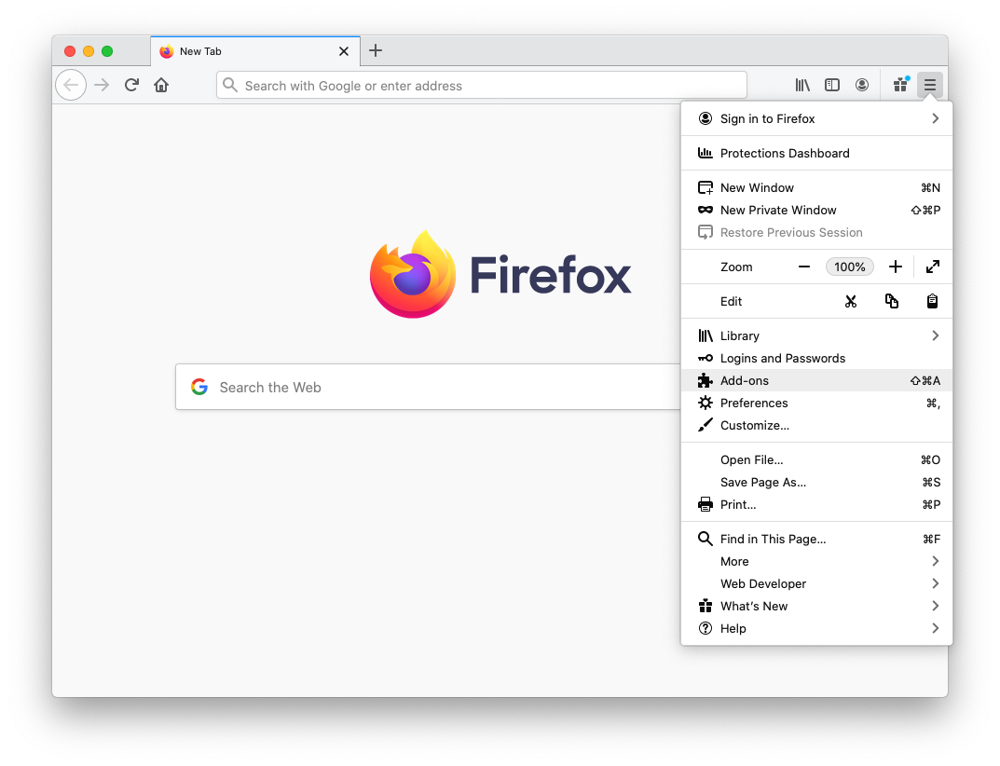
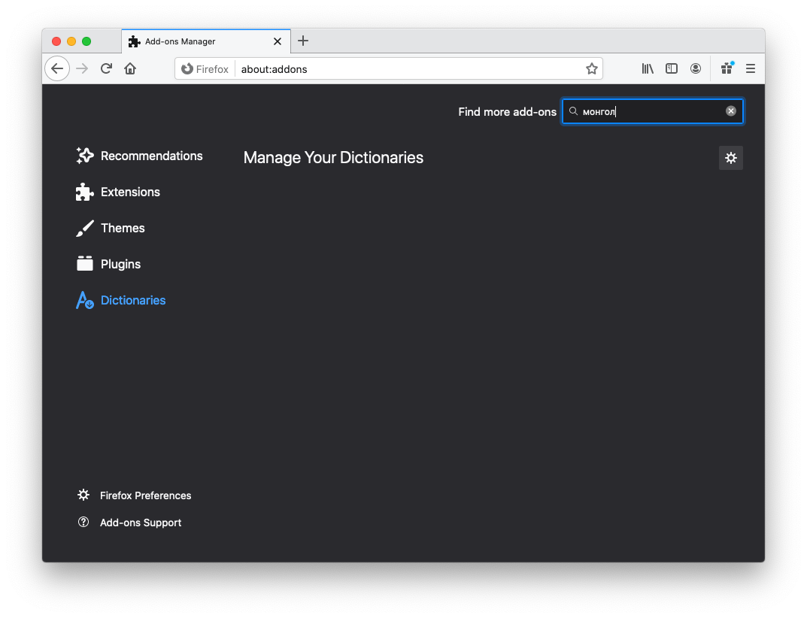
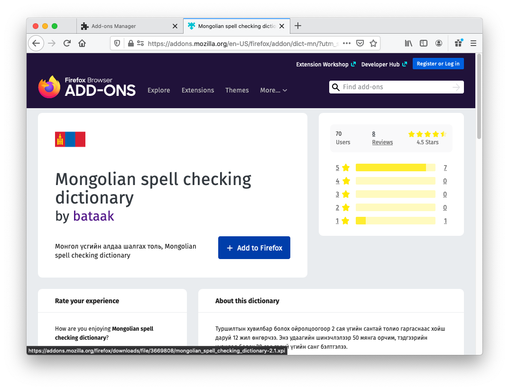
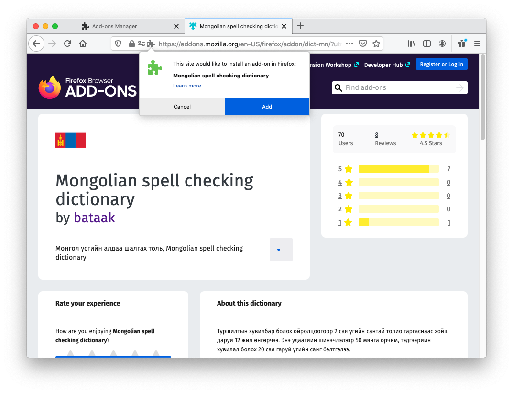
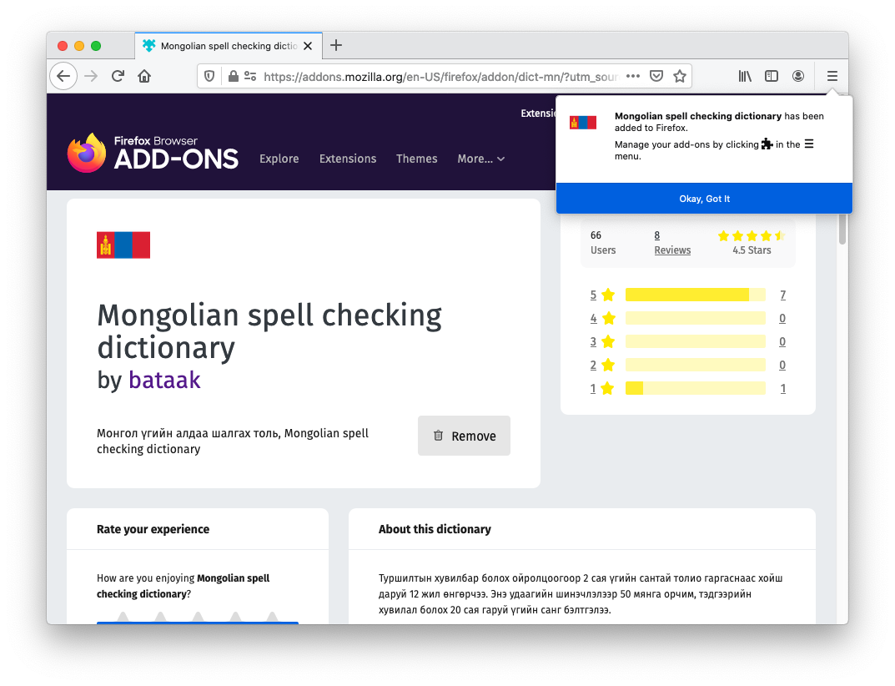
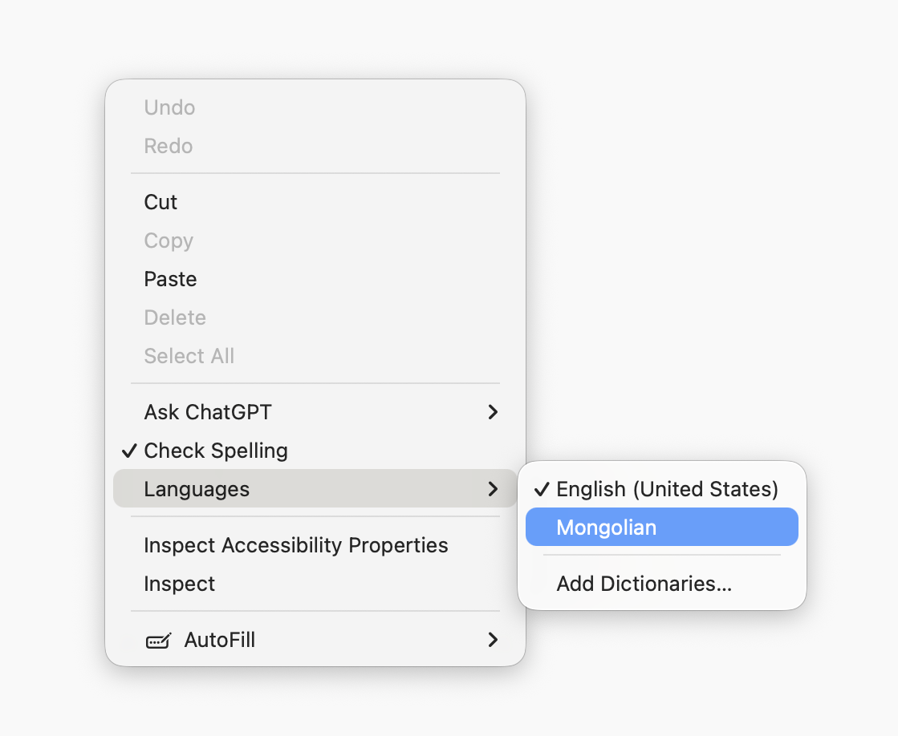
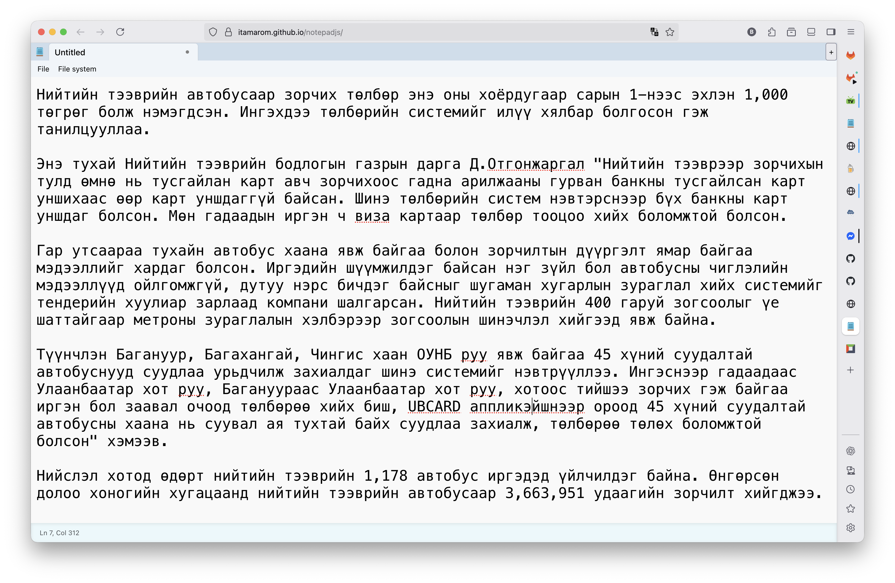

# Firefox дээр ашиглах

<div style="position: relative; width: 100%; padding-bottom: 56.25%;">
   <iframe src="https://www.youtube.com/embed/N-oRV9TlYrA" frameborder="0" allow="accelerometer; autoplay; clipboard-write; encrypted-media; gyroscope; picture-in-picture" allowfullscreen style="position: absolute; top: 0; left: 0; height: 100%; width: 100%; padding-bottom:20px;"></iframe>
</div>

`Firefox` программаа дараах хаягаар ороод татаж суулгаарай: <https://www.mozilla.org/en-US/firefox/new/>. Хэрэв `macOS` ашигладаг бол [Homebrew](https://brew.sh/) ашиглан суулгаж болно:
```
brew install --cask firefox
```

`Firefox интернет хөтчид монгол үгийн алдаа шалгагчийг дараах байдлаар идэвхжүүлнэ.
1. [firefox.com](https://firefox.com) хаягаар хандаж интернет хөтчөө татан авч суулгана.
1. Үүний дараа алдаа шалгах толио татаж авна. Ингэхдээ дараах 2 төрлийн аргын аль нэгийг ашиглаарай:
   1. [https://addons.mozilla.org/en-US/firefox/addon/dict-mn/](https://addons.mozilla.org/en-US/firefox/addon/dict-mn/) хаягаар хандах
   1. Эсвэл хөтчийнхөө `Add-ons` цэсийг сонгоод хайх талбарт `монгол` хэмээн бичиж хайгаарай\
   \
   
1. Ийнхүү нээгдэх хуудаснаас `+ Add to Firefox` гэсэн товчлуурыг дарж суулгах хүсэлт илгээнэ.\

1. Ингэхэд хөтчийн дээд талд гарч ирэх жижиг цонхноос `Add` гэсэн товчийг дарж суулгана.\

1. Ийнхүү ашиглахад бэлэн боллоо.\

1. Одоо [бичих талбарыг](https://itamarom.github.io/notepadjs/) нээж, хулганын баруун товчоор `Languages > Mongolian` хэмээн сонгож монгол хэлийг идэвхжүүлье.\

1. Ийнхүү оруулсан бичвэрийн тань алдаа шалгагдах болно.\


Бэлэн текст талбар ашиглан бичвэрийн алдааг шалгахыг хүсвэл [buruu.bichig.dev](https://buruu.bichig.dev/) вебт эсвэл [Notepadjs](https://itamarom.github.io/notepadjs/) эсвэл [Notepad PWA](https://notepad.js.org/) хандаарай.

# Firefox дээр Notepad ашиглах

<div style="position: relative; width: 100%; padding-bottom: 56.25%;">
   <iframe src="https://www.youtube.com/embed/uT83nLIW3Ds?si=wfG_80v_CeaBmaus" frameborder="0" allow="accelerometer; autoplay; clipboard-write; encrypted-media; gyroscope; picture-in-picture" allowfullscreen style="position: absolute; top: 0; left: 0; height: 100%; width: 100%; padding-bottom:20px;"></iframe>
</div>

`Firefox` программ дээр Notepad app ашиглахын тулд монгол үгийн алдаа шалгах толь суулгасан байх шаардлагатай. Хэрхэн суулгах зааврыг [эндээс](https://zuv.bichig.dev/firefox/) авна уу.

[Notepad веб ап](https://notepad.js.org/) ашиглахын давуу тал:
- Бичвэрийг олон хэл дээр зэрэг шалгах боломжтой.
- Компьютер дээрээ программ татаж суулгах шаардлагагүй
- Веб хөтөч уруу орж Notepad веб ап хаягаар дуудах шаардлагагүй

