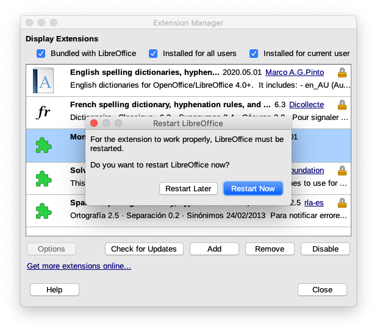
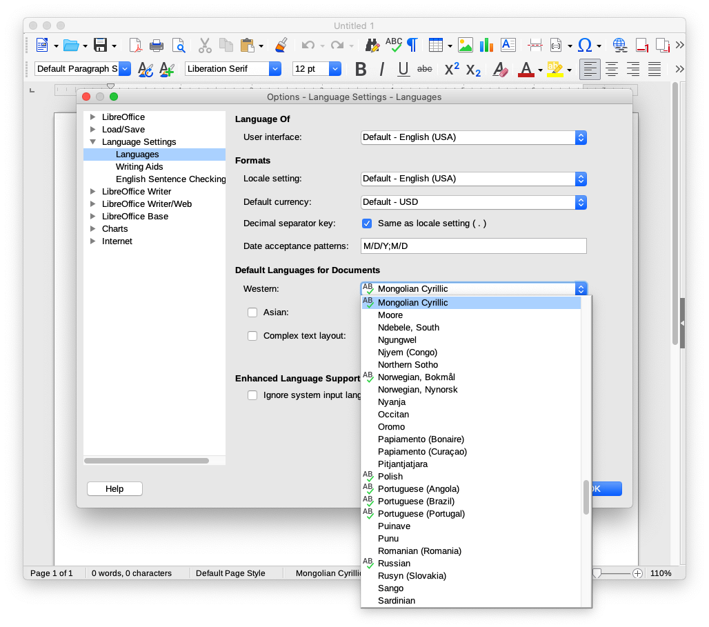
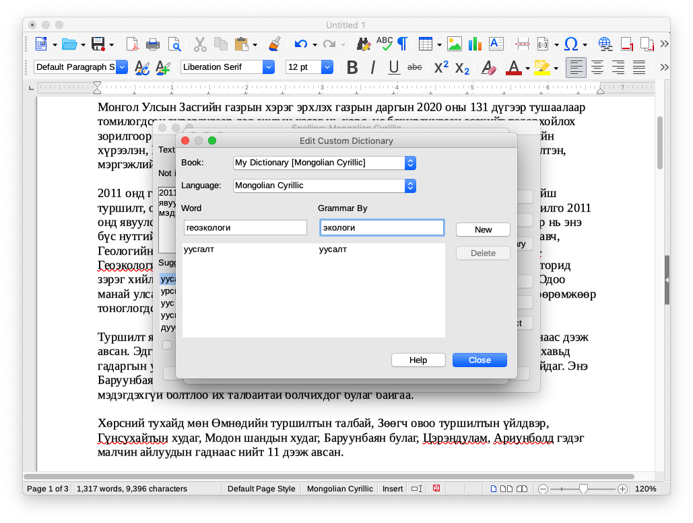

# LibreOffice дээр ашиглах

<div style="position: relative; width: 100%; padding-bottom: 56.25%;">
   <iframe src="https://www.youtube.com/embed/JVSwADALGZA" frameborder="0" allow="accelerometer; autoplay; clipboard-write; encrypted-media; gyroscope; picture-in-picture" allowfullscreen style="position: absolute; top: 0; left: 0; height: 100%; width: 100%; padding-bottom:20px;"></iframe>
</div>

Бичиг баримт боловсруулагч программд монгол үгийн алдаа шалгахын тулд дараах зааврыг дагаарай.
1. [https://www.libreoffice.org](https://www.libreoffice.org/download/) хаяг уруу орж программаа татаж авч суулгана. Хэрэв `macOS` ашигладаг бол [Homebrew](https://brew.sh/) ашиглан суулгаж болно:
```
brew install --cask libreoffice
```
1. Үүний дараа [dict-mn.oxt](https://extensions.libreoffice.org/en/extensions/show/1980) файлаа татаж авна. Эсвэл 
   1. LibreOffice анх нээгдэх үеийн цонхны зүүн доод буланд байх `Extensions` товчийг сонгоод (5-р алхамд үзүүлсэн зураг)
   1. нээгдэх хуудаснаас `mongolian` хэмээн хайж толио татаж авна.
1. Татаж авсан файлаа ажиллуулж, суулгана.\


1. Суулгасны дараа `Close` товчийг дараад `Restart Now` товчийг бас дарж программаа дахин эхлүүлээрэй.\

1. Ийнхүү программ дахин нээгдэх үед `Writer Document` товчийг сонгоно\

1. Монгол үгийн алдаа шалгагчийг үндсэн шалгагч болгохын тулд
   1. `LibreOffice > Preferences...` (macOS) эсвэл `Tools > Options...` (Windows) цэсийг сонгоод 
   1. Доорх зурагт үзүүлсэнчлэн `Language Settings > Languages` гэж ороод 
   1. `Default Languages for Documents` дотор `Western: Mongolian Cyrillic` гэж сонгоод 
   1. `OK` товчийг дарна\

1. Ийнхүү ашиглахад бэлэн боллоо.

## Толинд шинэ үг нэмэх

LibreOffice 6.0 хувилбараас эхлэн хэрэглэгч толинд шинэ үндэс үгийг хувиллын хамтаар оруулах боломжтой болсон юм. Үүнийг хэрхэн хийхийг үзүүлье.
1. Алдаатай үг дээр хулганынхаа баруун товчийг дарж жижиг цонхыг нээнэ. Уг жижиг цонхноос `Spelling...` гэдгийг сонгоно.\

1. Улмаар нээгдэх жижиг цонхноос `Options...` товчийг дарж дахин жижиг цонх нээнэ\

1. Одоо `New` товчийг дарж шинэ толь үүсгэнэ\

1. `Name` гэдэгт дурын нэр өгнө, `Language` гэдэгт `Mongolian Cyrillic` гэж сонгоод `OK` товч дараад сая үүсгэсэн толио `Edit` хийнэ\

1. Нээгдэх цонхны `Word` нүдэнд оруулахыг хүссэн үгийн үндсийг (хэрэв үйл үг бол үйлт нэрийн "х"-гүй төлөвийг оруулна: `оруул`, ~~`оруулах`~~, `оруулчих`), `Grammar By` нүдэнд толинд буй гэхдээ оруулах үгтэй хувилал төстэй үгийг бичнэ\

1. Дээрх жишээнд `уусгалт` нь `уусалт`, `геоэкологи` нь `экологи` хэмээх үгүүдтэй хувиллын хувьд дүйх юм. Ийнхүү `уусгалт` гэсэн үгийн бүх хувиллууд (`уусгалтын`, `уусгалтыг`, `уусгалтад`, ...) толинд орлоо.
