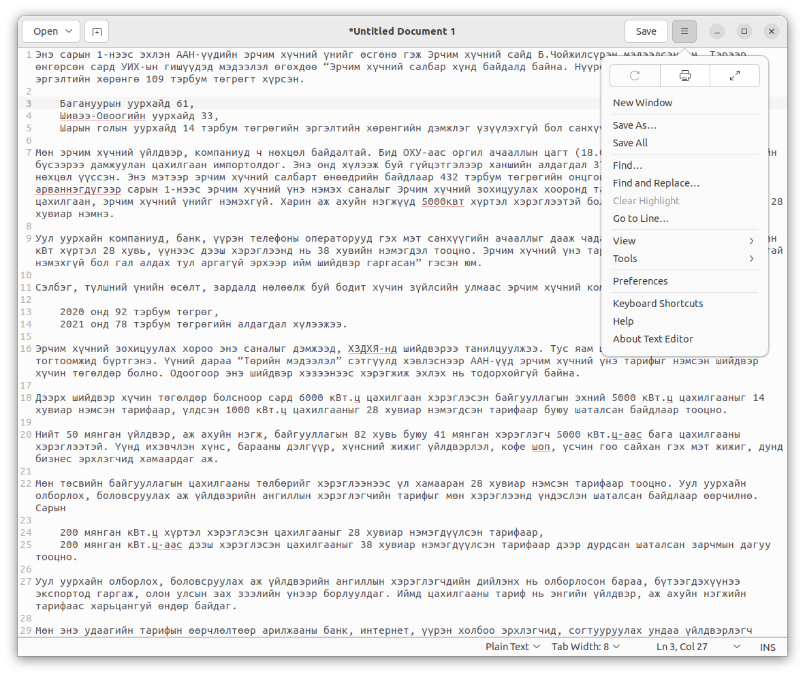
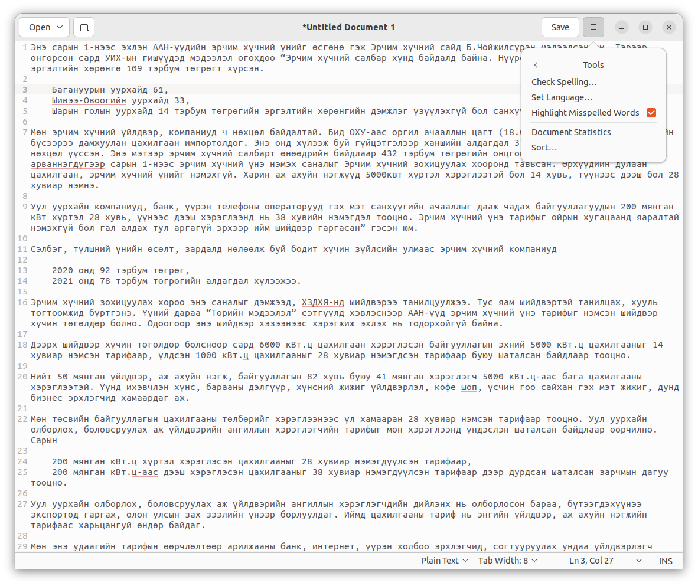
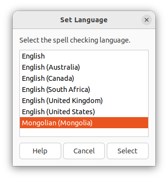
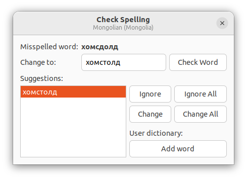
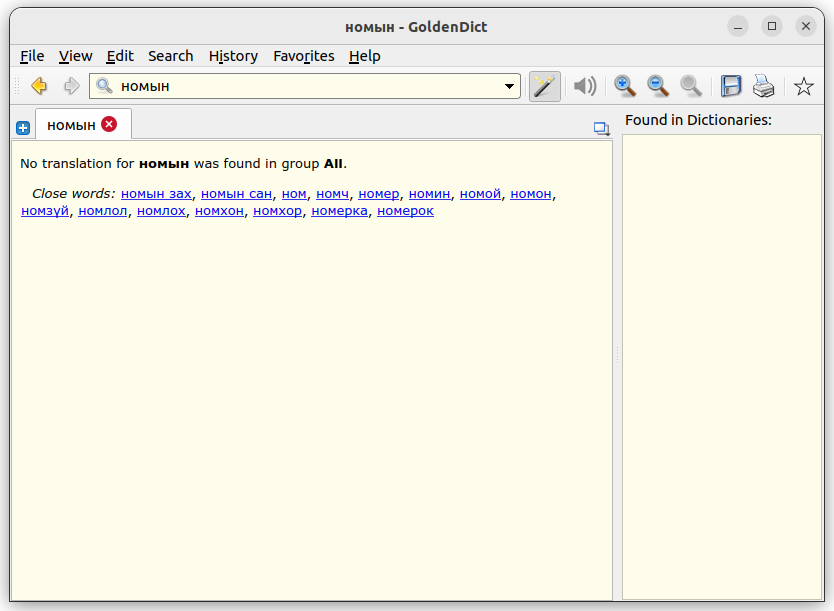
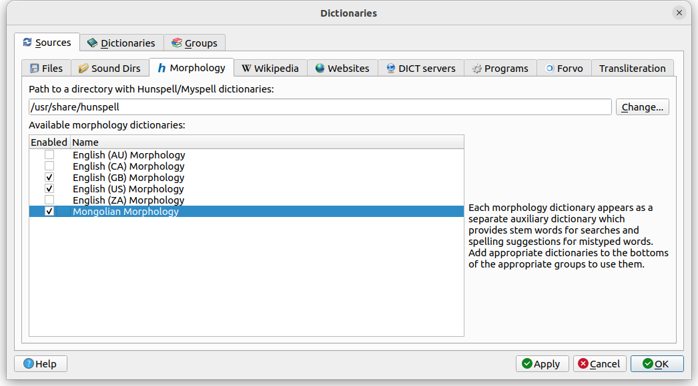

# Linux дээр ашиглах

`Linux` дээр монгол үгийн алдаа шалгах толийг суулгаж ашиглахын тулд дараах командыг terminal дээр оруулна:
```
sudo apt install hunspell
```
хэрэв таны системд монгол хэл, эсвэл монгол гарын драйвер суусан бол монгол үгийн алдаа шалгах толь сууна. Эсрэг тохиолдолд дараах командыг ашиглана:
```
sudo apt install hunspell-mn
```
Ийнхүү монгол үгийн алдаа шалгах толийг Linux системд ашиглахад бэлэн боллоо. Одоо gedit, goldendict, sublime text дээр хэрхэн ашиглахыг үзүүлье.

1. Gedit программ дээр ашиглахын тулд программаа нээгээд `Tools > Set Language... > Mongolian` гэсэн тохиргоог хийнэ.
\
\
\
Ийнхүү ашиглахад бэлэн боллоо.
\
Хэрэв `Tools > Spelling...` гэвэл дараах цонх гарч ирнэ:\


1. Goldendict программаа дараах командаар суулгана:
```
sudo apt install -y goldendict
```
Goldendict dictionary программ дээр монгол үгийн алдаа шалгах толийг ашиглахын давуу тал гэвэл ялангуяа монгол толинууд (монгол-англи, монгол-монгол) дээр тухайн үгийг зөв хувилсан хэлбэрээр хайхад илэрц гарах юм. Жишээлбэл: `улирлын` хэмээн хайхад `улирал` гэсэн үг олдох юм. Хэрэв дээрх тохиргоог хийгээгүй тохиолдолд илэрц олдохгүй юм.
\
Тохиргоог хийхийн тулд `Edit > Dictionaries > Sources > Morphology` гэж ороод Hunspell суусан замыг зааж өгөхөд ашиглах боломжтой толинууд жагсаалтаар харагдах бөгөөд толио сонгож идэвжхүүлнэ.
\
\

1. Хэрэв Sublime Text программ [суулгасан бол](https://www.sublimetext.com/docs/linux_repositories.html) `View > Dictionary > System > mn_MN` гэж сонгоно.
