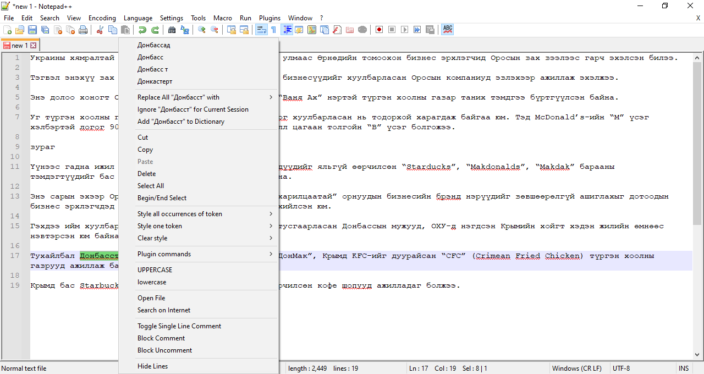

# Notepad++ дээр ашиглах

   <iframe src="https://www.youtube.com/embed/WOzuFxhtLMk" frameborder="0" allow="accelerometer; autoplay; clipboard-write; encrypted-media; gyroscope; picture-in-picture" allowfullscreen style="position: absolute; top: 0; left: 0; height: 100%; width: 100%; padding-bottom:20px;"></iframe>

1. [Notepad++](https://notepad-plus-plus.org/) программаа татан авч суулгана.
1. Улмаар `Plugins > Plugins Admin` гэж ороод `Hunspell` гэж хайна.
1. Ингэхэд гарч ирэх цонхноос `DSpellCheck` багцыг сонгож суулгана.
1. Ийнхүү суулгасны дараа `Plugins > DSpellCheck > Settings...` гэж ороод `Download...` товчийг дармагц нээгдэх цонхноос `Mongolian` гэдгийг сонгож `Install Selected` товчийг дарж монгол толио суулгана.
1. Ийнхүү ашиглахад бэлэн боллоо.

