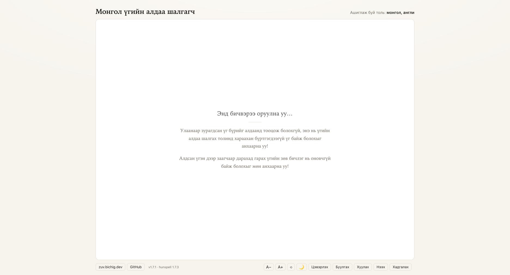
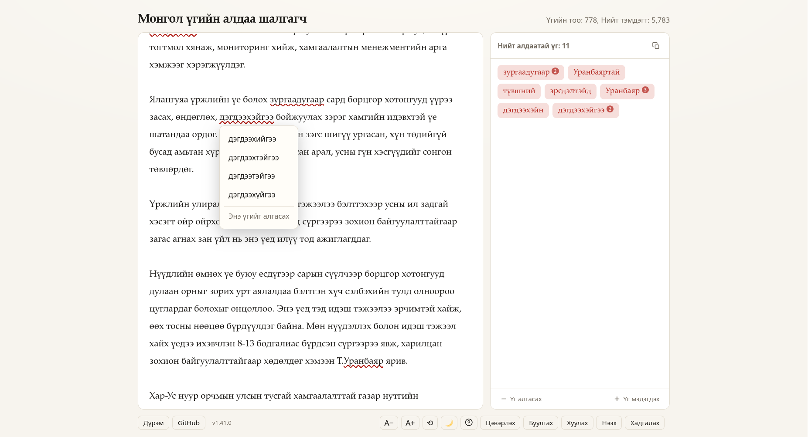
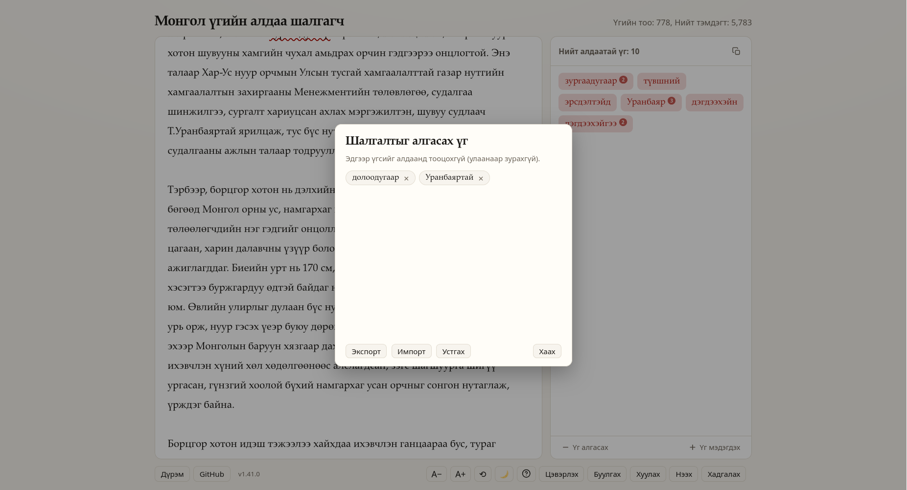
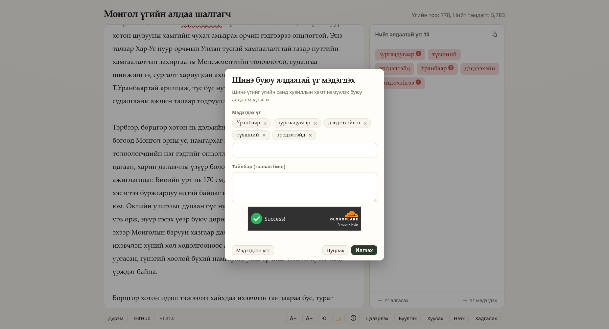
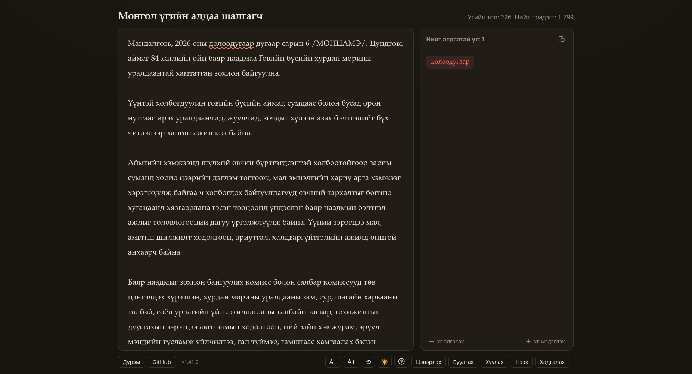
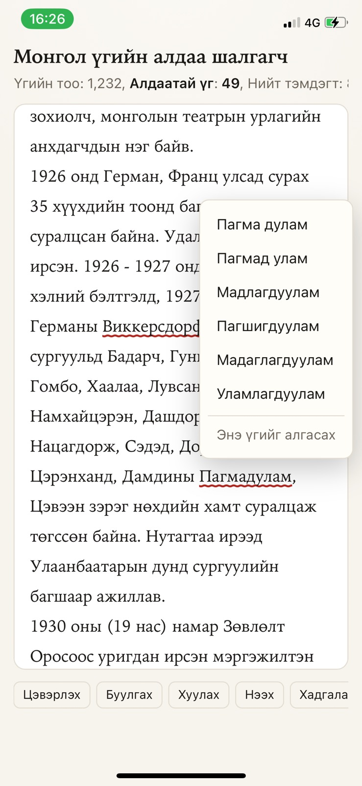
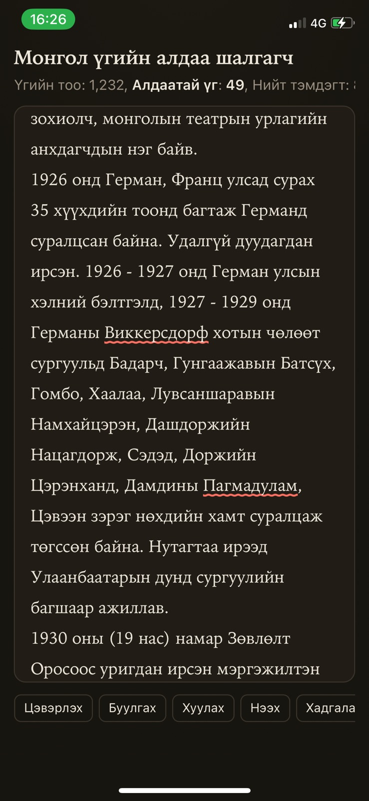

# Онлайн ап ашиглах

{: width="48%" } {: width="48%" }

1. [aldaa.bichig.dev](https://aldaa.bichig.dev/) веб ап уруугаа орж ашиглана.
1. Энэхүү веб ап нь офлайн горимоор буюу таны интернет хөтөч дотор ажилладаг тул гуравдагч сервер уруу мэдээлэл дамжуулахгүй. 
1. Гар утас болон дурын интернет хөтөч ашиглан бичвэрийн үгийн алдааг хянах боломжтой.
1. Гар утасны ап болгон ашиглах боломжтой.
1. Десктоп апликейшн болгон ашиглах боломжтой.

## Шинэ буюу алдаатай үг илгээх

`Үг мэдэгдэх` товчлуурын тусламжтайгаар алдаатай үгийг [github.com/bataak/dict-mn/issues](https://github.com/bataak/dict-mn/issues) хаяг уруу илгээнэ.
`Үг мэдэгдэх` товчлуурыг дараах тохиолдлуудад ашиглах хэрэгтэй:
- Алдаатай бичигдсэн үгийн зөв бичлэг гарахгүй байх
- Гадаад болон зарим цөөн монгол үгийг алдаанд тооцох
- Зарим үг үгийн санд буруу бичигдэх
- Зарим үгийн хувилал буруу байх

## Үгийг шалгуулахаас зайлсхийх

`Үг алгасах` товчлуурын тусламжтайгаар тухайн үгийн алдааг шалгуулахаас зайлсхийх нь бусад алдаатай үгийг ялган харахад туслах зорилготой байдаг. 
Тэгвэл дараах тохиолдолд `Үг алгасах` товчлуурыг ашиглах хэрэгтэй: 
- Хүний нэр
- Мэргэжлийн үг (хойшдоо энэ үг байнга ашиглагдана гэж үзвэл `Үг мэдэгдэх` товчлуураар тухайн үгийг үгийн санд нэмүүлэхийг зөвлөж байна)
- Алдаа шалгагчаас өөрөөр бичихийг эрхэмлэх, жишээлбэл: гариг гэсэн үгийг гараг хэмээн бичих, төвшин гэдэг үгийг түвшин хэмээн бичих, уруу гэдэг дагавар үгийг руу, рүү, луу, лүү хэмээн бичих бол

Түүнчлэн, шалгалтаас зайлсхийсэн үгийн жагсаалтыг, `Үг алгасах` товчлуурыг дарахад нээгдэх цонхонд байх `Экспорт` товчлуурын тусламжтайгаар `*.txt` файл болгон авч болох бөгөөд ингэснээр өөр компьютер дээр тухайн файлаа `Импорт` товчлуураар эгүүлэн ашиглах боломжтой.

## Хялбар ашиглах зөвлөгөө

Компьютер дээр дараах товчлуурын хослолыг ашиглаж болно:
1. Windows болон Linux үйлдлийн системийн хувьд:
   1. Хуулах үйлдэл: `ctrl + c`
   1. Алдаатай үгсийг хуулах үйлдэл: `ctrl + e`
   1. Алдаатай үгсийг гар утсан дээр хуулах үйлдэл: `Хуулах` товчлуурыг удаан дарна
   1. Буулгах үйлдэл: `ctrl + v` Жич: зарим хөтчүүд аюулгүй байдлын үүднээс зарим тохиолдолд `ctrl + v` товчлуурын ажиллагааг хориглодог гэдгийг санах хэрэгтэй.
   1. Талбар цэвэрлэх үйлдэл: `ctrl + shift + backspace`
   1. Файл нээх: файлаа шууд зөөж тавьж болно эсвэл `ctrl + o` дарж зам зааж өгнө.
   1. Бичвэрийг хадгалах: `ctrl + s`
   1. Үсгийн хэмжээг томруулах: `ctrl + +`
   1. Үсгийн хэмжээг жижгэрүүлэх: `ctrl + -`
   1. Үсгийн хэмжээг анхны төлөвт шилжүүлэх: `ctrl + 0`
   1. Талбарыг бараан эсвэл цайвар болгох: `ctrl + shift + d`
1. macOS үйлдлийн системийн хувьд дээрх бүх товчлуурын хослолын `ctrl` товчийг `cmd (⌘)` товчоор сольж ашиглана.
1. Хэрэв урт бичвэрийг засах үед мөрийн заагчийн байрлал нь системд хадгалагддаг тул бичвэрийн аль хэсэгт түр завсарласнаа заагчаар баримжаалах боломжтой. Хэрэв заагчийн байрлал харагдахгүй болбол десктоп хувилбарын хувьд Алдаатай үгсийн самбарт хулганаар дарж, заагчийг харж болно.
1. Апыг хаагаад эргэн нээхэд бичвэр болон заагчийн байрлал хадгалагддаг.
1. Улаанаар зурагдсан үгийн зөв бичлэгийг харахдаа уг үг дээр дарахад хангалттай. Бичвэрийг дээш буюу доош гүйлгэхэд уг зөв бичлэгийн жагсаалт хаагдана. Десктоп хувилбарын хувьд Алдаатай үгийн самбарт гарах үг дээр мөн дарж болно.
1. Уг ап нь гар утас болон десктоп горимд веб болон ап байдлаар ашиглагдах боломжтой бөгөөд нэгэнт суулгасан тохиолдолд заавал интернет шаардахгүйгээр ажиллах боломжтой.

Монгол үгийн алдаа шалгах веб апыг ашиглах заавар

   <iframe src="https://www.youtube.com/embed/8livrp7NU8M" frameborder="0" allow="accelerometer; autoplay; clipboard-write; encrypted-media; gyroscope; picture-in-picture" allowfullscreen style="position: absolute; top: 0; left: 0; height: 100%; width: 100%; padding-bottom:20px;"></iframe>

Гар утсан дээр ап болгон ашиглах заавар

   <iframe src="https://www.youtube.com/embed/t76Y5oO9_QE" frameborder="0" allow="accelerometer; autoplay; clipboard-write; encrypted-media; gyroscope; picture-in-picture" allowfullscreen style="position: absolute; top: 0; left: 0; height: 100%; width: 100%; padding-bottom:20px;"></iframe>

