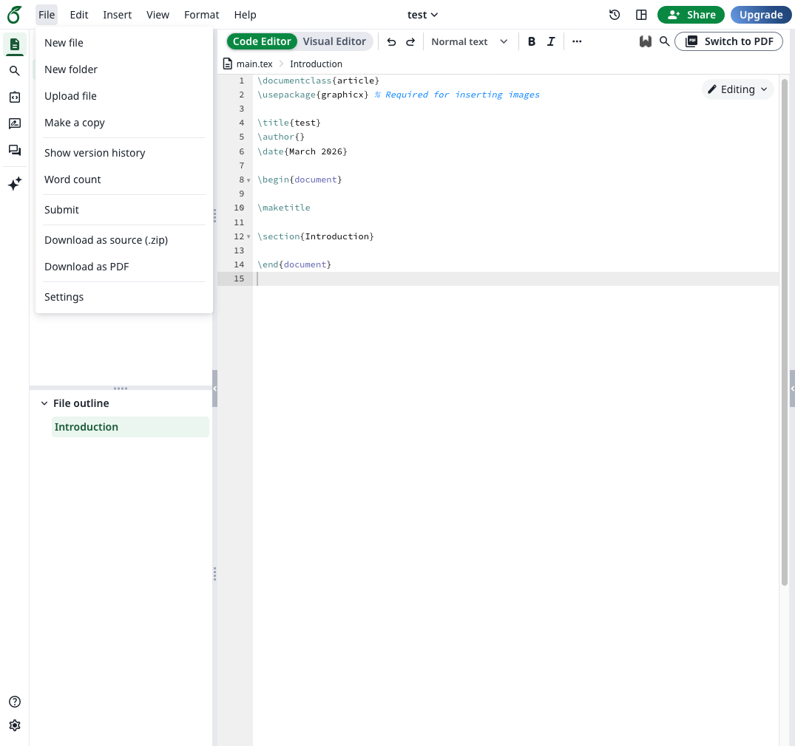
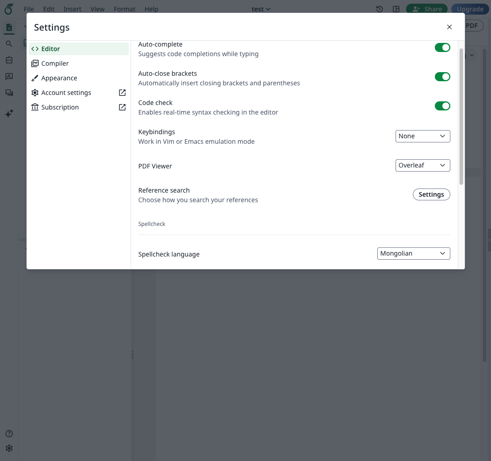

# Overleaf дээр ашиглах

LaTeX файлын онлайн засварлагч болох [Overleaf](https://www.overleaf.com/) дээр монгол үгийн алдаа шалгах толийг ашиглахын тулд `File > Settings > Editor` гэж ороод, `Spellcheck language` гэдгийг `Mongolian` болгоно.

\

