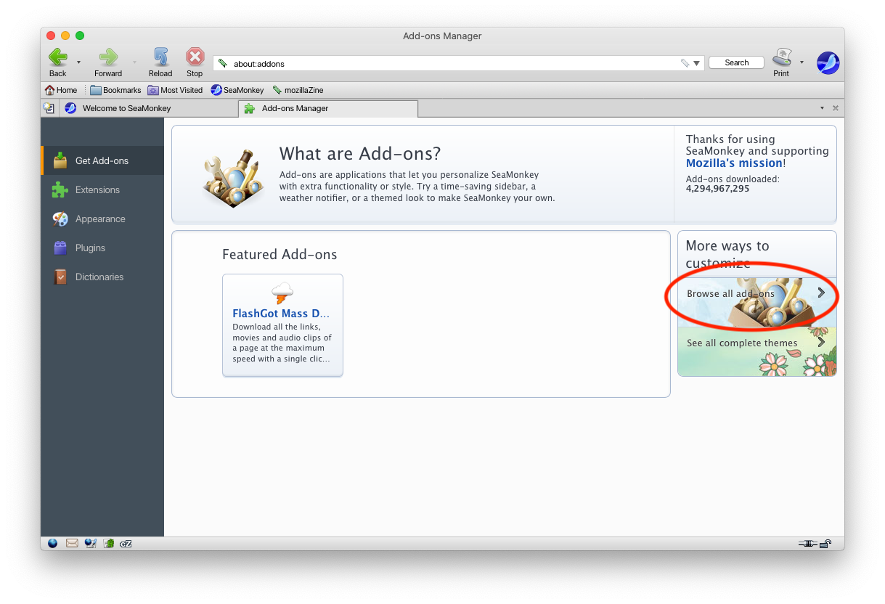

# SeaMonkey дээр ашиглах

1. Программаа нээж, `Tools > Add-ons Manager` гэж орно.
1. Улмаар `Get Add-ons` гэж ороод баруун талд байрлах `Browse all add-ons >` гэсэн товчийг дарна.

1. Гарч ирэх цонхны хайлтын талбарт `mongolian` хэмээн бичихэд санал болгох `Mongolian Spellchecking Dictionary` гэснийг сонгоно.
1. Ийнхүү `Add to SeaMonkey` товчийг дарна.
1. Улмаар гарч ирэх цонхноос `Install Now` товчийг дарж толио суулгана.
1. Бичих талбарт хулганынхаа баруун товчийг дарж `Languages > Mongolian` хэмээн сонгоно.
1. Ийнхүү ашиглахад бэлэн боллоо.
