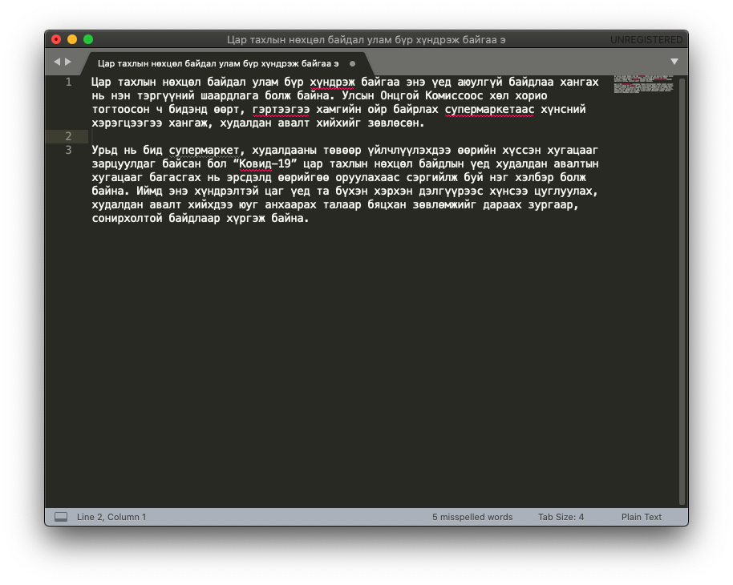

# Sublime Text дээр ашиглах

<div style="position: relative; width: 100%; padding-bottom: 56.25%;">
   <iframe src="https://www.youtube.com/embed/ruZJcOqcEmc" frameborder="0" allow="accelerometer; autoplay; clipboard-write; encrypted-media; gyroscope; picture-in-picture" allowfullscreen style="position: absolute; top: 0; left: 0; height: 100%; width: 100%; padding-bottom:20px;"></iframe>
</div>

1. [Sublime Text](https://www.sublimetext.com/) татан авч суулгана. Хэрэв `macOS` ашигладаг бол [Homebrew](https://brew.sh/) ашиглан суулгаж болно:

```
brew install --cask sublime-text
```

1. `Preferences > Package Control` гэж ороод `Package Control: Install Package` гэж сонгоно.
1. Улмаар гарч ирэх цонхонд `mongolian` гэж хайгаад `Language - Mongolian` багцыг сонгоно.
1. `Sublime Text` программын баруун доод хэсэгт суулгаж буй мэдээлэл гарах бөгөөд монгол хэлний багцыг суулгаж дуусмагц
1. `View > Spell Check` гэдгийг идэвхжүүлнэ.
1. `View > Dictionary > Language - Mongolian > mn_MN` гэдгийг сонгоно.
1. Ийнхүү ашиглахад бэлэн боллоо.



1. Хэрэв англи, монгол толиудыг зэрэг ашиглах бол  `Preferences > Settings` дотор дараах мөрийг оруулна:

```
"dictionary": ["Packages/Language - Mongolian/mn_MN.dic", "Packages/Language - English/en_GB.dic", "Packages/Language - English/en_US.dic"],
```

Хэрэв Windows үйлдлийн системд суулгах бол дараах заавартай танилцана уу!

<div style="position: relative; width: 100%; padding-bottom: 56.25%;">
   <iframe src="https://www.youtube.com/embed/FmC1Mg07TXU" frameborder="0" allow="accelerometer; autoplay; clipboard-write; encrypted-media; gyroscope; picture-in-picture" allowfullscreen style="position: absolute; top: 0; left: 0; height: 100%; width: 100%; padding-bottom:20px;"></iframe>
</div>
