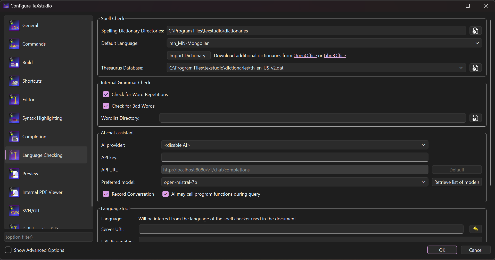
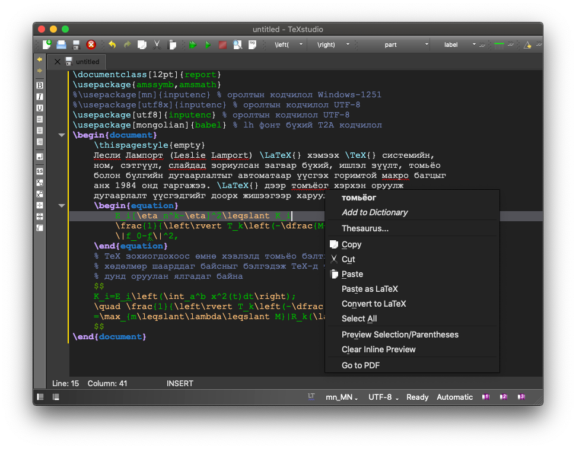

# TeXstudio дээр ашиглах

<div style="position: relative; width: 100%; padding-bottom: 56.25%;">
   <iframe src="https://www.youtube.com/embed/KeHBPeH9s88" frameborder="0" allow="accelerometer; autoplay; clipboard-write; encrypted-media; gyroscope; picture-in-picture" allowfullscreen style="position: absolute; top: 0; left: 0; height: 100%; width: 100%; padding-bottom:20px;"></iframe>
</div>

1. [TeXstudio](https://www.texstudio.org/) программаа татаж аваад суулгана. Хэрэв `macOS` ашигладаг бол [Homebrew](https://brew.sh/) ашиглан суулгаж болно:
```
brew install --cask texstudio
```
1. TeXstudio 4.9.5 хувилбараас эхлэн (2026-06-06) монгол үгийн алдаа шалгах толь албан ёсоор дэмжигдэж эхэлсэн тул толь татаж авч тохируулах шаардлагагүй болсон.
1. Программаа нээгээд `Preferences... > Language Checking` (macOS) эсвэл `Options > Configure TeXstudio > Language Checking` (Windows) гэж ороод
1. `Default Language` гэдэгт `mn_MN-Mongolian` гэдгийг сонгож өгнө.\

1. Ийнхүү ашиглахад бэлэн болов.\

