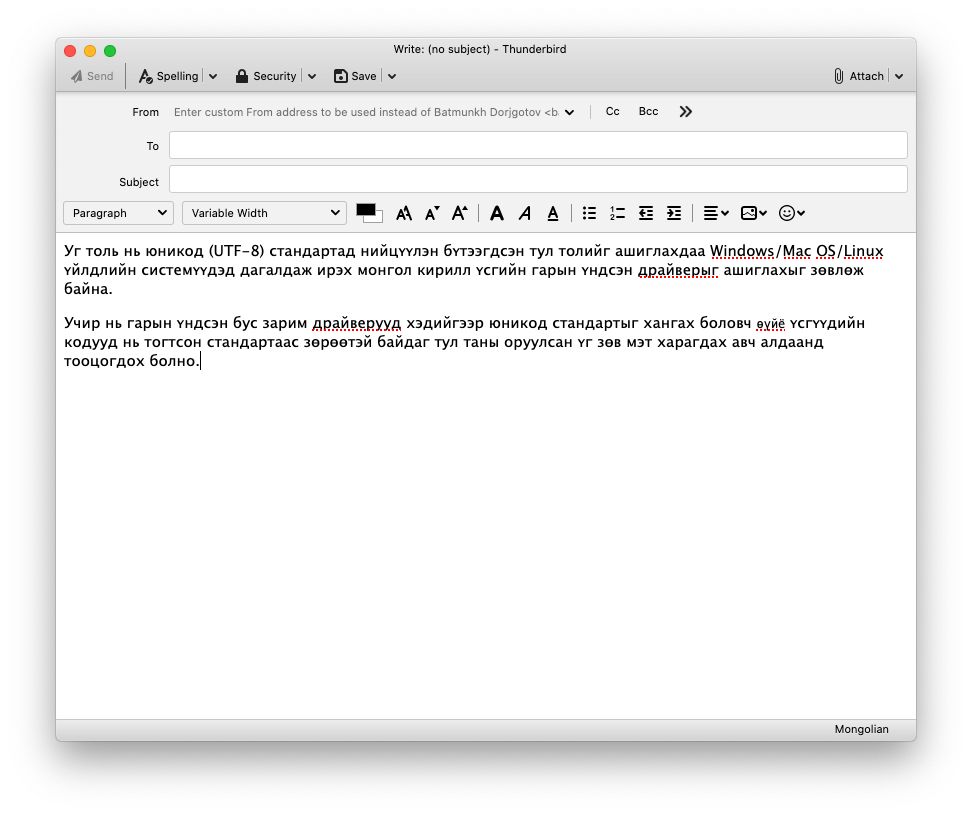

# Thunderbird дээр ашиглах

1. Ихэнх `Linux` системүүдэд [Thunderbird](https://www.thunderbird.net/) дагалдаж суусан байдаг. Хэрэв `macOS` ашигладаг бол [Homebrew](https://brew.sh/) ашиглан суулгаж болно:
```
brew install --cask thunderbird
```
1. Программаа нээж, `Tools > Add-ons` гэж ороод хайх талбарт `mongolian` хэмээн хайна.
1. Хайлтад гарч ирэх `Mongolian Spellchecking Dictionary` гэдгийн хажууд байрлах `Add to Thunderbird` товчийг дарна.
1. Улмаар баруун дээд буланд гарч ирэх цонхноос `Add` товчийг дарж толио суулгана.
1. Захидал бичих талбарт хулганынхаа баруун товчийг дарж `Languages > Mongolian` хэмээн сонгоно.
1. Ийнхүү ашиглахад бэлэн боллоо.


