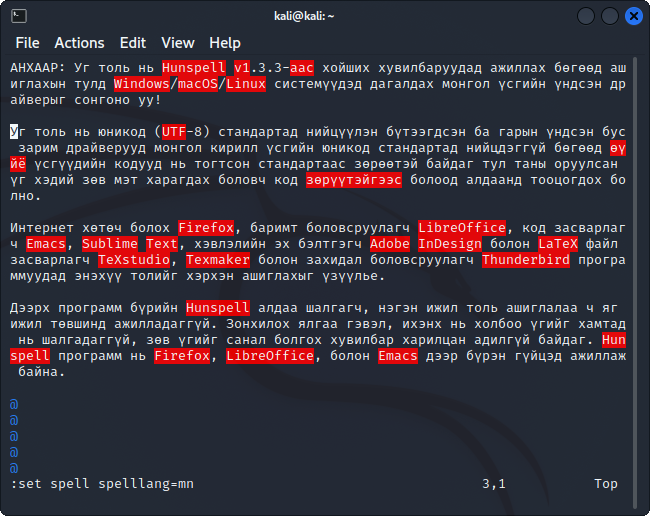
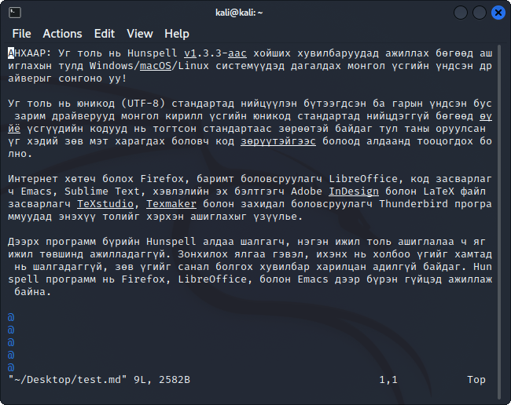

# Vim дээр ашиглах

[Vim](https://en.wikipedia.org/wiki/Vim_(text_editor)) ашиглахын давуу тал гэвэл [Windows OS](https://www.vim.org/download.php) системээс бусад системд дагалдаж ирэх тул ихэнх тохиолдолд суулгах шаардлагагүй байдаг.

1. Толио [эндээс](https://github.com/bataak/dict-mn/raw/main/package%20-%20Vim/mn.utf-8.spl) татаж авна.
1. Татаж авсан толио `~/.vim/spell/` хавтсанд хуулна.
1. Ийнхүү ашиглахын тулд `command-line mode` дээр `:set spell spelllang=mn` гэсэн команд бичнэ. Ингэхэд алдаатай үгийг улаанаар тэмдэглэнэ. Алдаатай үгийн зөв хувилбарыг `z=` командаар харж, зохих үгийг дугаараар сонгоно. Харин алдаатай үгс хооронд шилжихдээ `]s, [s`, шинэ үг нэмэхдээ `zg` командыг тус тус ашиглана. Алдаа шалгахыг зогсоохдоо `:set nospell` гэсэн командыг ашиглана. Дэлгэрэнгүй мэдээллийг `:help spell` командаар аваарай.\

1. Хэрэв текст файл нээх бүрд үгийн алдааг англи болон монголоор шалгахдаа алдаатай үгийн доогуур зурдаг болгоё гэвэл дараах тохиргоог `~/.vimrc` файлд бичиж өгнө:
```vimscript
autocmd BufRead,BufEnter *.md,*.tex,*.txt,*.org setlocal spell spelllang=mn,en
hi clear SpellBad
hi SpellBad cterm=underline
```

