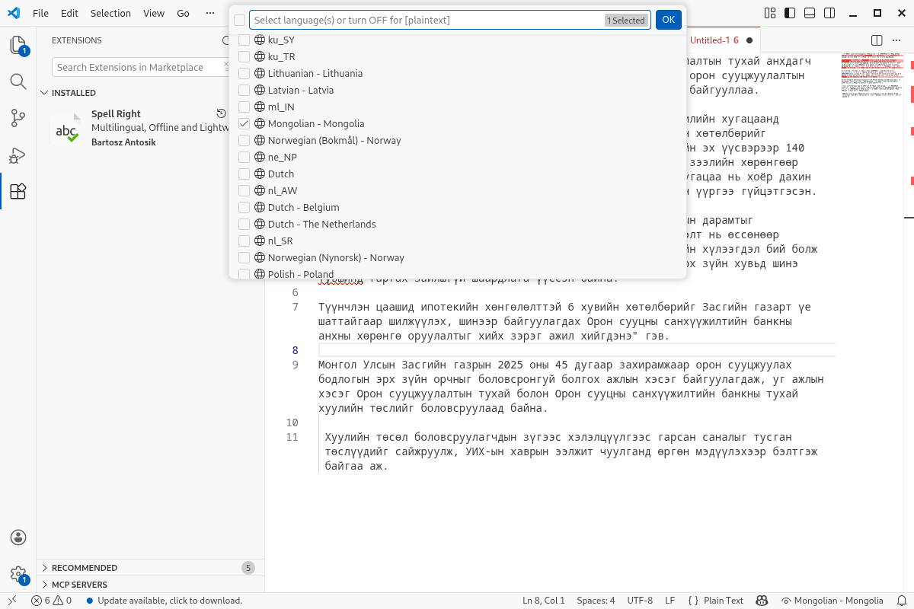
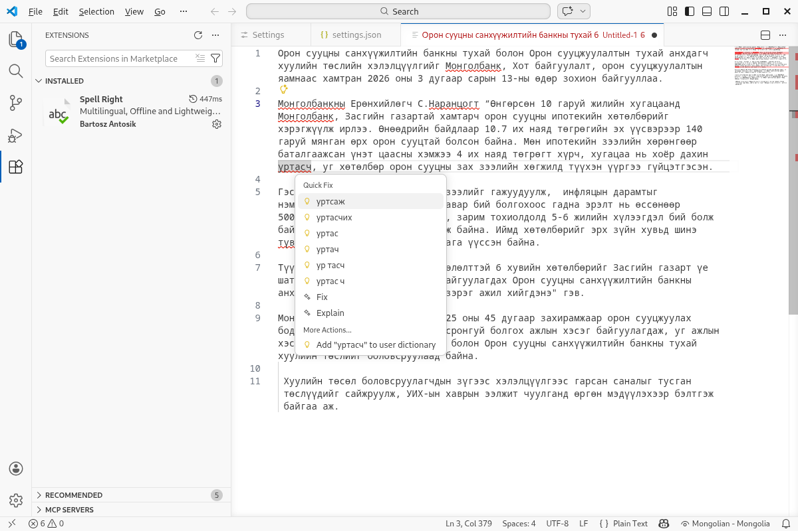
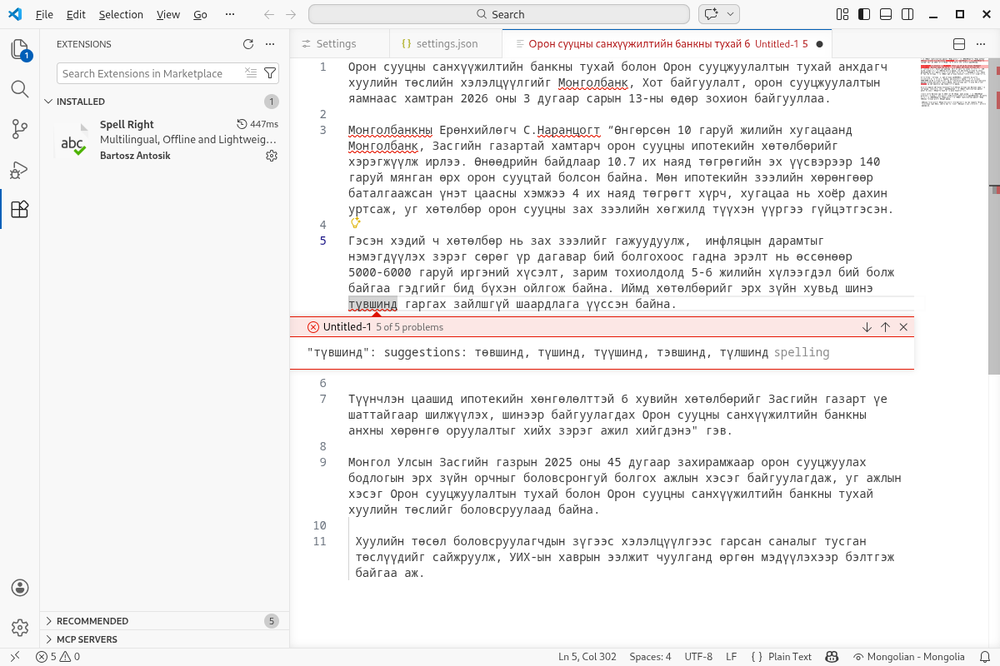

# Visual Studio Code дээр ашиглах

1. Толио [эндээс](https://github.com/bataak/dict-mn/raw/main/mn_MN.zip){:target="_blank"} татаж авна.
1. Татаж авсан zip файлаа `mn_MN` хавтаст задалж хуулна. Англи үгийн алдаа шалгах толийг [эндээс](https://github.com/LibreOffice/dictionaries/tree/master/en) (en_US.aff, en_US.dic) татаж авна.
1. Программаа нээгээд `Extensions` дотроос `Spell Right` өргөтгөлийг хайж олоод суулгана.
1. Хэрэв таны ашиглаж буй үйлдлийн систем Windows бол `%APPDATA%\Code\Dictionaries\` хавтсанд өмнө татаж авсан `mn_MN` хавтас доторх `mn_MN.aff`, `mn_MN.dic` файлуудыг хуулна.
1. Хэрэв үйлдлийн систем тань Linux бол `$HOME/.config/Code/Dictionaries/` хавтсанд дээрх 2 файлыг хуулна.
1. Улмаар VSCode программын баруун доод буланд байрлах нүдний зураг дээр дармагц үгийн алдаа шалгахад ашиглаж болох хэлний сонголт гарах бөгөөд эндээс Монгол хэлийг сонгоно.

Linux үйлдлийн системд монгол үгийн алдаа шалгах толийг хялбараар суулган ашиглаж бас болно, гэхдээ дээрх аргаар суулгасан толины хувилбар хуучин байж болзошгүй гэдгийг анхаарах хэрэгтэй:
```bash
sudo apt install hunspell-mn
ln -s /usr/share/hunspell/* ~/.config/Code/Dictionaries
```

macOS системийн хувьд дараах тохиргоог хийх хэрэгтэй (англи хэлээр хамт шалгах бол мөн толийг хуулна):
```bash
unzip ~/Downloads/mn_MN.zip mn_MN.dic mn_MN.aff -d ~/Library/Spelling/

mkdir -p ~/Library/Application\ Support/Code/Dictionaries
ln -sf ~/Library/Spelling/* ~/Library/Application\ Support/Code/Dictionaries/

echo 'export SPELLCHECKER_PREFER_HUNSPELL=1' >> ~/.zshrc
source ~/.zshrc
```
Дээрх тохиргоог буцаах бол:
```bash
rm -rf ~/Library/Application\ Support/Code/Dictionaries
rm ~/Library/Spelling/mn_MN.dic ~/Library/Spelling/mn_MN.aff

sed -i '' '/export SPELLCHECKER_PREFER_HUNSPELL=1/d' ~/.zshrc
unset SPELLCHECKER_PREFER_HUNSPELL
source ~/.zshrc
```

Ийнхүү VSCode программын `Spell Right` өргөтгөлд монгол хэл нэмэгдэх тул түүнийг сонгоно.





Хэрэв алдаатай үгийн зөв бичлэгийг харах бол алдаатай үг дээр заагчаа байрлуулаад, `ctr + shift + 6` (macOS бол `cmd + .`) товчлуурын хослолыг ашиглана:



Алдаатай үг бүрийг дамжин шалгах бол `f8` (macOS бол `option + f8`) товчлуурыг ашиглана:



Хэрэв алдаатай үгийн зөв хувиллыг гаргах товчлуурын хослол ажиллахгүй байвал өргөтгөлийн тохиргооны дэлгэрэнгүй [мэдээлэлтэй](https://github.com/bartosz-antosik/vscode-spellright) танилцахыг зөвлөж байна.
