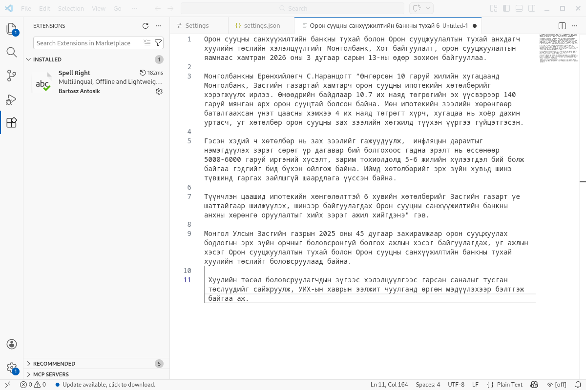
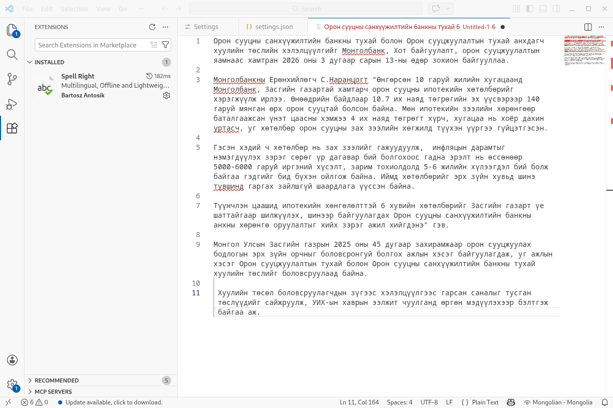

# Visual Studio Code дээр ашиглах

1. Толио [эндээс](https://github.com/bataak/dict-mn/raw/main/mn_MN.zip){:target="_blank"} татаж авна.
1. Татаж авсан zip файлаа `mn_MN` хавтаст задалж хуулна.
1. Программаа нээгээд `Extensions` дотроос `Spell Right` өргөтгөлийг хайж олоод суулгана.
1. Хэрэв таны ашиглаж буй үйлдлийн систем Windows бол `%APPDATA%\Code\Dictionaries\` хавтсанд өмнө татаж авсан `mn_MN` хавтас доторх `mn_MN.aff`, `mn_MN.dic` файлуудыг хуулна.
1. Хэрэв үйлдлийн систем тань Linux бол `$HOME/.config/Code/Dictionaries/` хавтсанд дээрх 2 файлыг хуулна.
1. Улмаар VSCode программын баруун доод буланд байрлах нүдний зураг дээр дармагц үгийн алдаа шалгахад ашиглаж болох хэлний сонголт гарах бөгөөд эндээс Монгол хэлийг сонгоно.

Linux үйлдлийн системд монгол үгийн алдаа шалгах толийг хялбараар суулган ашиглаж болно, гэхдээ дээрх аргаар суулгасан толины хувилбар хуучин байж болзошгүй гэдгийг анхаарах хэрэгтэй:
```bash
sudo apt install hunspell-mn
ln -s /usr/share/hunspell/* ~/.config/Code/Dictionaries
```
Ийнхүү VSCode программын `Spell Right` өргөтгөлд монгол хэл нэмэгдэх тул түүнийг сонгоно.




Ийнхүү ашиглахад бэлэн болно. Тохиргооны талаарх дэлгэрэнгүй мэдээллийг [эндээс](https://github.com/bartosz-antosik/vscode-spellright) авна уу.
