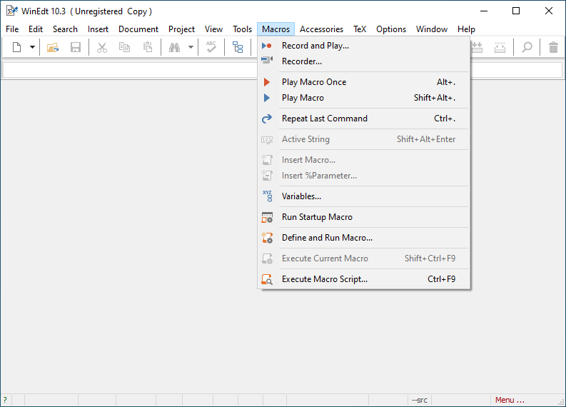
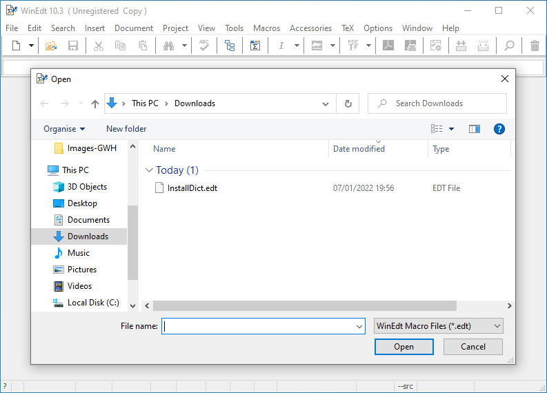
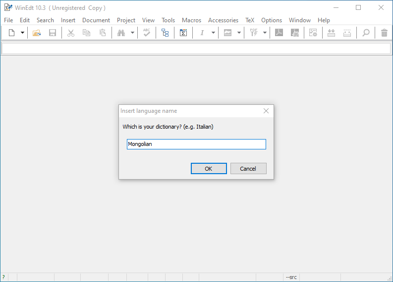
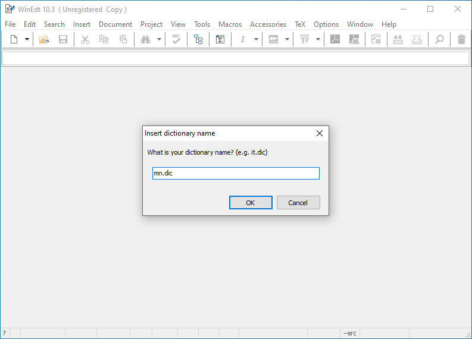
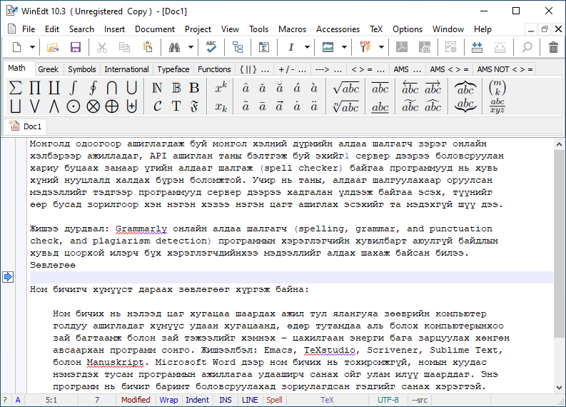

# WinEdt дээр ашиглах

[WinEdt](https://en.wikipedia.org/wiki/WinEdt) программыг [LaTeX](https://www.latex-project.org/) хэрэглэгчид сайн мэдэх байх. 

1. Программыг [эндээс](https://www.winedt.com/download.html) татаж аваад суулгана.
1. Толио [эндээс](https://github.com/bataak/dict-mn/raw/main/package%20-%20WinEdt/Mongolian.zip) татаж авна.
1. Татаж авсан толио `Downloads` хавтсандаа, шинэ хавтас (`Mongolian`) үүсгэхгүйгээр задална (`Downloads/mn.dic`).
1. Одоо толь суулгах `InstallDict.edt` макро файлыг [эндээс](https://www.winedt.org//macros/winedt/InstallDict.html) татаж авахдаа хулганынхаа баруун товчийг дарж цэсээс `Save Link As...` хэмээн сонгож `Downloads` хавтсанд хуулж тавина. Энэхүү макро файл нь татаж авсан тольтой нэг хавтсанд байх ёстой.
1. Программаа нээгээд `Macros > Execute Macro Script` сонгоод нээгдэх жижиг цонхонд татаж авсан макро файлаа зааж өгнө.\
\

1. Улмаар нээгдэх эхний цонхонд `Mongolian`, удаах цонхонд `mn.dic` хэмээн бичиж өгнө.\

1. Амжилттай суусан бол `Installation Complete!` хэмээн мэдэгдэх болно.
1. Ийнхүү ашиглахад бэлэн боллоо.\

